---
## Author
author:
  name: Кабанов Иван Олегович
  email: 1032253495@rudn.ru
  affiliation:
    - name: Российский университет дружбы народов
      country: Российская Федерация
      postal-code: 117198
      city: Москва
      address: ул. Миклухо-Маклая, д. 6

## Title
title: "Отчет по лабораторной работе №2"
subtitle: "Архитектура компьютеров и операционные системы. Раздел Операционные системы"
license: "CC BY"
---

# Цель работы
- Изучить идеологию и применение средств контроля версий.
- Освоить умения по работе с git.

# Задание
- Установка программного обеспечения
- Базовая настройка git
- Создайте ключи ssh
- Создайте ключи pgp
- Настройка github
- Добавление PGP ключа в GitHub
- Настройка автоматических подписей коммитов git
- Настройка gh
- Сознание репозитория курса на основе шаблона
- Настройка каталога курса

# Теоретическое введение

Системы контроля версий (Version Control System, VCS) применяются при работе нескольких человек над одним проектом. Обычно основное дерево проекта хранится в локальном или удалённом репозитории, к которому настроен доступ для участников проекта. При внесении изменений в содержание проекта система контроля версий позволяет их фиксировать, совмещать изменения, произведённые разными участниками проекта, производить откат к любой более ранней версии проекта, если это требуется.

В классических системах контроля версий используется централизованная модель, предполагающая наличие единого репозитория для хранения файлов. Выполнение большинства функций по управлению версиями осуществляется специальным сервером. Участник проекта (пользователь) перед началом работы посредством определённых команд получает нужную ему версию файлов. После внесения изменений, пользователь размещает новую версию в хранилище. При этом предыдущие версии не удаляются из центрального хранилища и к ним можно вернуться в любой момент. Сервер может сохранять не полную версию изменённых файлов, а производить так называемую дельта-компрессию — сохранять только изменения между последовательными версиями, что позволяет уменьшить объём хранимых данных.

Системы контроля версий поддерживают возможность отслеживания и разрешения конфликтов, которые могут возникнуть при работе нескольких человек над одним файлом. Можно объединить (слить) изменения, сделанные разными участниками (автоматически или вручную), вручную выбрать нужную версию, отменить изменения вовсе или заблокировать файлы для изменения. В зависимости от настроек блокировка не позволяет другим пользователям получить рабочую копию или препятствует изменению рабочей копии файла средствами файловой системы ОС, обеспечивая таким образом, привилегированный доступ только одному пользователю, работающему с файлом.

Системы контроля версий также могут обеспечивать дополнительные, более гибкие функциональные возможности. Например, они могут поддерживать работу с несколькими версиями одного файла, сохраняя общую историю изменений до точки ветвления версий и собственные истории изменений каждой ветви. Кроме того, обычно доступна информация о том, кто из участников, когда и какие изменения вносил. Обычно такого рода информация хранится в журнале изменений, доступ к которому можно ограничить.

В отличие от классических, в распределённых системах контроля версий центральный репозиторий не является обязательным.

Среди классических VCS наиболее известны CVS, Subversion, а среди распределённых — Git, Bazaar, Mercurial. Принципы их работы схожи, отличаются они в основном синтаксисом используемых в работе команд.

# Выполнение лабораторной работы
## Базовая настройка git
Произведем базовую настройку git. Зададим имя и email владельца репозитория, настроим utf-8 в выводе сообщений git, зададим имя начальной ветки (будем называть её master) параметр autocrlf, параметр safecrlf. ([рис. @fig-001])

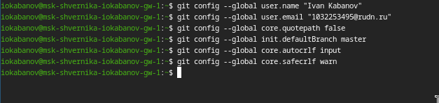{#fig-001 width=70%}

## Создайте ключи ssh
Создадим ключ по алгоритму rsa ([рис. @fig-002])

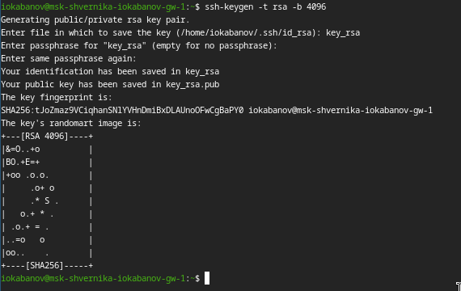{#fig-002 width=70%}

Создадим ключ по алгоритму ed25519 ([рис. @fig-003])

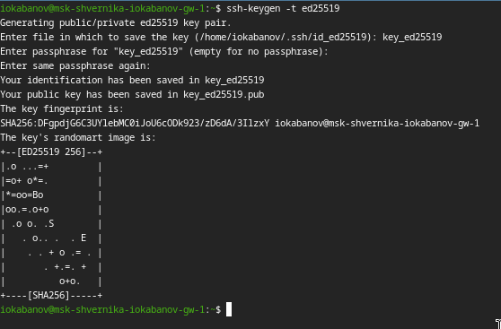{#fig-003 width=70%}

## Создайте ключи pgp
Генерируем gpg  ключ со следующими параметрами
тип RSA and RSA;
размер 4096;
срок действия - 0. ([рис. @fig-004]) ([рис. @fig-005])

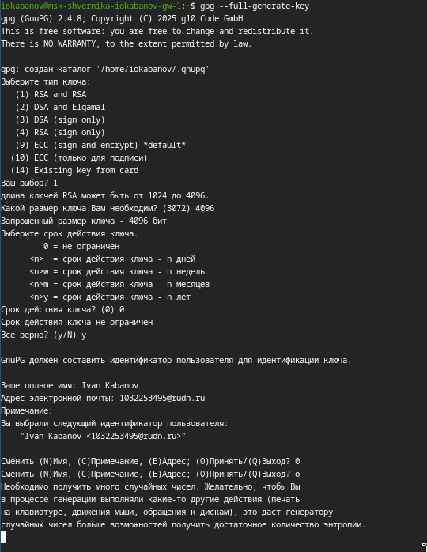{#fig-004 width=70%}

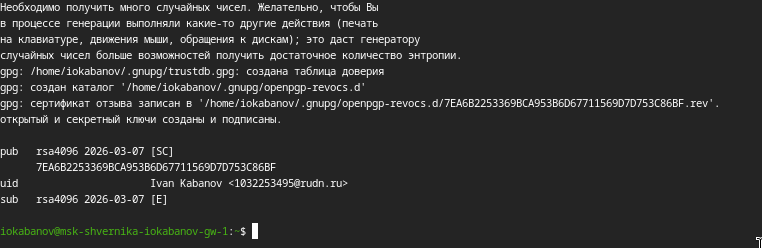{#fig-005 width=70%}

## Настройка github
Так как в первом семестре уже был создан и настроен аккаунт github, будем пользоваться им.
## Добавление PGP ключа в GitHub
Выводим список ключей и копируем отпечаток приватного ключа. Копируем наш сгенерированный PGP ключ в буфер обмена. ([рис. @fig-006]) 

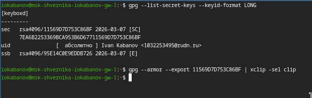{#fig-006 width=70%}

Всатавляем полученный ключ на githhub ([рис. @fig-007]) 

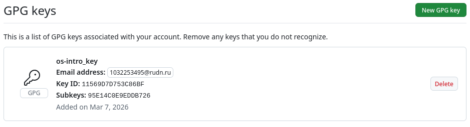{#fig-007 width=70%}

## Настройка автоматических подписей коммитов git
Используя введёный email, указываем Git применять ключ при подписи коммитов ([рис. @fig-008]) 

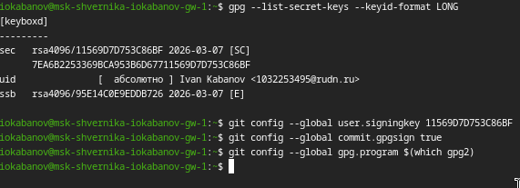{#fig-008 width=70%}

## Настройка gh
Авторизовываемся, чтобы настроить gh. ([рис. @fig-009]) 

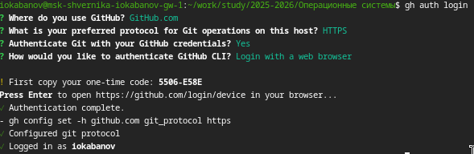{#fig-009 width=70%}

## Сознание репозитория курса на основе шаблона
Создаем необходимые каталоги ([рис. @fig-010]) 

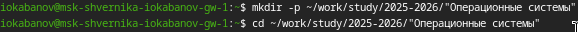{#fig-010 width=70%}

Создаем репозиторий по шаблону ([рис. @fig-011]) 

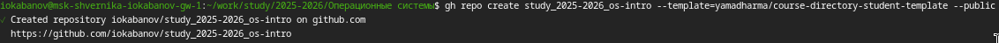{#fig-011 width=70%}

Клонируем репозиторий ([рис. @fig-012]) 

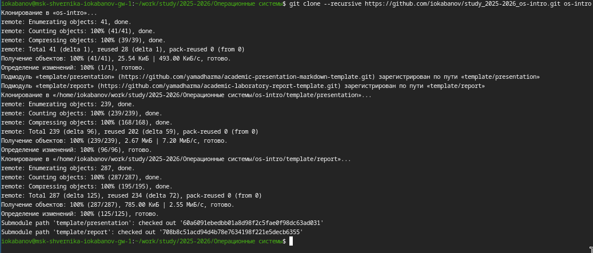{#fig-012 width=70%}

## Настройка каталога курса
Удаляем лишние файлы и производим необходимые операции ([рис. @fig-013])

{#fig-013 width=70%}

Создаем каталоги ([рис. @fig-014]) 

{#fig-014 width=70%}

Делаем коммит ([рис. @fig-015]) 

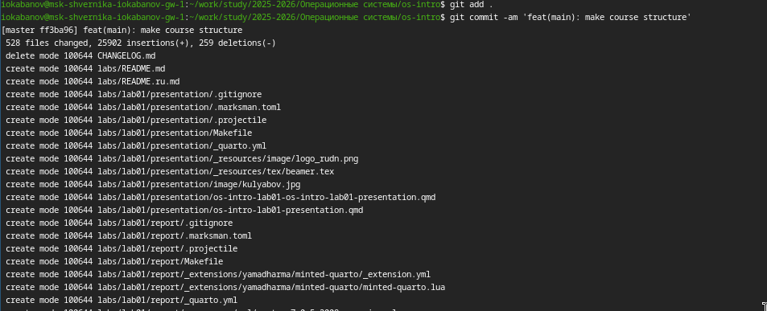{#fig-015 width=70%}

Отправляем файлы на сервер ([рис. @fig-016]) 

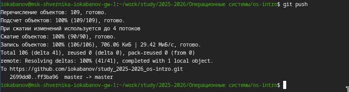{#fig-016 width=70%}

# Ответы на контрольные вопросы
1. Системы контроля версий (VCS) — это инструменты для отслеживания изменений в файлах (чаще всего в коде). Они позволяют хранить историю изменений, работать нескольким разработчикам одновременно, возвращаться к предыдущим версиям и управлять разработкой проекта.

2. Понятия VCS:

Хранилище (repository) — место, где хранится проект и вся история его изменений.

Commit — сохранённое изменение в репозитории (снимок состояния файлов).

История (history) — последовательность всех commit’ов проекта.

Рабочая копия (working copy) — локальная версия файлов, с которой работает разработчик.

Связь: разработчик изменяет рабочую копию, делает commit, который сохраняется в хранилище и становится частью истории.

3. Централизованные (CVCS) — один центральный сервер с репозиторием, разработчики получают и отправляют изменения туда.
Примеры: SVN (Subversion), CVS.

Децентрализованные (DVCS) — у каждого разработчика есть полный репозиторий с историей.
Примеры: Git, Mercurial.

Главное отличие: в DVCS можно работать без постоянного подключения к серверу.

4. Работа с VCS при единоличной работе:

Создать репозиторий.

Добавить файлы в отслеживание.

Изменять файлы.

Делать commit изменений.

При необходимости возвращаться к прошлым версиям.

5. Работа с общим хранилищем:

Получить копию репозитория (clone/checkout).

Внести изменения локально.

Сделать commit.

Получить последние изменения (pull/update).

Отправить свои изменения на сервер (push).

Разрешить конфликты при необходимости.

6. Основные задачи git:

хранение истории изменений;

совместная работа разработчиков;

создание ветвей и параллельная разработка;

объединение изменений;

управление версиями проекта.

7. Основные команды git:

git init — создание нового репозитория.

git clone — копирование удалённого репозитория.

git add — добавление файлов в индекс.

git commit — сохранение изменений.

git status — состояние файлов.

git log — просмотр истории.

git push — отправка изменений на сервер.

git pull — получение изменений с сервера.

git branch — управление ветвями.

git merge — объединение ветвей.

8. Примеры работы

Локальный репозиторий:

git init
git add file.txt
git commit -m "Добавлен файл"

Удалённый репозиторий:

git clone https://github.com/user/project.git
git pull
git push

9. Ветвь — это независимая линия разработки.
Позволяет работать над новой функцией или исправлением, не влияя на основную версию проекта. Позже ветви можно объединить.

10. Некоторые файлы (временные, сборки, логи) не нужно сохранять в репозитории. Для этого используется файл .gitignore. Git будет игнорировать эти файлы при add и commit.

# Выводы

Была изучена идеология и применение системы контроля версий git. Получены базовые навыки работы с git и github, а также ssh и  gpg ключами.

# Список литературы{.unnumbered}

::: {#refs}
:::
