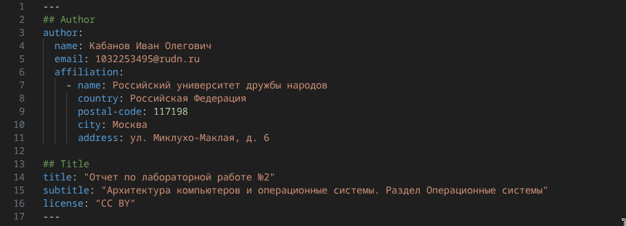
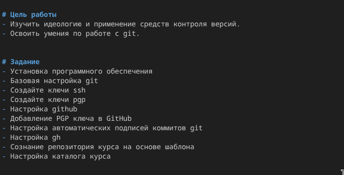
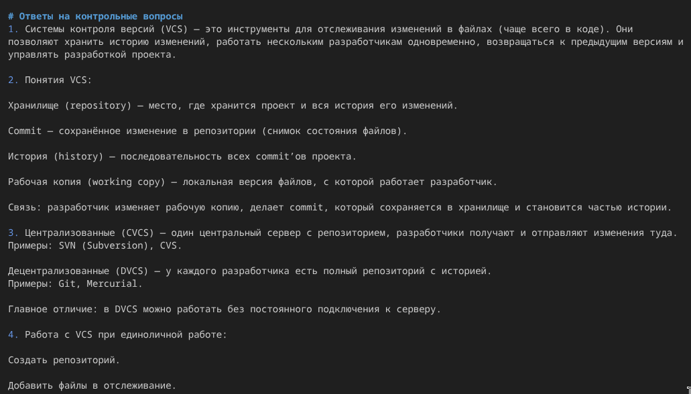

---
author:
  name: Кабанов Иван Олегович
  email: 1032253495@rudn.ru
  affiliation:
    - name: Российский университет дружбы народов
      country: Российская Федерация
      postal-code: 117198
      city: Москва
      address: ул. Миклухо-Маклая, д. 6

## Title
lang: ru-RU
fontenc: T2A
mainfont: "DejaVu Serif"
sansfont: "DejaVu Sans"
monofont: "DejaVu Sans Mono"
title: "Презентация по лабораторной работе №3"
subtitle: "Архитектура компьютеров и операционные системы. Раздел Операционные системы"
license: "CC BY"
date: today
date-format: "YYYY-MM-DD" # Example: 2025-09-06
---

# Информация

## Докладчик

:::::::::::::: {.columns align=center}
::: {.column width="70%"}

  * Кабанов Иван Олегович
  * студент группы НКАбд-03-25
  * Российский университет дружбы народов им. П. Лумумбы
  * [1032253495@rudn.ru](mailto:1032253495@rudn.ru)
  * <https://github.com/iokabanov/>

:::
::: {.column width="30%"}

:::
::::::::::::::

# Цель работы

Научиться оформлять отчёты с помощью легковесного языка разметки Markdown.

# Задание

– Сделайте отчёт по предыдущей лабораторной работе в формате Markdown.
– В качестве отчёта просьба предоставить отчёты в 3 форматах: pdf, docx и md в архиве,
поскольку он должен содержать скриншоты, Makefile и т.д.

# Теоретическое введение

Лабораторная работа является небольшой научно-исследовательской работой, которую
и оформлять следует по всем утверждённым требованиям. При подготовке отчета по лабораторной работе вы освоите ряд важных элементов, которые в дальнейшем пригодятся
вам при написании курсовой и дипломной работы.

# Выполнение лабораторной работы

## Информация об авторе и название отчета

Заполним информацию об авторе и укажем название отчета. ([рис. @fig-001])

{#fig-001 width=70%}

## Введение

Напишем цели лабораторной работы и задание. ([рис. @fig-002])

{#fig-002 width=70%}

Напишем теоретическое введение. ([рис. @fig-003])

{#fig-003 width=70%}

## Основная часть

Заполним информацию о выполненния лабораторной работы. ([рис. @fig-004])

{#fig-004 width=70%}

## Ответы на контрольные вопросы

Напишем ответы на контрольные вопросы. ([рис. @fig-005]) 

{#fig-005 width=70%}

## Заключение

Напишем выводы к лабораторной работе №2. ([рис. @fig-006]) 

{#fig-006 width=70%}

# Выводы

Были получены и применены на практике знания о работе с языком разметки markdown. Также были освоены базовые принципы написания отчетов.