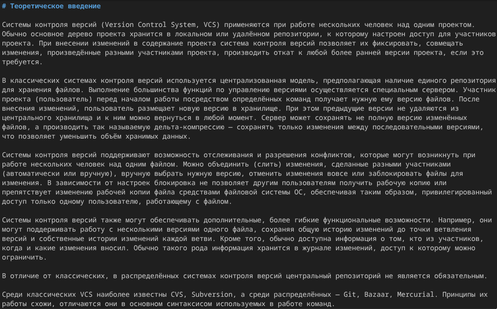
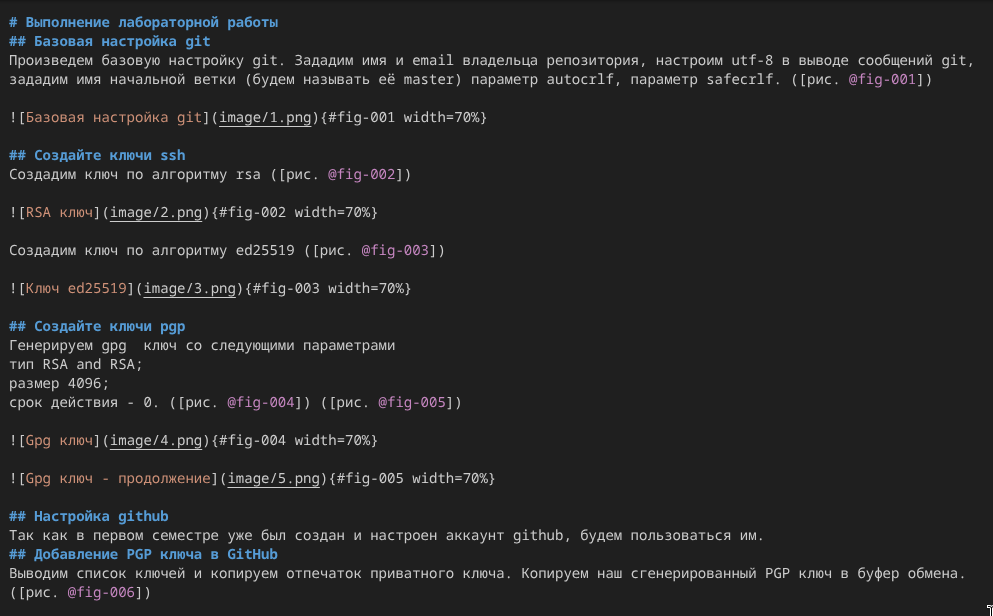
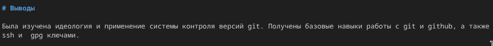

---
## Author
author:
  name: Кабанов Иван Олегович
  email: 1032253495@rudn.ru
  affiliation:
    - name: Российский университет дружбы народов
      country: Российская Федерация
      postal-code: 117198
      city: Москва
      address: ул. Миклухо-Маклая, д. 6

## Title
title: "Отчет по лабораторной работе №3"
subtitle: "Архитектура компьютеров и операционные системы. Раздел Операционные системы"
license: "CC BY"
---

# Цель работы

Научиться оформлять отчёты с помощью легковесного языка разметки Markdown.

# Задание

– Сделайте отчёт по предыдущей лабораторной работе в формате Markdown.
– В качестве отчёта просьба предоставить отчёты в 3 форматах: pdf, docx и md в архиве,
поскольку он должен содержать скриншоты, Makefile и т.д.

# Теоретическое введение

Чтобы создать заголовок, используйте знак ( # ). 
Чтобы задать для текста полужирное начертание, заключите его в двойные звездочки. 
Чтобы задать для текста курсивное начертание, заключите его в одинарные звездочки.
Чтобы задать для текста полужирное и курсивное начертание, заключите его в тройные
звездочки.
Блоки цитирования создаются с помощью символа >.
Неупорядоченный (маркированный) список можно отформатировать с помощью звездочек или тире.
Чтобы вложить один список в другой, добавьте отступ для элементов дочернего списка.
Упорядоченный список можно отформатировать с помощью соответствующих цифр.
Чтобы вложить один список в другой, добавьте отступ для элементов дочернего списка.
Синтаксис Markdown для встроенной ссылки состоит из части [link text] , представляющей текст гиперссылки, и части (file-name.md) – URL-адреса или имени файла,
на который дается ссылка.
Markdown поддерживает как встраивание фрагментов кода в предложение, так и их
размещение между предложениями в виде отдельных огражденных блоков. Огражденные
блоки кода — это простой способ выделить синтаксис для фрагментов кода. 

Лабораторная работа является небольшой научно-исследовательской работой, которую
и оформлять следует по всем утверждённым требованиям. При подготовке отчета по лабораторной работе вы освоите ряд важных элементов, которые в дальнейшем пригодятся
вам при написании курсовой и дипломной работы.

# Выполнение лабораторной работы

## Информация об авторе и название отчета

Заполним информацию об авторе и укажем название отчета. ([рис. @fig-001])

{#fig-001 width=70%}

## Введение

Напишем цели лабораторной работы и задание. ([рис. @fig-002])

{#fig-002 width=70%}

Напишем теоретическое введение. ([рис. @fig-003])

{#fig-003 width=70%}

## Основная часть

Заполним информацию о выполненния лабораторной работы. ([рис. @fig-004])

{#fig-004 width=70%}

## Ответы на контрольные вопросы

Напишем ответы на контрольные вопросы. ([рис. @fig-005]) 

{#fig-005 width=70%}

## Заключение

Напишем выводы к лабораторной работе №2. ([рис. @fig-006]) 

{#fig-006 width=70%}

# Выводы

Были получены и применены на практике знания о работе с языком разметки markdown. Также были освоены базовые принципы написания отчетов.

# Список литературы{.unnumbered}

::: {#refs}
:::
