---
## Author
author:
  name: Кабанов Иван Олегович
  email: 1032253495@rudn.ru
  affiliation:
    - name: Российский университет дружбы народов
      country: Российская Федерация
      postal-code: 117198
      city: Москва
      address: ул. Миклухо-Маклая, д. 6

## Title
title: "Отчет по лабораторной работе №5"
subtitle: "Архитектура компьютеров и операционные системы. Раздел Операционные системы"
license: "CC BY"
---

# Цель работы

Научиться работать с менеджером паролей pass. Освоить навыки взаимодействия с файлами конфигурации и chezmoi.

# Задание
1. Менеджер паролей pass
    - Установка
    - Настройка
    - Настройка интерфейса с браузером
    - Сохранение пароля
2. Управление файлами конфигурации
3. Дополнительное программное обеспечение
    - Установка
    - Создание собственного репозитория с помощью утилит
    - Подключение репозитория к своей системе
    - Использование chezmoi на нескольких машинах
    - Настройка новой машины с помощью одной команды
    - Ежедневные операции c chezmoi

# Теоретическое введение

## Менеджер паролей pass

Менеджер паролей pass — программа, сделанная в рамках идеологии Unix.
Также носит название стандартного менеджера паролей для Unix (The standard Unix password manager).

## Основные свойства

Данные хранятся в файловой системе в виде каталогов и файлов.
Файлы шифруются с помощью GPG-ключа.

## Структура базы паролей

Структура базы может быть произвольной, если Вы собираетесь использовать её напрямую, без промежуточного программного обеспечения. Тогда семантику структуры базы данных Вы держите в своей голове.
Если же необходимо использовать дополнительное программное обеспечение, необходимо семантику заложить в структуру базы паролей.

## Семантическая структура базы паролей

Рассмотрим пользователя user в домене example.com, порт 22.
Отсутствие имени пользователя или порта в имени файла означает, что любое имя пользователя и порт будут совпадать:

example.com.pgp

Соответствующее имя пользователя может быть именем файла внутри каталога, имя которого совпадает с хостом. Это полезно, если в базе есть пароли для нескольких пользователей на одном хосте:

example.com/user.pgp

Имя пользователя также может быть записано в виде префикса, отделенного от хоста знаком @:

user@example.com.pgp

Соответствующий порт может быть указан после хоста, отделённый двоеточием (:):

example.com:22.pgp
example.com:22/user.pgp
user@example.com:22.pgp

Эти все записи могут быть расположены в произвольных каталогах, задающих Вашу собственную иерархию.

## Реализации

### Утилиты командной строки

На данный момент существует 2 основных реализации:
pass — классическая реализация в виде shell-скриптов (https://www.passwordstore.org/);
gopass — реализация на go с дополнительными интегрированными функциями (https://www.gopass.pw/).
Дальше в тексте будет использоваться программа pass, но всё то же самое можно сделать с помощью программы gopass.

### Графические интерфейсы

qtpass — может работать как графический интерфейс к pass, так и как самостоятельная программа. В настройках можно переключаться между использованием pass и gnupg.

gopass-ui — интерфейс к gopass.

webpass:
Репозиторий: https://github.com/emersion/webpass
Веб-интерфейс к pass.
Написано на golang.

## Управление файлами конфигурации

Использование chezmoi для управления файлами конфигурации домашнего каталога пользователя.

Состояние файлов конфигурации сохраняется в каталоге

~/.local/share/chezmoi
Он является клоном вашего репозитория dotfiles.
Файл конфигурации ~/.config/chezmoi/chezmoi.toml (можно использовать также JSON или YAML) специфичен для локальной машины.
Файлы, содержимое которых одинаково на всех ваших машинах, дословно копируются из исходного каталога.
Файлы, которые варьируются от машины к машине, выполняются как шаблоны, обычно с использованием данных из файла конфигурации локальной машины для настройки конечного содержимого, специфичного для локальной машины.

При запуске

chezmoi apply

вычисляется желаемое содержимое и разрешения для каждого файла, а затем вносит необходимые изменения, чтобы ваши файлы соответствовали этому состоянию.

По умолчанию chezmoi изменяет файлы только в рабочей копии

# Выполнение лабораторной работы

## Менеджер паролей pass: установка и настройка

Установим pass. ([рис. @fig-001])

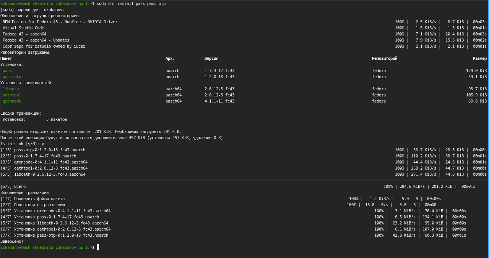{#fig-001 width=70%}

Установим gopass. ([рис. @fig-002])

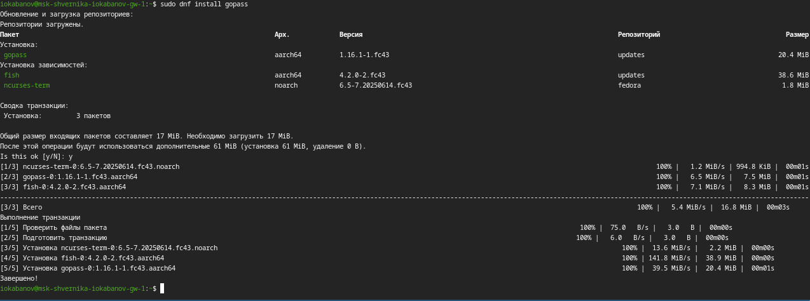{#fig-002 width=70%}

Начнем настройку. Просмотрим ключи gpg, инициализируем хранилище и зададим адрес репозитория на хостинге. ([рис. @fig-003])

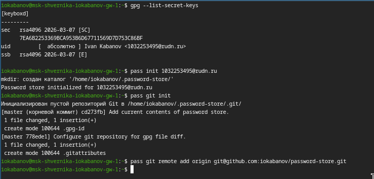{#fig-003 width=70%}

Для синхронизации выполним команды push и pull. ([рис. @fig-004])

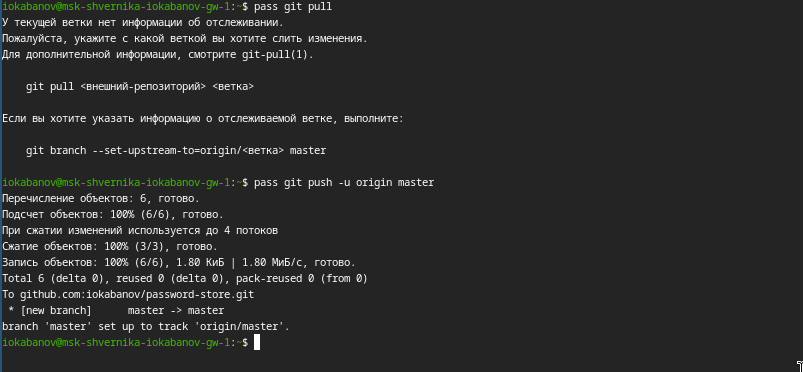{#fig-004 width=70%}

## Настройка интерфеса с браузером

Установим плагин browserpass. ([рис. @fig-005]) 

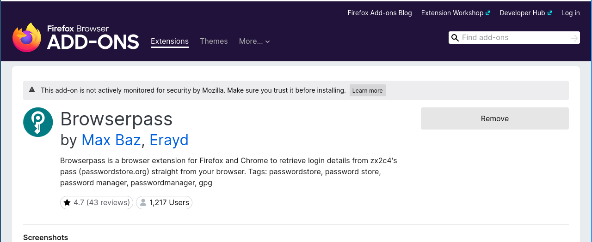{#fig-005 width=70%}

Установим интерфейс для взаимодействия с брaузером (native messaging). ([рис. @fig-006]) 

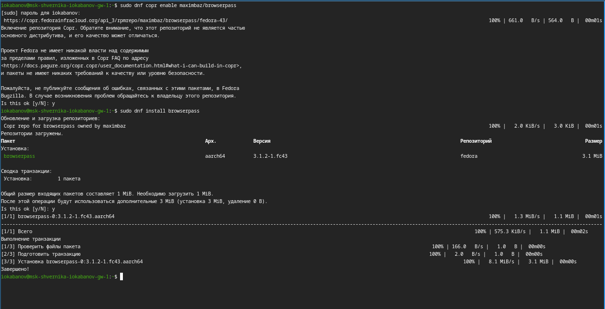{#fig-006 width=70%}

## Сохранение пароля

Добавим новый пароль, отобразим его и заменим. ([рис. @fig-007]) 

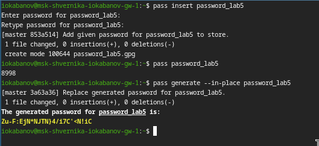{#fig-007 width=70%}

## Управление файлами конфигурации: дополнительное программное обеспечение

Установим дополнительное программное обеспечение. ([рис. @fig-008]) 

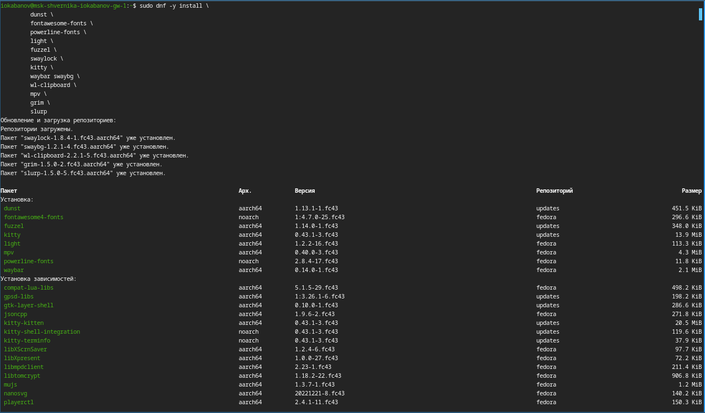{#fig-008 width=70%}

Установим необходимые шрифты. ([рис. @fig-009]) 

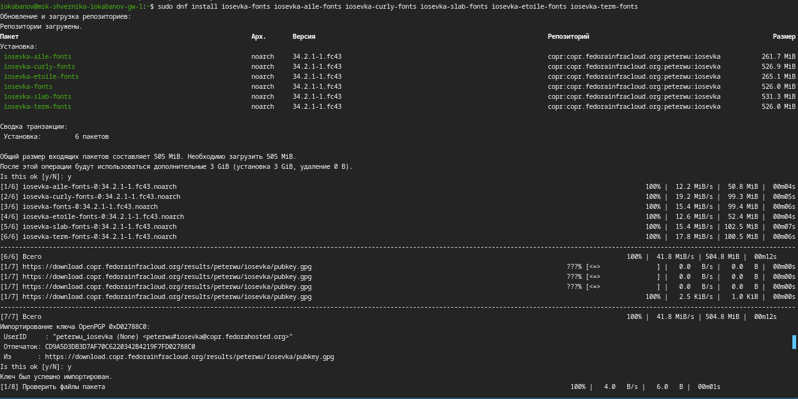{#fig-009 width=70%}

Установка бинарного файла. Скрипт определяет архитектуру процессора и операционную систему и скачивает необходимый файл.  ([рис. @fig-010]) 

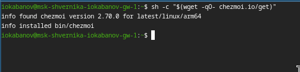{#fig-010 width=70%}

## Подключение репозитория к своей системе

Инициализируем chezmoi с репозиторием dotfiles:

chezmoi init git@github.com:iokabanov/dotfiles.git

Проверяем, какие изменения внесёт chezmoi в домашний каталог, запустив ([рис. @fig-011]) :

chezmoi diff

Так как устраивают изменения, внесённые chezmoi, запускаем:

chezmoi apply -v

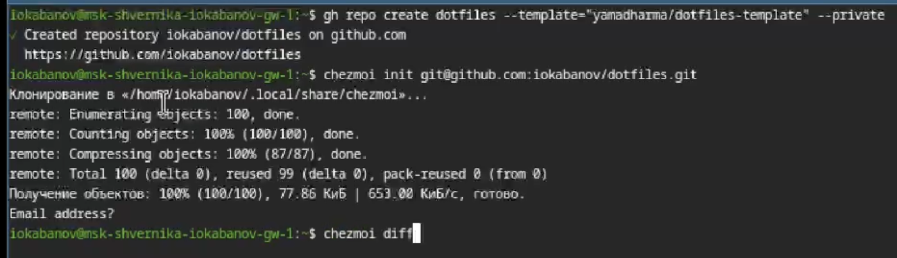{#fig-011 width=70%}

## Использование chezmoi на нескольких машинах

На второй машине инициализируйте chezmoi с вашим репозиторием dotfiles. ([рис. @fig-012]) 

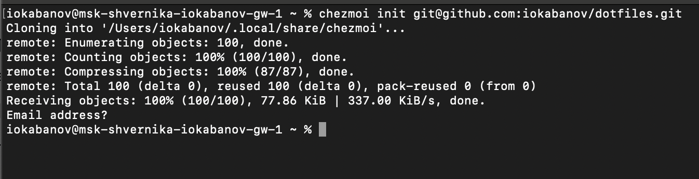{#fig-012 width=70%}

Проверяем, какие изменения внесёт chezmoi в домашний каталог, запустив chezmoi diff. ([рис. @fig-013]) 

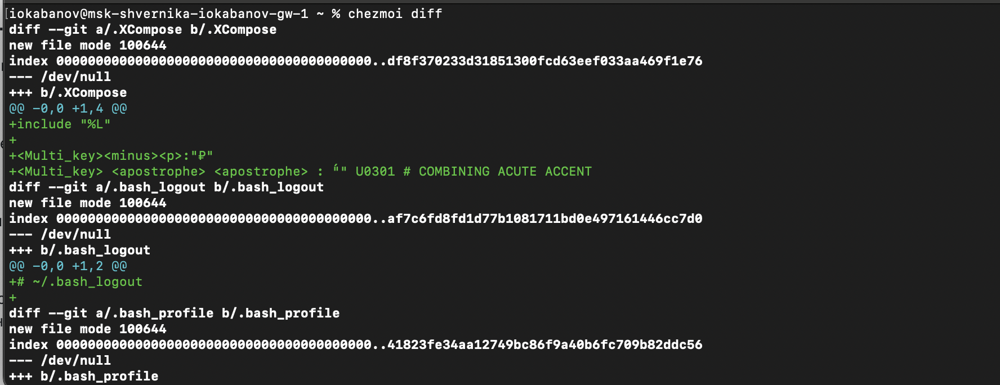{#fig-013 width=70%}

Так как устраивают изменения, внесённые chezmoi, запускаем chezmoi apply -v. ([рис. @fig-014]) 

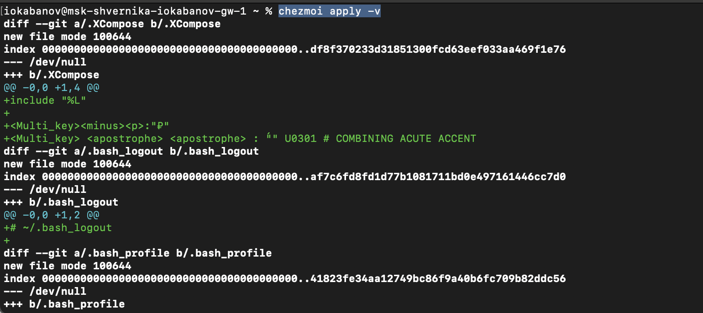{#fig-014 width=70%}

## Ежедневные операции c chezmoi

Извлекаем последние изменения из репозитория и применяем их с помощью команды chezmoi update. ([рис. @fig-015]) 

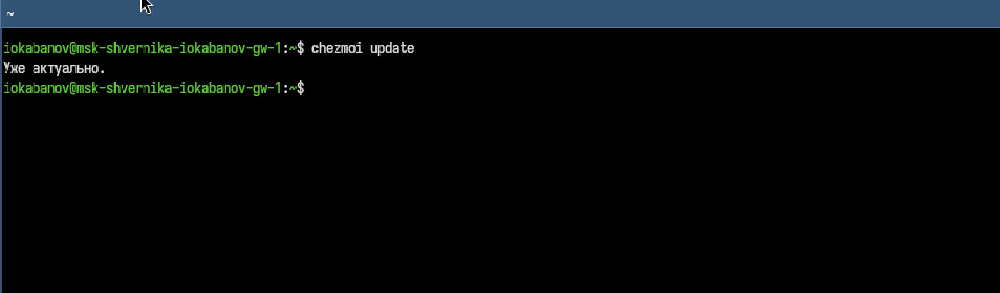{#fig-015 width=70%}

Выполняем chezmoi git pull -- --autostash --rebase && chezmoi diff. ([рис. @fig-016]) 

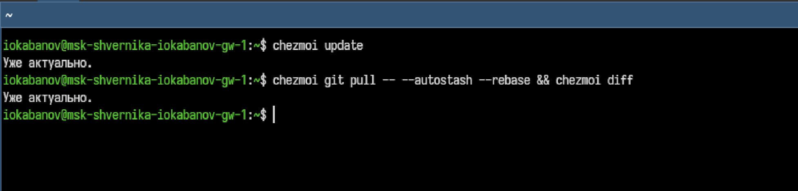{#fig-016 width=70%}

Смотрим файл конфигурации ~/.config/chezmoi/chezmoi.toml и добавляем в него изменения, которые включают автоматическое фиксирование и отправление изменений в исходный каталог в репозиторий. ([рис. @fig-017]) 

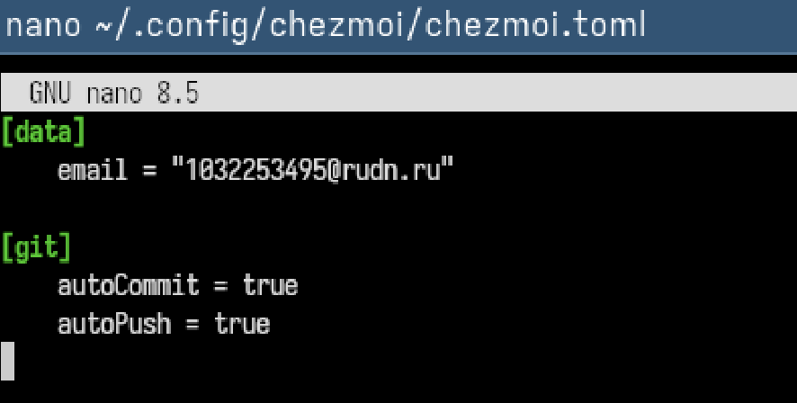{#fig-017 width=70%}

# Выводы

Были получены и применены на практике знания о работе с менеджером паролей pass. Также были освоены навыки взаимодействия с файлами конфигурации и chezmoi, а также работы с chezmoi на нескольких машинах.

# Список литературы{.unnumbered}

::: {#refs}
:::
