---
## Author
author:
  name: Кабанов Иван Олегович
  email: 1032253495@rudn.ru
  affiliation:
    - name: Российский университет дружбы народов
      country: Российская Федерация
      postal-code: 117198
      city: Москва
      address: ул. Миклухо-Маклая, д. 6

## Title
title: "Отчет по лабораторной работе №6"
subtitle: "Архитектура компьютеров и операционные системы. Раздел Операционные системы"
license: "CC BY"
---

# Цель работы

Приобретение практических навыков взаимодействия пользователя с системой посредством командной строки.

# Задание

1. Определите полное имя вашего домашнего каталога. Далее относительно этого ката-
лога будут выполняться последующие упражнения.
2. Выполните следующие действия:
2.1. Перейдите в каталог /tmp.
2.2. Выведите на экран содержимое каталога /tmp. Для этого используйте команду ls
с различными опциями. Поясните разницу в выводимой на экран информации.
2.3. Определите, есть ли в каталоге /var/spool подкаталог с именем cron?
2.4. Перейдите в Ваш домашний каталог и выведите на экран его содержимое. Опре-
делите, кто является владельцем файлов и подкаталогов?
3. Выполните следующие действия:
3.1. В домашнем каталоге создайте новый каталог с именем newdir.
3.2. В каталоге ~/newdir создайте новый каталог с именем morefun.
3.3. В домашнем каталоге создайте одной командой три новых каталога с именами
letters, memos, misk. Затем удалите эти каталоги одной командой.
3.4. Попробуйте удалить ранее созданный каталог ~/newdir командой rm. Проверьте,
был ли каталог удалён.
3.5. Удалите каталог ~/newdir/morefun из домашнего каталога. Проверьте, был ли
каталог удалён.
4. С помощью команды man определите, какую опцию команды ls нужно использо-
вать для просмотра содержимое не только указанного каталога, но и подкаталогов,
входящих в него.
5. С помощью команды man определите набор опций команды ls, позволяющий отсорти-
ровать по времени последнего изменения выводимый список содержимого каталога
с развёрнутым описанием файлов.
6. Используйте команду man для просмотра описания следующих команд: cd, pwd, mkdir,
rmdir, rm. Поясните основные опции этих команд.
7. Используя информацию, полученную при помощи команды history, выполните мо-
дификацию и исполнение нескольких команд из буфера команд.

# Теоретическое введение

## Общая информация

В операционной системе типа Linux взаимодействие пользователя с системой обычно
осуществляется с помощью командной строки посредством построчного ввода ко-
манд. При этом обычно используется командные интерпретаторы языка shell: /bin/sh;
/bin/csh; /bin/ksh.

## Формат команды

Командой в операционной системе называется записанный по
специальным правилам текст (возможно с аргументами), представляющий собой ука-
зание на выполнение какой-либо функций (или действий) в операционной системе.
Обычно первым словом идёт имя команды, остальной текст — аргументы или опции,
конкретизирующие действие.
Общий формат команд можно представить следующим образом:
<имя_команды><разделитель><аргументы>

## Сокращения имён файлов.

В работе с командами, в качестве аргументов которых
выступает путь к какому-либо каталогу или файлу, можно использовать сокращённую
запись пути.

## Использование символа «;»

Если требуется выполнить последовательно несколько
команд, записанный в одной строке, то для этого используется символ точка с запятой

# Выполнение лабораторной работы

## Подготовка к лабораторной работе 

Определим полное имя домашнего каталога. Далее относительно этого ката-
лога будут выполняться последующие упражнения. ([рис. @fig-001])

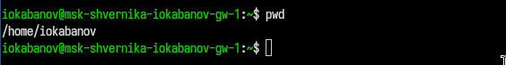{#fig-001 width=70%}

## Работа с ls

Перейдем в каталог /tmp и выведем на экран его содержимое. ([рис. @fig-002])

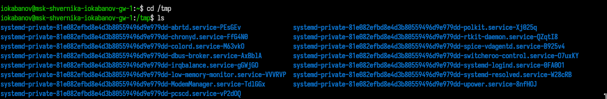{#fig-002 width=70%}

Воспользуемся различными опциями команды  ls.  При использовании -a выводятся все файлы, в том числе скрытые. При использовании -alF выводится расширенная (в длинном формате) информация о файле и индикатор типа файла для всех файлов, в том числе скрытых. ([рис. @fig-003])

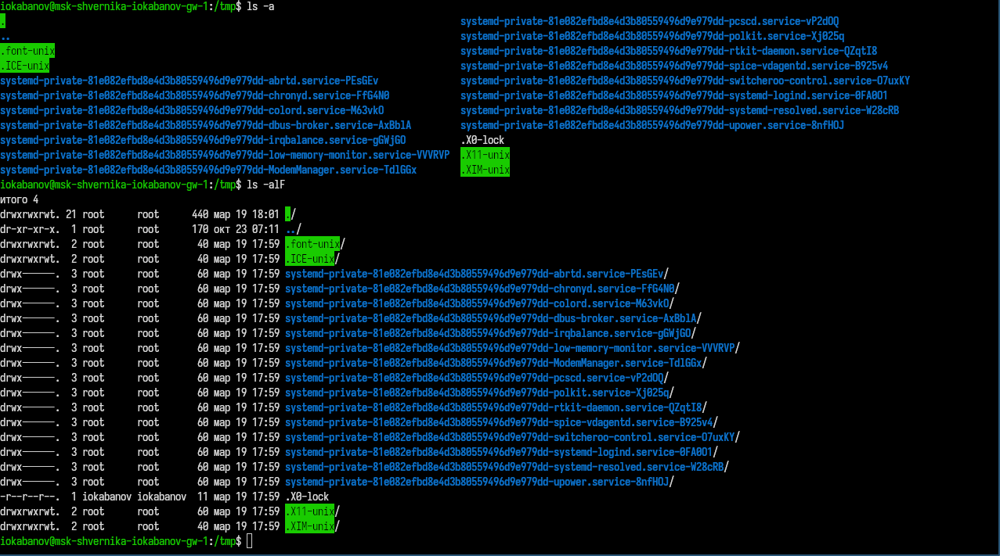{#fig-003 width=70%}

С помощью ls определяем, что в каталоге /var/spool есть подкаталог с именем cron. ([рис. @fig-004])

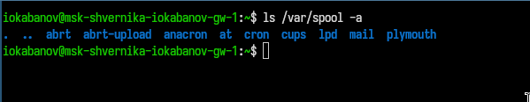{#fig-004 width=70%}

Переходим в домашний каталог и выводим на экран его содержимое. Владельцем всех файлов и подкаталогов кроме ".." является пользователь iokabanov, а его - root([рис. @fig-005]) 

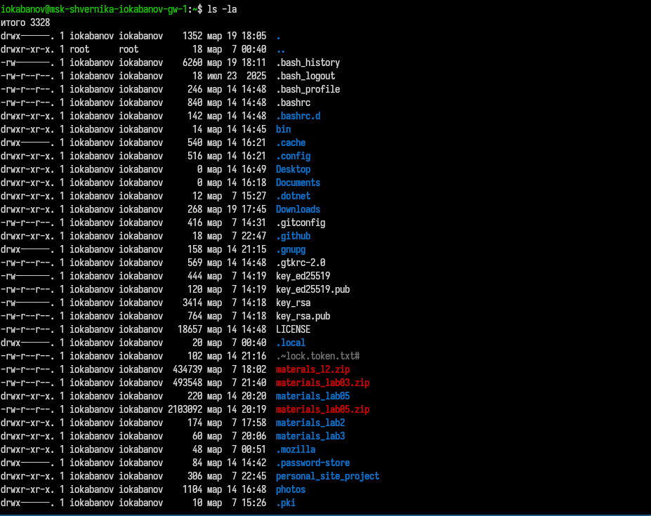{#fig-005 width=70%}

## Работа с каталогами

В домашнем каталоге создаем новый каталог с именем newdir. В каталоге ~/newdir создаем новый каталог с именем morefun. В домашнем каталоге создаем одной командой три новых каталога с именами
letters, memos, misk. ([рис. @fig-006]) 

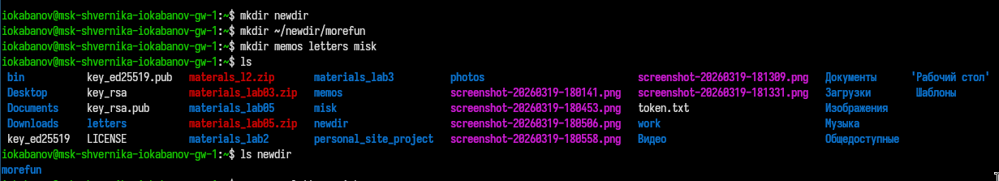{#fig-006 width=70%}

Затем удаляем каталоги letters, memos, misk одной командой. Пробуем удалить ранее созданный каталог ~/newdir командой rm. Каталог не был удален, так как rm вызвана без -r. Удаляем каталог ~/newdir/morefun из домашнего каталога. Убеждаемся, что он был удален. ([рис. @fig-007]) 

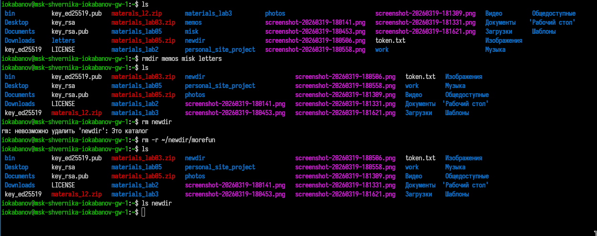{#fig-007 width=70%}

## Работа с man

С помощью команды man определяем, какую опцию команды ls нужно использо-
вать для просмотра содержимое не только указанного каталога, но и подкаталогов,
входящих в него. Это опция -R. ([рис. @fig-008]) 

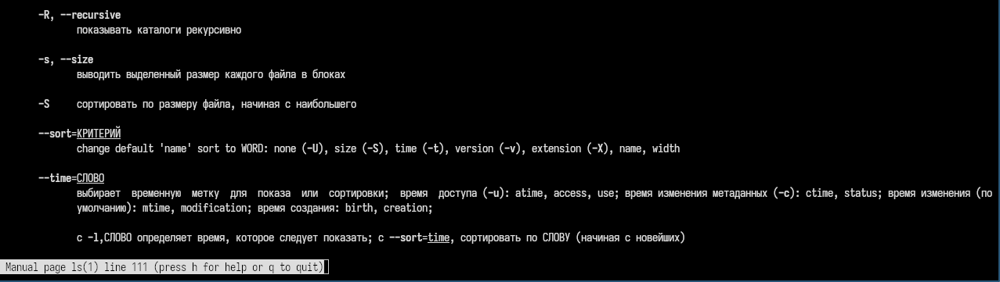{#fig-008 width=70%}

С помощью команды man определяем набор опций команды ls, позволяющий отсорти-
ровать по времени последнего изменения выводимый список содержимого каталога
с развёрнутым описанием файлов. Это опции -lt. ([рис. @fig-009]) ([рис. @fig-010]) 

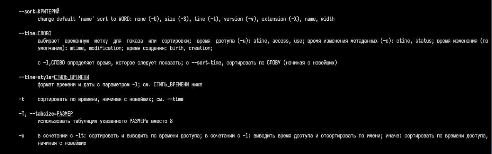{#fig-009 width=70%}

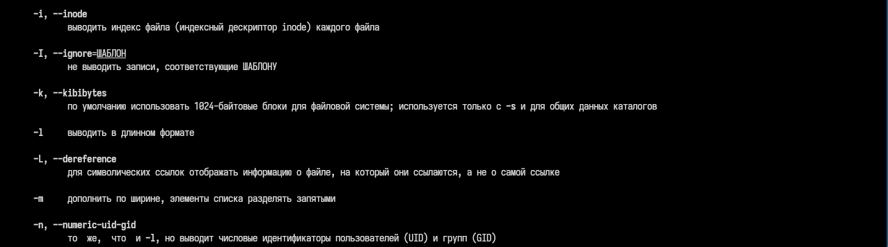{#fig-010 width=70%}

Используем команду man для просмотра описания следующих команд: cd, pwd, mkdir,
rmdir, rm. 
cd — смена каталога:
``` bash
cd ~          # домашний каталог
cd ..         # на уровень выше
cd -          # предыдущий каталог
cd /tmp       # абсолютный путь
```

pwd — путь:
``` bash
pwd -L        # логический путь (с симлинками, по умолчанию)
pwd -P        # физический путь (реальный, без симлинков)
```
([рис. @fig-011]) 

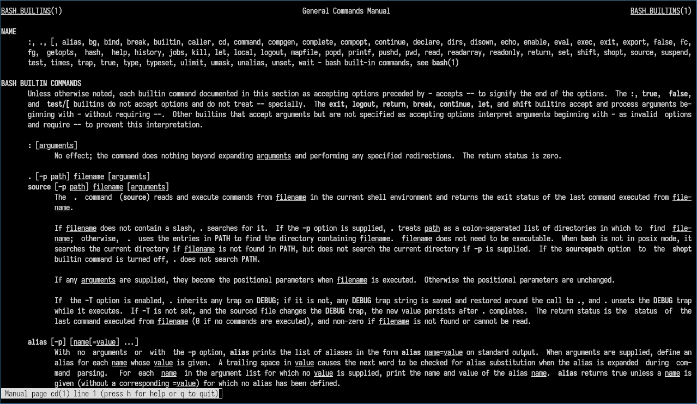{#fig-011 width=70%}

mkdir — создание каталога:
``` bash
mkdir -p a/b/c    # создать всю цепочку каталогов сразу
mkdir -m 755 dir  # задать права при создании
mkdir -v dir      # verbose — сообщать о каждом созданном каталоге
```
([рис. @fig-012]) 

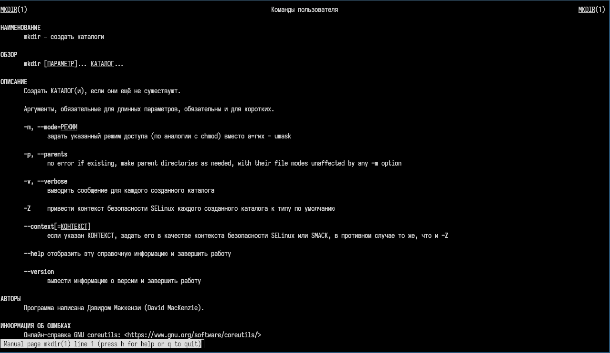{#fig-012 width=70%}

rm — удаление файлов и каталогов:
``` bash
rm -r dir     # рекурсивно (каталог со содержимым)
rm -f file    # принудительно, без подтверждения
rm -i file    # интерактивно — спрашивать перед каждым удалением
rm -rf dir    # комбинация: рекурсивно и без подтверждения
rm -v file    # verbose — выводить что удаляется
```
([рис. @fig-013]) 

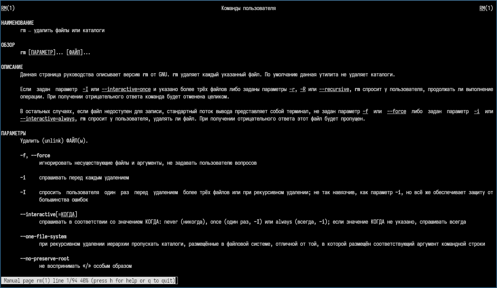{#fig-013 width=70%}

rmdir — удаление пустого каталога:
``` bash
rmdir -p a/b/c    # удалить цепочку пустых каталогов
rmdir -v dir      # verbose
```
 ([рис. @fig-014]) 

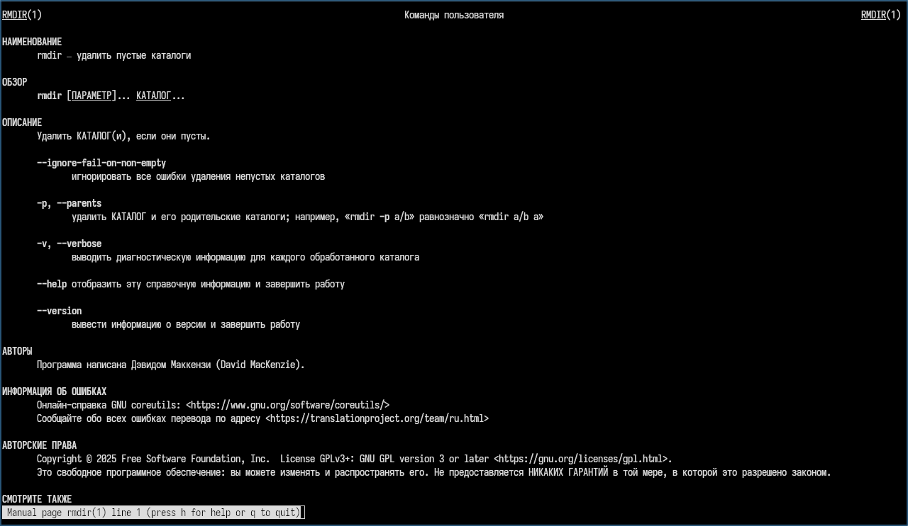{#fig-014 width=70%}

## Работа с history

Используя информацию, полученную при помощи команды history, выполняем модификацию и исполнение нескольких команд(236 и 233) из буфера команд. Проверяем результат. ([рис. @fig-015]) 

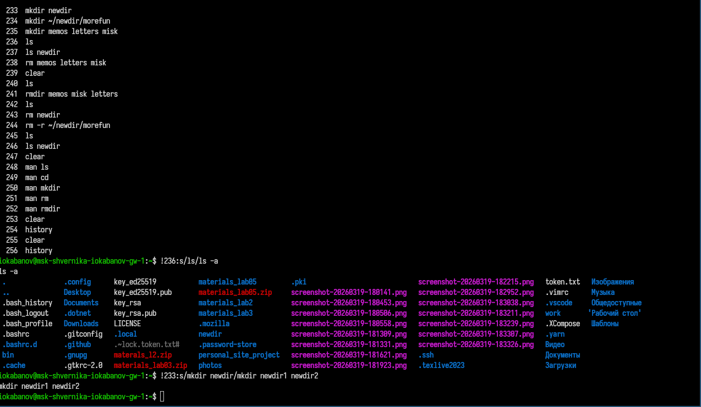{#fig-015 width=70%}

Проверяем результат с помощью ls. ([рис. @fig-016]) 

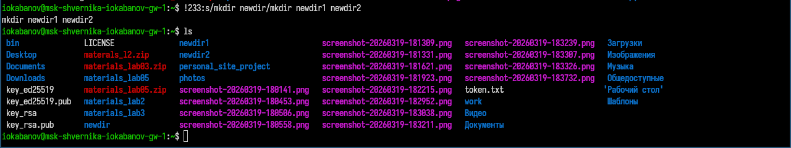{#fig-016 width=70%}

# Ответы на контрольные вопросы

1. Командная строка - текстовый интерфейс для взаимодействия с ОС путём ввода команд.
2. При помощи pwd.
3. ls -F показывает имена с символом типа (/ - каталог, * - исполняемый, @ - ссылка). 
``` bash
    $ ls -F
    file.txt  scripts/  link@  program*
```
Только типы без лишнего: ls -F | grep '/$' - только каталоги.
4. ls -a или ls -la - показывает скрытые файлы (начинающиеся с .):
``` bash
$ ls -a
.  ..  .bashrc  .config  documents
```
5. Файл удаляется командой rm, каталог - rmdir (пустой) или rm -r (рекурсивно). Одной командой rm -r можно удалить и файл, и каталог:
``` bash
$ rm file.txt
$ rmdir emptydir/
$ rm -r dir_with_files/
```
6. История команд выводится командой history:
``` bash
$ history
  1  ls -la
  2  cd documents
  3  pwd
```
7. Повтор команды из истории: !N - выполнить команду с номером N, !! - последнюю, !ls - последнюю начинающуюся с ls. Также можно нажать Ctrl+R для поиска по истории:
``` bash
$ !42        # выполнить команду №42
$ !!         # повторить последнюю команду
$ !cd        # последняя команда, начинающаяся с cd
```
8. Несколько команд в одной строке:
``` bash
$ cd /tmp && ls -la          # вторая выполнится только при успехе первой
$ mkdir test; cd test; pwd   # выполняются последовательно независимо
$ ls || echo "ошибка"        # вторая - только если первая упала
```
9.  Символы экранирования - символы, отменяющие специальное значение следующего символа. Основной - обратный слеш \. Кавычки тоже экранируют:
``` bash
$ echo Привет\ мир     # пробел - часть аргумента, а не разделитель
$ echo "цена $5"       # $ не интерпретируется как переменная
$ echo 'путь: /home'   # одинарные кавычки - всё буквально
```
10. ls -l выводит подробный список: тип и права доступа, число жёстких ссылок, владелец, группа, размер в байтах, дата изменения, имя файла:
``` bash
-rw-r--r-- 1 ivan users 2048 Mar 20 14:00 file.txt
drwxr-xr-x 2 ivan users 4096 Mar 19 10:30 docs/
```
11. Относительный путь - путь относительно текущего каталога, без / в начале. Абсолютный - от корня, начинается с /:
``` bash
$ cat documents/notes.txt        # относительный путь
$ cat /home/ivan/documents/notes.txt  # абсолютный путь
$ cd ../downloads                # относительный: на уровень выше, затем в downloads
```
12. Информацию о команде можно получить через:
``` bash
$ man ls          # полное руководство
$ ls --help       # краткая справка
$ info ls         # расширенная документация
$ whatis ls       # одна строка описания
```
13. Tab - автодополнение команд и путей. Одно нажатие дополняет, если вариант единственный; двойное - показывает все варианты.

# Выводы

В ходе выполнения лабораторной работы были получены знания об основных командах bash и их опциях. На практике были освоены навыки взаимодействия пользователя с системой посредством командной строки.


# Список литературы{.unnumbered}

::: {#refs}
:::