---
## Author
author:
  name: Кабанов Иван Олегович
  email: 1032253495@rudn.ru
  affiliation:
    - name: Российский университет дружбы народов
      country: Российская Федерация
      postal-code: 117198
      city: Москва
      address: ул. Миклухо-Маклая, д. 6

## Title
title: "Отчет по лабораторной работе №7"
subtitle: "Архитектура компьютеров и операционные системы. Раздел Операционные системы"
license: "CC BY"
---

# Цель работы

Ознакомление с файловой системой Linux, её структурой, именами и содержанием каталогов. Приобретение практических навыков по применению команд для работы с файлами и каталогами, по управлению процессами (и работами), по проверке использования диска и обслуживанию файловой системы.

# Задание
1. Выполните все примеры, приведённые в первой части описания лабораторной работы.
2. Выполните следующие действия, зафиксировав в отчёте по лабораторной работе
используемые при этом команды и результаты их выполнения:
2.1. Скопируйте файл /usr/include/sys/io.h в домашний каталог и назовите его
equipment. Если файла io.h нет, то используйте любой другой файл в каталоге
/usr/include/sys/ вместо него.
2.2. В домашнем каталоге создайте директорию ~/ski.plases.
2.3. Переместите файл equipment в каталог ~/ski.plases.
2.4. Переименуйте файл ~/ski.plases/equipment в ~/ski.plases/equiplist.
2.5. Создайте в домашнем каталоге файл abc1 и скопируйте его в каталог
~/ski.plases, назовите его equiplist2.
2.6. Создайте каталог с именем equipment в каталоге ~/ski.plases.
2.7. Переместите файлы ~/ski.plases/equiplist и equiplist2 в каталог
~/ski.plases/equipment.
2.8. Создайте и переместите каталог ~/newdir в каталог ~/ski.plases и назовите
его plans.
3. Определите опции команды chmod, необходимые для того, чтобы присвоить перечисленным ниже файлам выделенные права доступа, считая, что в начале таких прав
нет:
3.1. drwxr--r-- ... australia
3.2. drwx--x--x ... play
3.3. -r-xr--r-- ... my_os
3.4. -rw-rw-r-- ... feathers
При необходимости создайте нужные файлы.
4. Проделайте приведённые ниже упражнения, записывая в отчёт по лабораторной
работе используемые при этом команды:
4.1. Просмотрите содержимое файла /etc/password.
4.2. Скопируйте файл ~/feathers в файл ~/file.old.
4.3. Переместите файл ~/file.old в каталог ~/play.
4.4. Скопируйте каталог ~/play в каталог ~/fun.
4.5. Переместите каталог ~/fun в каталог ~/play и назовите его games.
4.6. Лишите владельца файла ~/feathers права на чтение.
4.7. Что произойдёт, если вы попытаетесь просмотреть файл ~/feathers командой
cat?
4.8. Что произойдёт, если вы попытаетесь скопировать файл ~/feathers?
4.9. Дайте владельцу файла ~/feathers право на чтение.
4.10. Лишите владельца каталога ~/play права на выполнение.
4.11. Перейдите в каталог ~/play. Что произошло?
4.12. Дайте владельцу каталога ~/play право на выполнение.
5. Прочитайте man по командам mount, fsck, mkfs, kill и кратко их охарактеризуйте, приведя примеры.

# Теоретическое введение

## Команды для работы с файлами и каталогами

Для создания текстового файла можно использовать команду touch.
Для просмотра файлов небольшого размера можно использовать команду cat.
Для просмотра файлов постранично удобнее использовать команду less.
Команда head выводит по умолчанию первые 10 строк файла. Команда tail выводит умолчанию 10 последних строк файла.

## Перемещение и переименование файлов и каталогов

Команды mv и mvdir предназначены для перемещения и переименования файлов и каталогов. Если необходим запрос подтверждения о перезаписи файла, то нужно использовать
опцию i.

## Права доступа и их изменение

Каждый файл или каталог имеет права доступа.
В сведениях о файле или каталоге указываются:
– тип файла (символ (-) обозначает файл, а символ (d) — каталог);
– права для владельца файла (r — разрешено чтение, w — разрешена запись, x — разре-
шено выполнение, - — право доступа отсутствует);
– права для членов группы (r — разрешено чтение, w — разрешена запись, x — разрешено
выполнение, - — право доступа отсутствует);
– права для всех остальных (r — разрешено чтение, w — разрешена запись, x — разрешено
выполнение, - — право доступа отсутствует).
Права доступа к файлу или каталогу можно изменить, воспользовавшись командой
chmod. Сделать это может владелец файла (или каталога) или пользователь с правами
администратора.

## Анализ файловой системы

Файловая система в Linux состоит из фалов и каталогов. Каждому физическому носителю соответствует своя файловая система.
Существует несколько типов файловых систем. Перечислим наиболее часто встречаю-
щиеся типы:
– ext2fs (second extended filesystem);
– ext2fs (third extended file system);
– ext4 (fourth extended file system);
– ReiserFS;
– xfs;
– fat (file allocation table);
– ntfs (new technology file system).
Для просмотра используемых в операционной системе файловых систем можно воспользоваться командой mount без параметров. В контексте команды mount устройство — специальный файл устройства, с помощью
которого операционная система получает доступ к аппаратному устройству. Файлы устройств обычно располагаются в каталоге /dev, имеют сокращённые имена (например, sdaN, sdbN или hdaN, hdbN, где N — порядковый номер устройства, sd — устройства SCSI, hd — устройства MFM/IDE). Точка монтирования — каталог (путь к каталогу), к которому присоединяются файлы устройств. Другой способ определения смонтированных в операционной системе файловых систем — просмотр файла/etc/fstab. Сделать это можно например с помощью команды cat. С помощью команды fsck можно проверить (а в ряде случаев восстановить) целостность файловой системы.

# Выполнение лабораторной работы

## Выполнение примеров

### Копирование файлов и каталогов

Скопируем файл ~/abc1 в файл april и в файл may. ([рис. @fig-001])

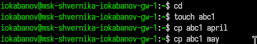{#fig-001 width=70%}

Скопируем файлы april и may в каталог monthly. Скопируем файл monthly/may в файл с именем june. ([рис. @fig-002])

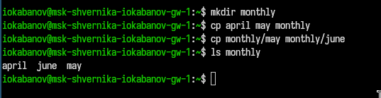{#fig-002 width=70%}

Скопируем каталог monthly в каталог monthly.00 и скопируем каталог monthly.00 в каталог /tmp. ([рис. @fig-003])

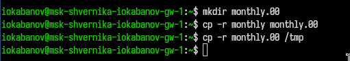{#fig-003 width=70%}

### Перемещение и переименование файлов и каталогов

Изменяем название файла april на july в домашнем каталоге. Перемещаем файл july в каталог monthly.00. Переименовываем каталог monthly.00 в monthly.01. Перемещаем каталог monthly.01 в каталог
reports. Переименовываем каталог reports/monthly.01 в reports/monthly. ([рис. @fig-004])

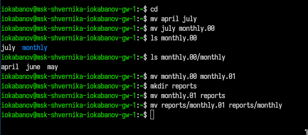{#fig-004 width=70%}


### Права доступа

Посмотрим права доступа для содержимого домашней директории с помощью ls -l. ([рис. @fig-005]) 

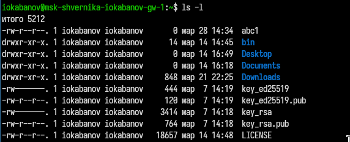{#fig-005 width=70%}

### Изменение прав доступа

Создаем файл ~/may с правом выполнения для владельца. Лишаем владельца файла ~/may права на выполнение. ([рис. @fig-006])  

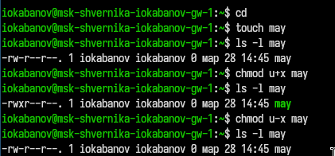{#fig-006 width=70%}

Создаем каталог monthly с запретом на чтение для членов группы и всех остальных пользователей. Создать файл ~/abc1 с правом записи для членов группы. ([рис. @fig-007])

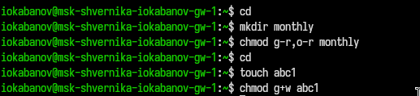{#fig-007 width=70%}

## Задание 2: работа с созданием, перемещением, копированием, переименованием файлов и каталогов 

Скопируем файл /usr/include/sys/uio.h в домашний каталог и назовем его equipment (команды cp, mv). В домашнем каталоге создадим директорию ~/ski.plases (команда mkdir). Переместим файл equipment в каталог ~/ski.plases Переименуем файл ~/ski.plases/equipment в ~/ski.plases/equiplist (команда mv).
Создадим в домашнем каталоге файл abc1 и скопируем его в каталог
~/ski.plases, назовем его equiplist2 (команды touch, cp, mv). Создадим каталог с именем equipment в каталоге ~/ski.plases (команда mkdir). Переместим файлы ~/ski.plases/equiplist и equiplist2 в каталог ~/ski.plases/equipment (команда mv -t). Команда ls использована несколько раз для проверки результата.  ([рис. @fig-008]) 

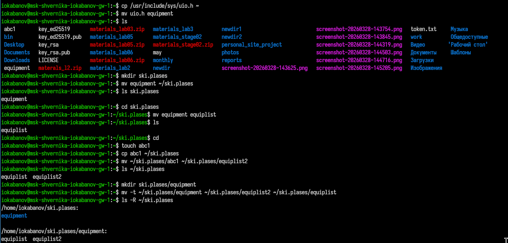{#fig-008 width=70%}

Создадим и переместим каталог ~/newdir в каталог ~/ski.plases и назовите его plans (команды mkdir, mv, cd, ls для проверки). ([рис. @fig-009]) 

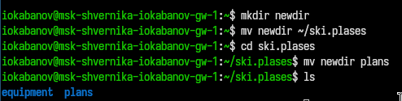{#fig-009 width=70%}

## Работа с chmod

Определяем опции команды chmod, необходимые для того, чтобы присвоить перечисленным ниже файлам требуемые заданием права доступа (для каталогов australia и play - 744 и 711 соответственно; для файлов my_os и feathers - 544 и 644 соответственно). ([рис. @fig-010]) 

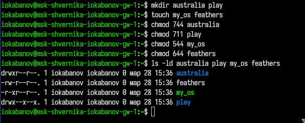{#fig-010 width=70%}

## Задание 4: работа с созданием, перемещением, копированием, переименованием, изменением прав доступа файлов и каталогов

Просмотрим содержимое файла /etc/passwd с помощью cat. ([рис. @fig-011]) 

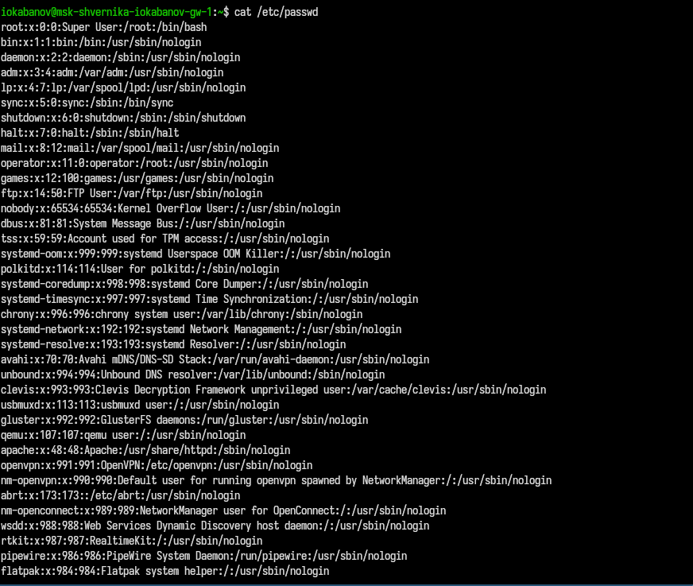{#fig-011 width=70%}

Скопируем файл ~/feathers в файл ~/file.old (команда cp). Переместим файл ~/file.old в каталог ~/play (команда mv). Скопируем каталог ~/play в каталог ~/fun (команда cp). Переместим каталог ~/fun в каталог ~/play и назовем его games (команда mv). Если попытаемся просмотреть файл ~/feathers командой cat то будет отказано в доступе. Дадим владельцу файла ~/feathers право на чтение (команда chmod). Лишим владельца каталога ~/play права на выполнение (команда chmod). Попробуем перейтив каталог ~/play, однако отказано в доступе (команда cd). Даем владельцу каталога ~/play право на выполнение (команда chmod). ([рис. @fig-012]) 

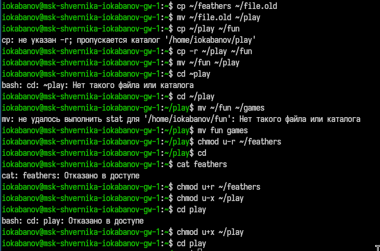{#fig-012 width=70%}

## Работа с man

### mount

Монтирует файловую систему — подключает раздел или устройство к дереву каталогов, делая его содержимое доступным ОС. ([рис. @fig-013]) 

```bash
mount /dev/sdb1 /mnt/usb          # смонтировать раздел
mount -t ext4 /dev/sdb1 /mnt/usb  # указать тип ФС явно
mount -o ro /dev/sdb1 /mnt/usb    # смонтировать только для чтения
mount -a                           # смонтировать всё из /etc/fstab
umount /mnt/usb                    # размонтировать
```

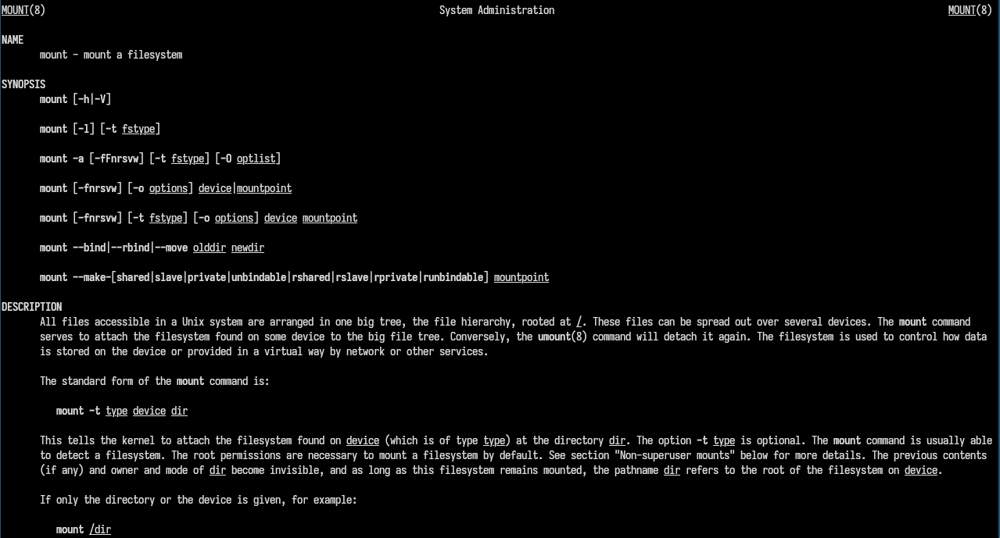{#fig-013 width=70%}

### fsck

Проверяет и восстанавливает целостность файловой системы. Запускается на размонтированном разделе, иначе возможны повреждения. ([рис. @fig-014]) 
```bash
fsck /dev/sda1          # проверить раздел
fsck -y /dev/sda1       # автоматически исправлять все ошибки
fsck -n /dev/sda1       # только проверить, ничего не исправлять
fsck -t ext4 /dev/sda1  # указать тип ФС явно
```

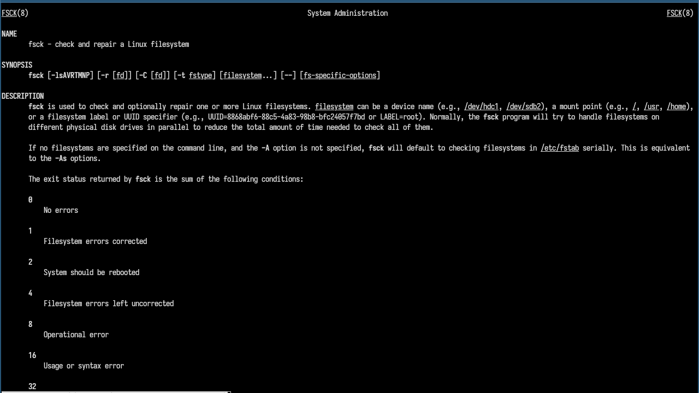{#fig-014 width=70%}

### mkfs

Создаёт файловую систему на разделе или устройстве (форматирование). Все данные на разделе уничтожаются. ([рис. @fig-015]) 

```bash
mkfs.ext4 /dev/sdb1            # создать ext4
mkfs.vfat /dev/sdb1            # создать FAT32
mkfs -t ext4 /dev/sdb1         # то же через флаг -t
mkfs.ext4 -L "mydata" /dev/sdb1  # задать метку тома
```

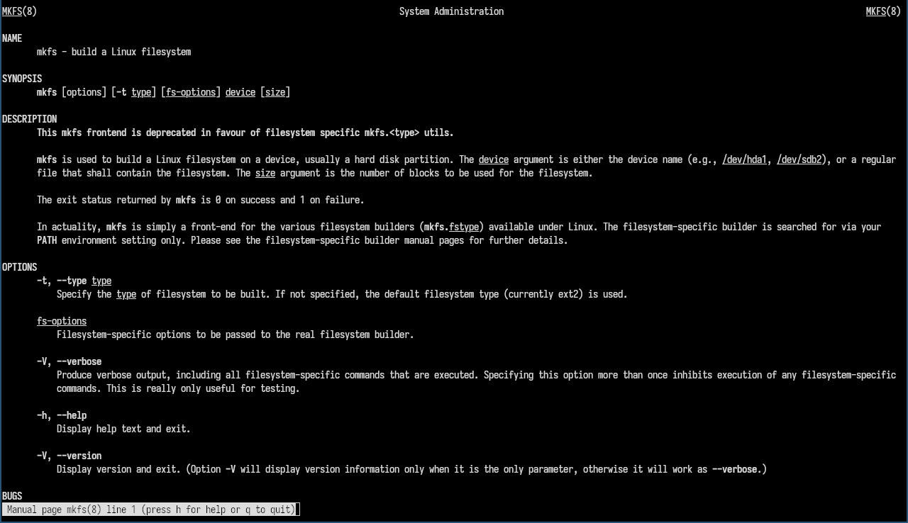{#fig-015 width=70%}

### kill

Отправляет сигнал процессу по его PID. Несмотря на название, может не только завершать процессы, но и посылать любые сигналы. ([рис. @fig-016])

```bash
kill 1234             # отправить SIGTERM (мягкое завершение)
kill -9 1234          # отправить SIGKILL (принудительное завершение)
kill -l               # список всех сигналов
kill -SIGHUP 1234     # перечитать конфиг (например, для демонов)
killall firefox       # завершить все процессы с именем firefox
```

Наиболее используемые сигналы:
- `SIGTERM (15)` — вежливый запрос на завершение
- `SIGKILL (9)` — принудительное завершение, игнорировать нельзя
- `SIGHUP (1)` — перезагрузка конфигурации

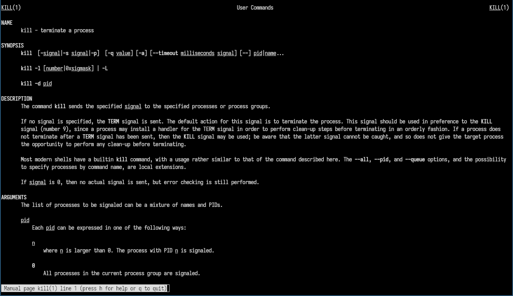{#fig-016 width=70%}

# Ответы на контрольные вопросы

### 1. Характеристика файловых систем на диске

На типичной учебной машине с Linux:
- ext4 — основная ФС для `/` и `/home`. Журналируемая, надёжная, поддерживает файлы до 16 ТБ.
- vfat/FAT32 — раздел EFI (`/boot/efi`). Без журнала, для совместимости с UEFI.
- swap — раздел подкачки, не является ФС в классическом смысле.

### 2. Структура файловой системы Linux (FHS)

- `/bin` — основные команды пользователя
- `/sbin` — команды администратора
- `/etc` — конфигурационные файлы
- `/home` — домашние каталоги пользователей
- `/root` — домашний каталог root
- `/var` — изменяемые данные (логи, кэш)
- `/tmp` — временные файлы
- `/usr` — программы и библиотеки пользователя
- `/lib` — системные библиотеки
- `/dev` — файлы устройств
- `/proc` — виртуальная ФС процессов ядра
- `/sys` — виртуальная ФС оборудования
- `/mnt`, `/media` — точки монтирования
- `/boot` — файлы загрузчика и ядра

### 3. Монтирование

Чтобы содержимое ФС стало доступно ОС, её нужно смонтировать командой `mount`.
При этом ФС «подключается» к точке монтирования в дереве каталогов.
```bash
mount /dev/sdb1 /mnt/usb
```

### 4. Нарушение целостности ФС

Основные причины:
- внезапное отключение питания
- некорректное размонтирование
- ошибки оборудования (bad blocks)
- программные ошибки или вирусы

Устранение — утилита `fsck` (запускается на размонтированном разделе):
```bash
fsck /dev/sda1
```

### 5. Создание файловой системы

Командой `mkfs` с указанием типа:
```bash
mkfs.ext4 /dev/sdb1
mkfs.vfat /dev/sdb2
```

### 6. Команды просмотра текстовых файлов

- `cat` — выводит весь файл целиком
- `less` — постраничный просмотр с навигацией вперёд и назад
- `more` — постраничный просмотр (только вперёд)
- `head` — первые N строк (по умолчанию 10)
- `tail` — последние N строк; `-f` следит за обновлением файла
- `grep` — поиск строк по шаблону

### 7. Основные возможности `cp`
```bash
cp file1 file2        # копировать файл
cp -r dir1 dir2       # рекурсивно (папка)
cp -p file1 file2     # сохранить атрибуты (права, время)
cp -i file1 file2     # спросить перед перезаписью
cp -u file1 file2     # копировать только если новее
```

### 8. Основные возможности `mv`
```bash
mv file1 file2        # переименовать файл
mv file dir/          # переместить в директорию
mv -i file1 file2     # спросить перед перезаписью
mv -u file1 file2     # переместить только если новее
mv -v file1 file2     # подробный вывод
```

### 9. Права доступа

Каждый файл имеет права для трёх категорий: владелец (u), группа (g), остальные (o).
Три типа прав: r (чтение), w (запись), x (выполнение).

Изменение прав — `chmod`:
```bash
chmod 755 file        # числовой формат (rwxr-xr-x)
chmod u+x file        # символьный: добавить x владельцу
chmod go-w file       # убрать w у группы и остальных
```

Изменение владельца — `chown`:
```bash
chown user:group file
```

# Выводы

Были получены знания о файловой системе Linux, её структуре, именах и содержаниии каталогов. Приобретены и применены на реальных задачах практические навыки по работе с файлами и каталогами, по управлению процессами (и работами), по проверке использования диска и обслуживанию файловой системы.


# Список литературы{.unnumbered}

::: {#refs}
:::
