---
## Author
author:
  name: Кабанов Иван Олегович
  email: 1032253495@rudn.ru
  affiliation:
    - name: Российский университет дружбы народов
      country: Российская Федерация
      postal-code: 117198
      city: Москва
      address: ул. Миклухо-Маклая, д. 6

## Title
title: "Отчет по лабораторной работе №8"
subtitle: "Архитектура компьютеров и операционные системы. Раздел Операционные системы"
license: "CC BY"
---

# Цель работы

Ознакомление с инструментами поиска файлов и фильтрации текстовых данных.
Приобретение практических навыков: по управлению процессами (и заданиями), по
проверке использования диска и обслуживанию файловых систем.

# Задание

1. Осуществите вход в систему, используя соответствующее имя пользователя.
2. Запишите в файл file.txt названия файлов, содержащихся в каталоге /etc. Допишите в этот же файл названия файлов, содержащихся в вашем домашнем каталоге.
3. Выведите имена всех файлов из file.txt, имеющих расширение .conf, после чего
запишите их в новый текстовой файл conf.txt.
4. Определите, какие файлы в вашем домашнем каталоге имеют имена, начинавшиеся
с символа c? Предложите несколько вариантов, как это сделать.
5. Выведите на экран (по странично) имена файлов из каталога /etc, начинающиеся
с символа h.
6. Запустите в фоновом режиме процесс, который будет записывать в файл ~/logfile
файлы, имена которых начинаются с log.
7. Удалите файл ~/logfile.
8. Запустите из консоли в фоновом режиме редактор gedit.
9. Определите идентификатор процесса gedit, используя команду ps, конвейер и фильтр
grep. Как ещё можно определить идентификатор процесса?
10. Прочтите справку (man) команды kill, после чего используйте её для завершения
процесса gedit.
11. Выполните команды df и du, предварительно получив более подробную информацию
об этих командах, с помощью команды man.
12. Воспользовавшись справкой команды find, выведите имена всех директорий, имеющихся в вашем домашнем каталоге.

# Теоретическое введение

## Перенаправление ввода-вывода

В системе по умолчанию открыто три специальных потока:
– stdin — стандартный поток ввода (по умолчанию: клавиатура), файловый дескриптор
0;
– stdout — стандартный поток вывода (по умолчанию: консоль), файловый дескриптор
1;
– stderr — стандартный поток вывод сообщений об ошибках (по умолчанию: консоль),
файловый дескриптор 2.
Большинство используемых в консоли команд и программ записывают результаты
своей работы в стандартный поток вывода stdout. Например, команда ls выводит в стандартный поток вывода (консоль) список файлов в текущей директории. Потоки вывода и ввода можно перенаправлять на другие файлы или устройства. Проще всего это делается с помощью символов >, >>, <, <<.

## Конвейер

Конвейер (pipe) служит для объединения простых команд или утилит в цепочки, в которых результат работы предыдущей команды передаётся последующей. Чаще всего скрипты на Bash используются в качестве автоматизации каких-то рутинных операций в консоли, отсюда иногда возникает необходимость в обработке stdout одной команды и передача на stdin другой команде, при этом результат выполнения команды должен обработан.

## Поиск файла

Команда find используется для поиска и отображения на экран имён файлов, соответствующих заданной строке символов. Путь определяет каталог, начиная с которого по всем подкаталогам будет вестись поиск.

## Фильтрация текста

Найти в текстовом файле указанную строку символов позволяет команда grep. Кроме того, команда grep способна обрабатывать стандартный вывод других команд (любой текст). Для этого следует использовать конвейер, связав вывод команды с вводом grep.

## Проверка использования диска

Команда df показывает размер каждого смонтированного раздела диска. Команда du показывает число килобайт, используемое каждым файлом или каталогом. На afs можно посмотреть использованное пространство командой.

## Управление задачами

Любую выполняющуюся в консоли команду или внешнюю программу можно запустить
в фоновом режиме. Для этого следует в конце имени команды указать знак амперсанда
&. Запущенные фоном программы называются задачами (jobs). Ими можно управлять
с помощью команды jobs, которая выводит список запущенных в данный момент задач.

## Управление процессами

Любой команде, выполняемой в системе, присваивается идентификатор процесса (process ID). Получить информацию о процессе и управлять им, пользуясь идентификатором процесса, можно из любого окна командного интерпретатора.

## Получение информации о процессах

Команда ps используется для получения информации о процессах. Для получения информации о процессах, управляемых вами и запущенных (работающих или остановленных) на вашем терминале, используйте опцию aux.

# Выполнение лабораторной работы

## Подготовка к выполнению лабораторной работы 

Удостоверимся, что вход в систему совершен, используя соответствующее имя пользователя. ([рис. @fig-001])

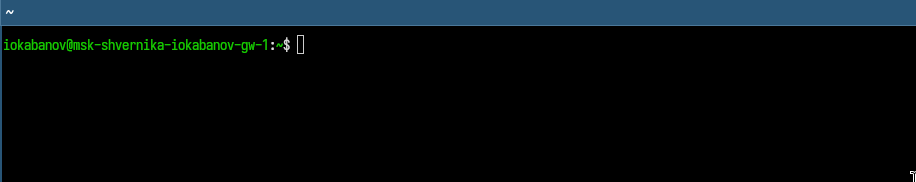{#fig-001 width=70%}

## Задание 2

Запишем в файл file.txt названия файлов, содержащихся в каталоге /etc. Допишем в этот же файл названия файлов, содержащихся в  домашнем каталоге. ([рис. @fig-002])

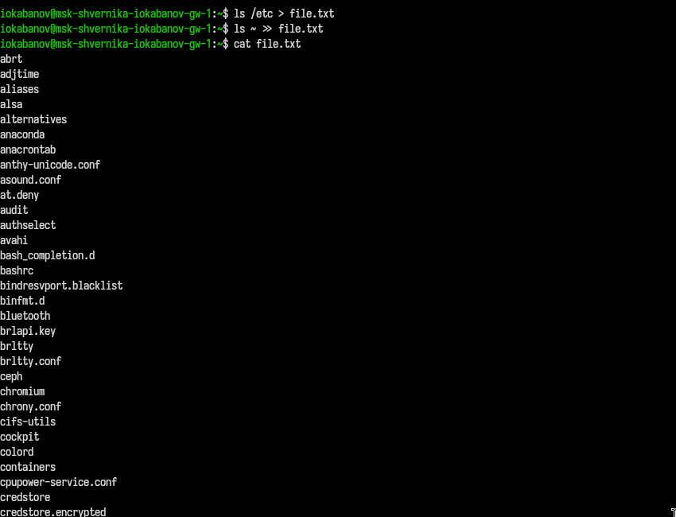{#fig-002 width=70%}

## Задание 3

Выведем имена всех файлов из file.txt, имеющих расширение .conf, после чего
запишем их в новый текстовой файл conf.txt. ([рис. @fig-003])

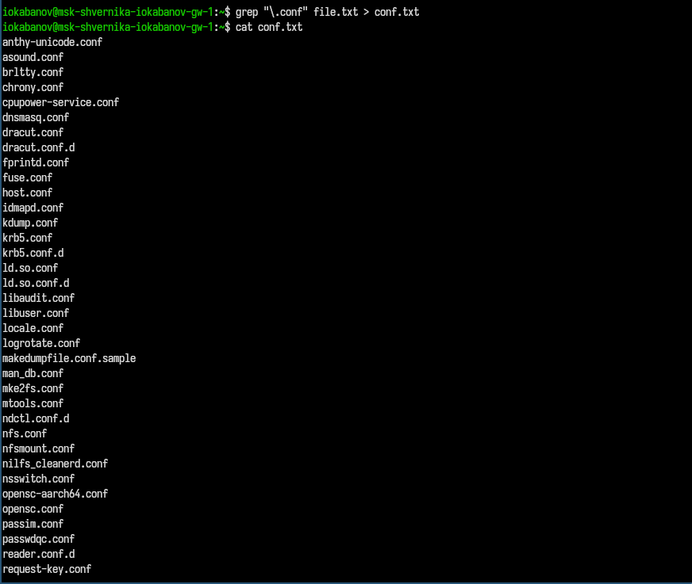{#fig-003 width=70%}

## Задание 4

Определим, какие файлы в домашнем каталоге имеют имена, начинавшиеся
с символа c. Сделаем это несколькими способами:  
- через ls ~ | grep "^c"
- через find ~ -maxdepth 1 -name "c*"
- через ls ~/c*
([рис. @fig-004])

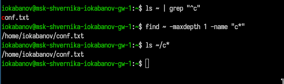{#fig-004 width=70%}

## Задание 5

Выведем на экран (по странично) имена файлов из каталога /etc, начинающиеся
с символа h. ([рис. @fig-005]) 

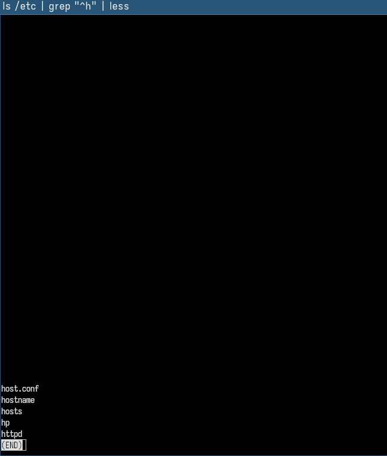{#fig-005 width=70%}

## Задание 6

Запустим в фоновом режиме процесс, который будет записывать в файл ~/logfile
файлы, имена которых начинаются с log. ([рис. @fig-006])  

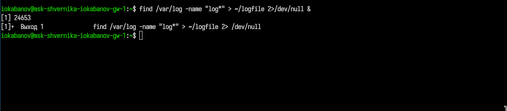{#fig-006 width=70%}

## Задание 7

Удалим файл ~/logfile. ([рис. @fig-007])

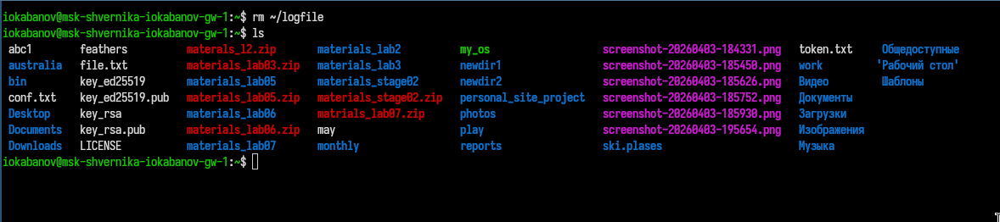{#fig-007 width=70%}

## Задание 8

Запустим из консоли в фоновом режиме редактор gedit.  ([рис. @fig-008]) 

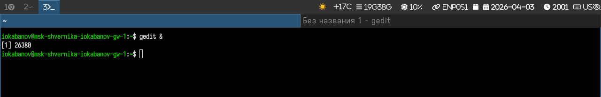{#fig-008 width=70%}

## Задание 9

Определим идентификатор процесса gedit, используя команду ps, конвейер и фильтр
grep, тремя способами:
- с помощью ps aux | grep gedit
- pgrep gedit
- pidof gedit
Идентификатор процесса: 26380 ([рис. @fig-009]) 

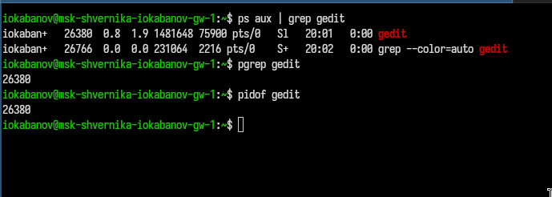{#fig-009 width=70%}

## Задание 10

Прочитав справку (man) команды kill ([рис. @fig-010]), используем эту команду для завершения
процесса gedit. ([рис. @fig-011]) 

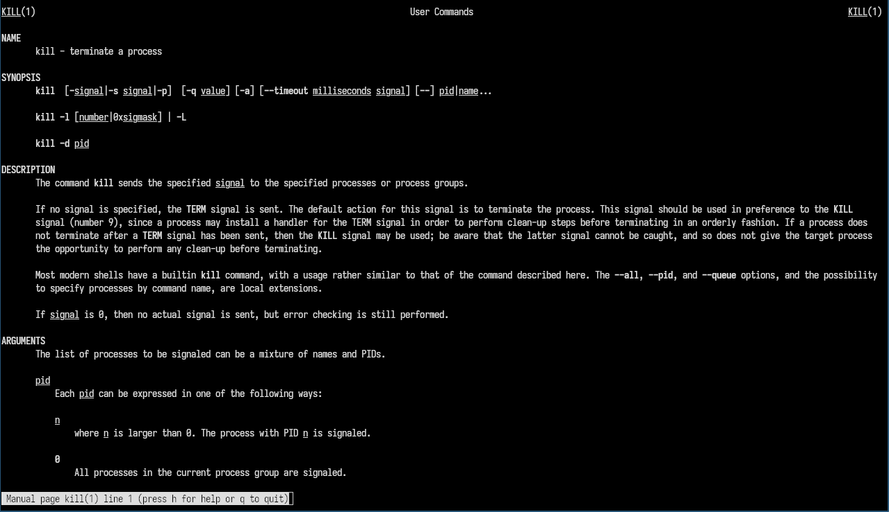{#fig-010 width=70%}

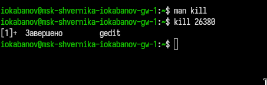{#fig-011 width=70%}

## Задание 11

Предварительно получив более подробную информацию
о командах df ([рис. @fig-012]) и du ([рис. @fig-013]) с помощью man, выполним их. ([рис. @fig-014]) ([рис. @fig-015]) 

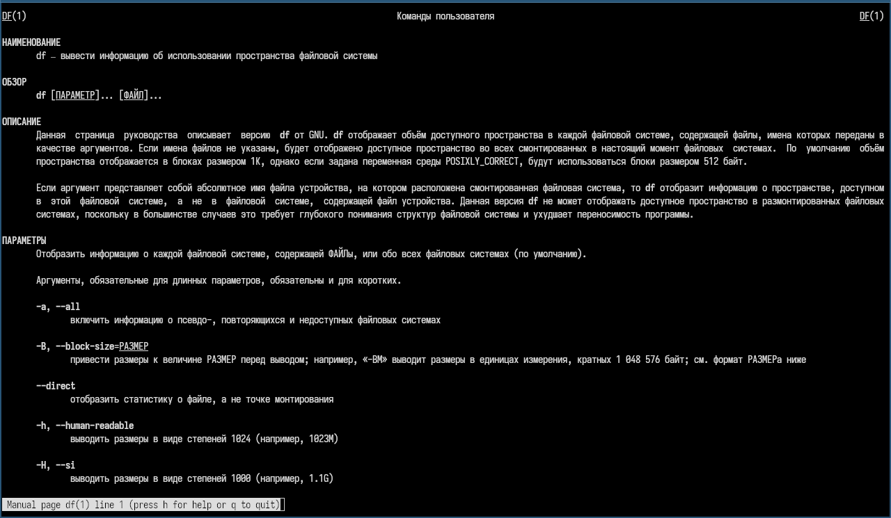{#fig-012 width=70%}

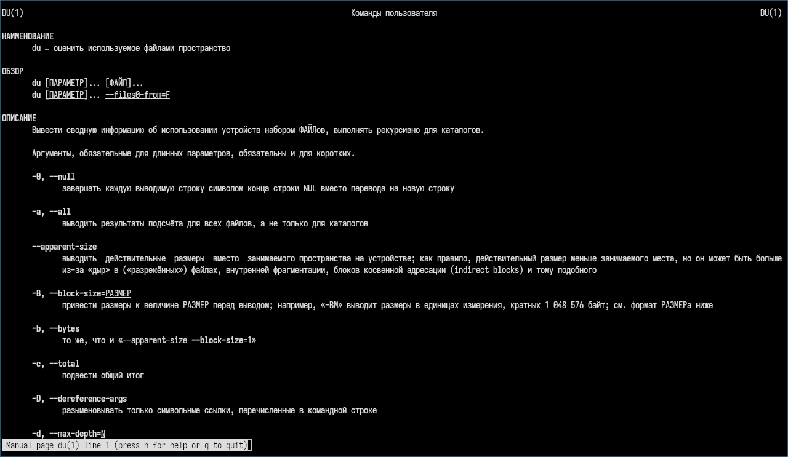{#fig-013 width=70%}

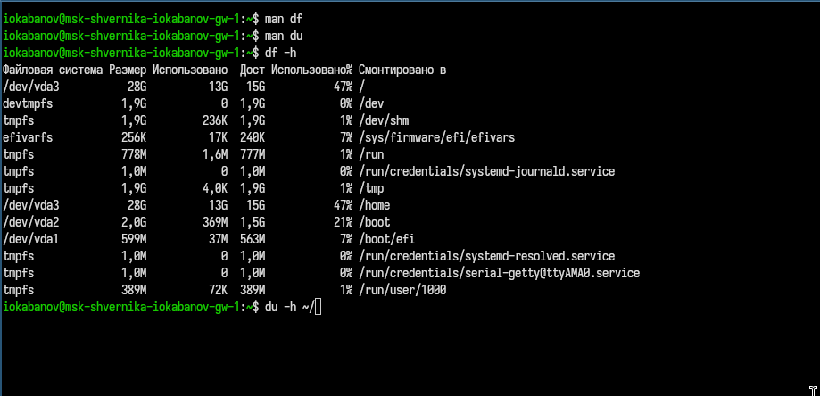{#fig-014 width=70%}

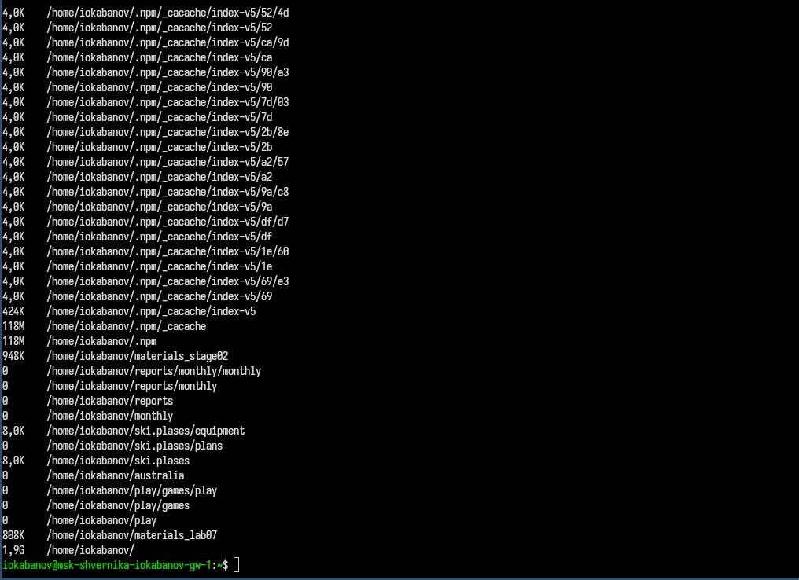{#fig-015 width=70%}

## Задание 12

Воспользовавшись справкой команды find ([рис. @fig-016]), выведем имена всех директорий, имеющихся в домашнем каталоге. ([рис. @fig-017])

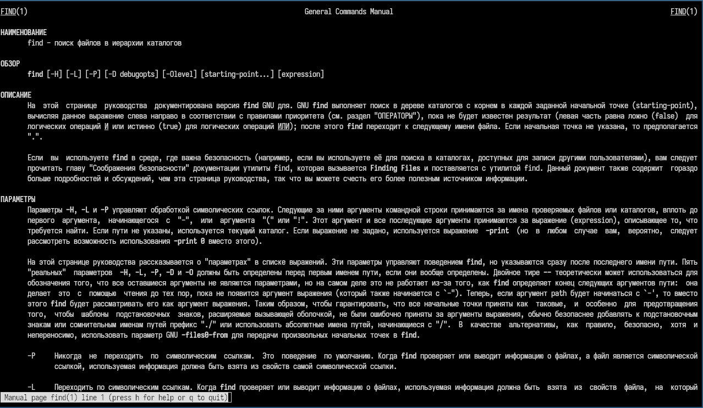{#fig-016 width=70%}

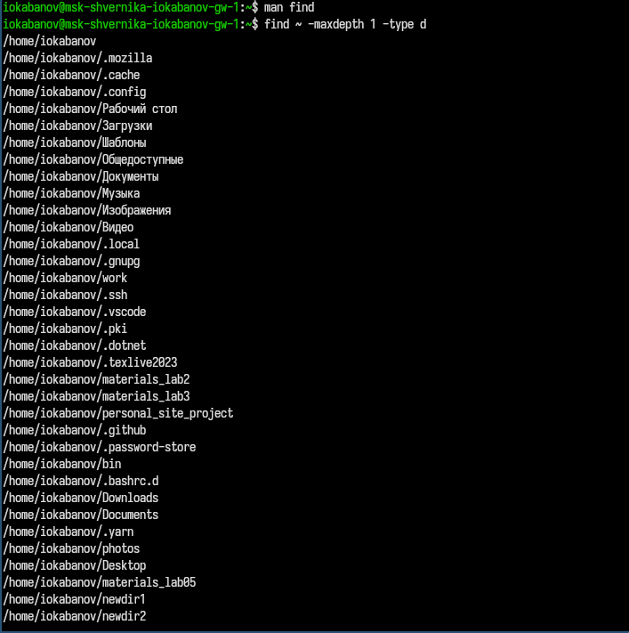{#fig-017 width=70%}

# Ответы на контрольные вопросы

### 1. Потоки ввода-вывода

В системе существует три стандартных потока:
- stdin (дескриптор 0) — стандартный ввод, по умолчанию клавиатура
- stdout (дескриптор 1) — стандартный вывод, по умолчанию консоль
- stderr (дескриптор 2) — вывод ошибок, по умолчанию консоль

### 2. Разница между > и >>

`>` перезаписывает файл (или создаёт новый, если файл не существует). `>>` дописывает данные в конец существующего файла, не удаляя его содержимое.

### 3. Конвейер

Конвейер (pipe, `|`) — механизм передачи вывода одной команды на вход другой. Например: `ls -la | grep conf` — вывод ls передаётся на вход grep.

### 4. Процесс и программа

Программа — это статический набор инструкций, хранящийся на диске. Процесс — это запущенная программа в памяти, которой выделены ресурсы системы (память, время CPU). Одна программа может порождать несколько процессов одновременно.

### 5. PID и GID

PID (Process ID) — уникальный числовой идентификатор процесса, присваиваемый системой при его запуске. GID (Group ID) — идентификатор группы пользователей, используется для управления правами доступа.

#### 6. Задачи

Задачи (jobs) — это процессы, запущенные в фоновом режиме из текущего сеанса терминала (с помощью `&`). Управление ими осуществляется командой `jobs` для просмотра и `kill %номер` для завершения.

### 7. top и htop

`top` — утилита для просмотра запущенных процессов в реальном времени, показывает загрузку CPU, памяти и список процессов. `htop` — улучшенная версия top с цветным интерфейсом, поддержкой мыши и более удобным управлением процессами.

### 8. Команда поиска файлов

Команда `find` выполняет поиск файлов по заданным критериям начиная с указанного каталога.

Примеры:
```bash
find ~ -name "f*"           # файлы на f в домашнем каталоге
find /etc -name "*.conf"    # файлы .conf в /etc
find ~ -type d              # только директории в домашнем каталоге
```

### 9. Поиск файла по содержимому

Да, можно. Для этого используется команда `grep`:
```bash
grep "искомый текст" имя_файла
grep -r "искомый текст" ~/   # рекурсивный поиск по каталогу
```

### 10. Объём свободной памяти на диске

Используется команда `df`:
```bash
df -h
```
Флаг `-h` выводит размеры в удобочитаемом формате (МБ, ГБ).

### 11. Объём домашнего каталога

Используется команда `du`:
```bash
du -sh ~/
```
Флаг `-s` выводит только итоговый размер, `-h` — в удобочитаемом формате.

### 12. Удаление зависшего процесса

Нужно узнать PID процесса и завершить его командой `kill`:
```bash
ps aux | grep имя_процесса   # узнать PID
kill PID                      # завершить процесс
kill -9 PID                   # принудительное завершение
```
Флаг `-9` отправляет сигнал SIGKILL, который нельзя игнорировать.

# Выводы

В ходе выполнения лабораторной работы были получены знания о работе с инструментами поиска файлов и фильтрации текстовых данных. Были приобретены практические навыки: по управлению процессами (и заданиями), по проверке использования диска и обслуживанию файловых систем.


# Список литературы{.unnumbered}

::: {#refs}
:::
