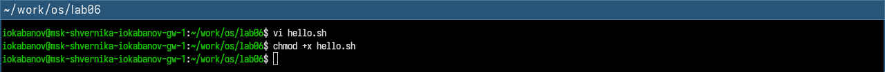
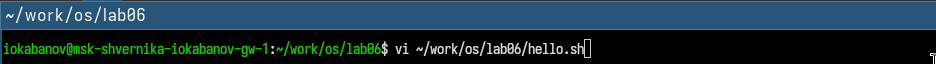
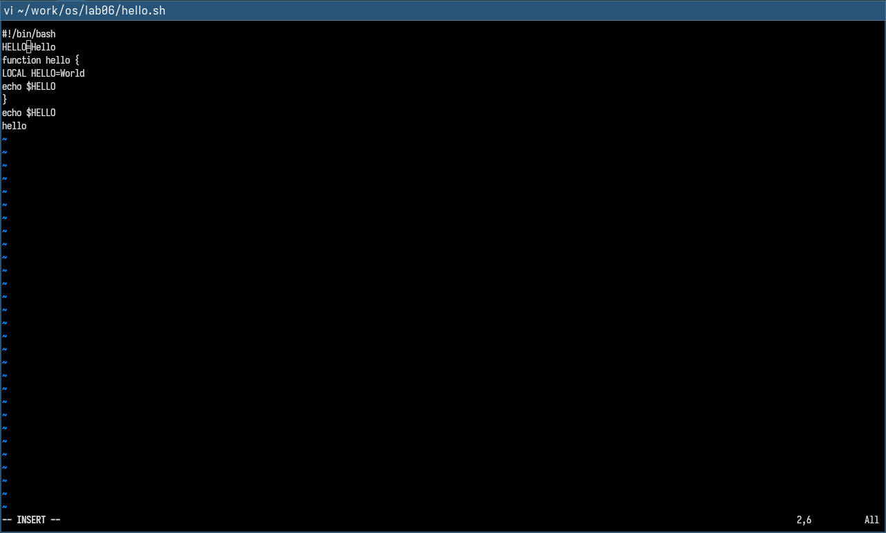
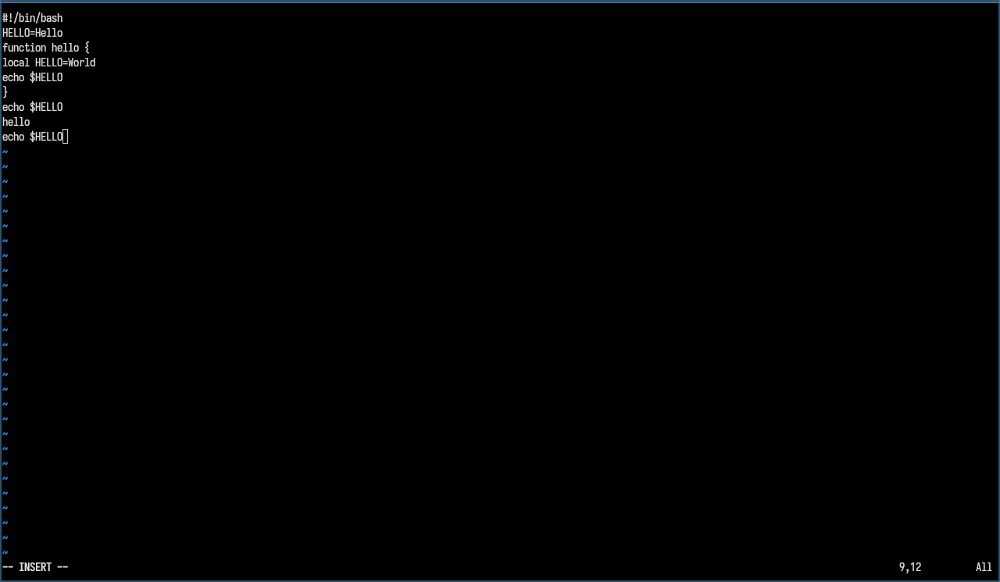
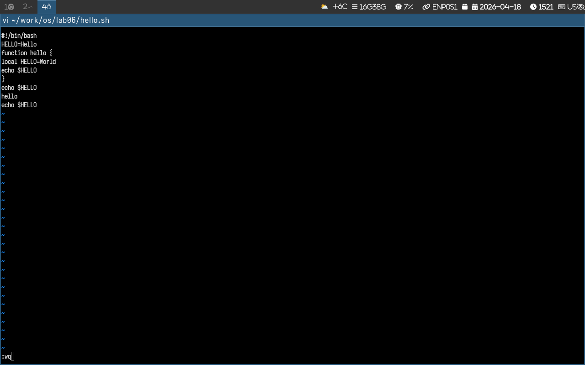

---
author:
  name: Кабанов Иван Олегович
  email: 1032253495@rudn.ru
  affiliation:
    - name: Российский университет дружбы народов
      country: Российская Федерация
      postal-code: 117198
      city: Москва
      address: ул. Миклухо-Маклая, д. 6

## Title
lang: ru-RU
fontenc: T2A
mainfont: "DejaVu Serif"
sansfont: "DejaVu Sans"
monofont: "DejaVu Sans Mono"
title: "Презентация по лабораторной работе №10"
subtitle: "Архитектура компьютеров и операционные системы. Раздел Операционные системы"
license: "CC BY"
date: today
date-format: "YYYY-MM-DD" # Example: 2025-09-06
---

# Информация

## Докладчик

:::::::::::::: {.columns align=center}
::: {.column width="70%"}

  * Кабанов Иван Олегович
  * студент группы НКАбд-03-25
  * Российский университет дружбы народов им. П. Лумумбы
  * [1032253495@rudn.ru](mailto:1032253495@rudn.ru)
  * <https://github.com/iokabanov/>

:::
::: {.column width="30%"}


:::
::::::::::::::


# Цель работы

Познакомиться с операционной системой Linux. Получить практические навыки работы с редактором vi, установленным по умолчанию практически во всех дистрибутивах.

# Задание 1. Создание нового файла с использованием vi

1. Создайте каталог с именем ~/work/os/lab06.
2. Перейдите во вновь созданный каталог.
3. Вызовите vi и создайте файл hello.sh
``` bash
   vi hello.sh
```
4. Нажмите клавишу i и вводите следующий текст.
``` bash
   #!/bin/bash
   HELL=Hello
   function hello {
    LOCAL HELLO=World
    echo $HELLO
    }
    echo $HELLO
    hello
```
5. Нажмите клавишу Esc для перехода в командный режим после завершения ввода текста.
6. Нажмите : для перехода в режим последней строки и внизу вашего экрана появится приглашение в виде двоеточия.
7. Нажмите w (записать) и q (выйти), а затем нажмите клавишу Enter для сохранения вашего текста и завершения работы.
8. Сделайте файл исполняемым
``` bash
chmod +x hello.sh
``` 

# Задание 2. Редактирование существующего файла

1. Вызовите vi на редактирование файла
``` bash
 vi ~/work/os/lab06/hello.sh
```
2. Установите курсор в конец слова HELL второй строки.
3. Перейдите в режим вставки и замените на HELLO. Нажмите Esc для возврата в командный режим.
4. Установите курсор на четвертую строку и сотрите слово LOCAL.
5. Перейдите в режим вставки и наберите следующий текст: local, нажмите Esc для возврата в командный режим.
6. Установите курсор на последней строке файла. Вставьте после неё строку, содержащую следующий текст: echo $HELLO.
7. Нажмите Esc для перехода в командный режим.
8. Удалите последнюю строку.
9. Введите команду отмены изменений u для отмены последней команды.
10. Введите символ : для перехода в режим последней строки. Запишите произведённые изменения и выйдите из vi.

# Теоретическое введение

## Указания к работе

В большинстве дистрибутивов Linux в качестве текстового редактора по умолчанию устанавливается интерактивный экранный редактор vi (Visual display editor).
Редактор vi имеет три режима работы:
– командный режим — предназначен для ввода команд редактирования и навигации по редактируемому файлу;
– режим вставки — предназначен для ввода содержания редактируемого файла;
– режим последней (или командной) строки — используется для записи изменений в файл
и выхода из редактора.
Для вызова редактора vi необходимо указать команду vi и имя редактируемого файла:
vi <имя_файла>
При этом в случае отсутствия файла с указанным именем будет создан такой файл.
Переход в командный режим осуществляется нажатием клавиши Esc . Для выхода из
редактора vi необходимо перейти в режим последней строки: находясь в командном режиме, нажать Shift-; (по сути символ : — двоеточие), затем:
– набрать символы wq, если перед выходом из редактора требуется записать изменения
в файл;
– набрать символ q (или q!), если требуется выйти из редактора без сохранения.

# Выполнение лабораторной работы

## Задание 1

### Пункты 1, 2, 3

Создадим каталог с именем ~/work/os/lab06. Перейдем во вновь созданный каталог. Вызовем vi и создадим файл hello.sh. ([рис. @fig-001])

{#fig-001 width=70%}

### Пункт 4

Нажмем клавишу i и введем текст из задания. ([рис. @fig-002])

{#fig-002 width=70%}

### Пункты 5, 6, 7

Нажмем клавишу Esc для перехода в командный режим после завершения ввода текста. Нажмем : для перехода в режим последней строки, а  затем  w (записать), q (выйти)  и Enter для сохранения
текста и завершения работы. ([рис. @fig-003])

{#fig-003 width=70%}

### Пункт 8

Сделаем файл исполняемым с помощью chmod ([рис. @fig-004])

{#fig-004 width=70%}

## Задание 2

### Пункт 1

Вызовем vi на редактирование файла. ([рис. @fig-005])

{#fig-005 width=70%}

### Пункты 2, 3

Установим курсор в конец слова HELL второй строки. Перейдем в режим вставки и заменим на HELLO. Нажмем Esc для возврата в команд-
ный режим. ([рис. @fig-006])

{#fig-006 width=70%}

### Пункты 4, 5

Установим курсор на четвертую строку и сотрем слово LOCAL.
Перейдем в режим вставки и наберем следующий текст: local, нажмем Esc для возврата в командный режим. ([рис. @fig-007])

{#fig-007 width=70%}

### Пункт 6

Установим курсор на последней строке файла. Вставим после неё строку, содержащую следующий текст: echo $HELLO. ([рис. @fig-008])

{#fig-008 width=70%}

### Пункты 7, 8

Нажмем Esc для перехода в командный режим и удалим последнюю строку. ([рис. @fig-009])

{#fig-009 width=70%}

### Пункт 9

Введем команду отмены изменений u для отмены последней команды.([рис. @fig-010])

{#fig-010 width=70%}

### Пункт 10

Введем символ : для перехода в режим последней строки. Запишем произведённые изменения и выйдите из vi. ([рис. @fig-011])

{#fig-011 width=70%}

# Выводы

В результате выполнения лабораторной работы были получены практические навыки работы с редактором vi, установленным по умолчанию практически во всех дистрибутивах Linux. Также были освоены дополнительные знания о Linux. 
