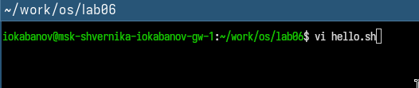
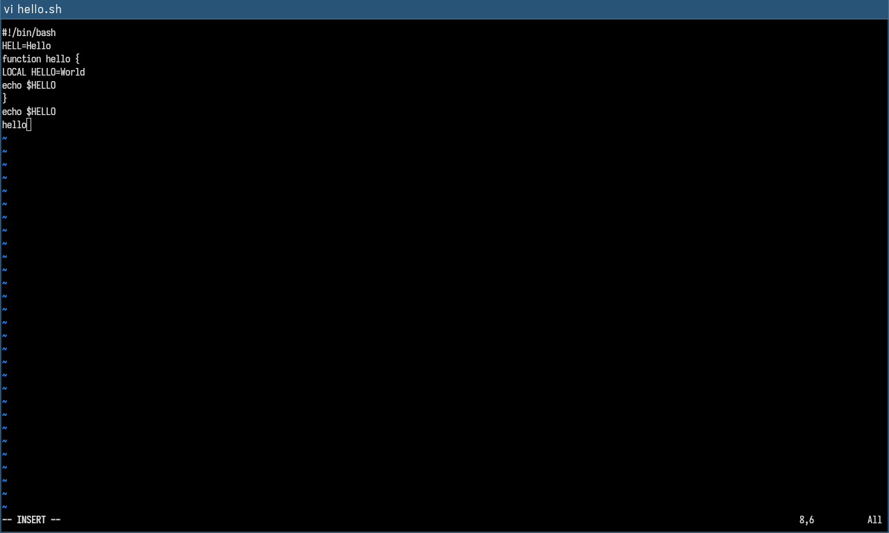
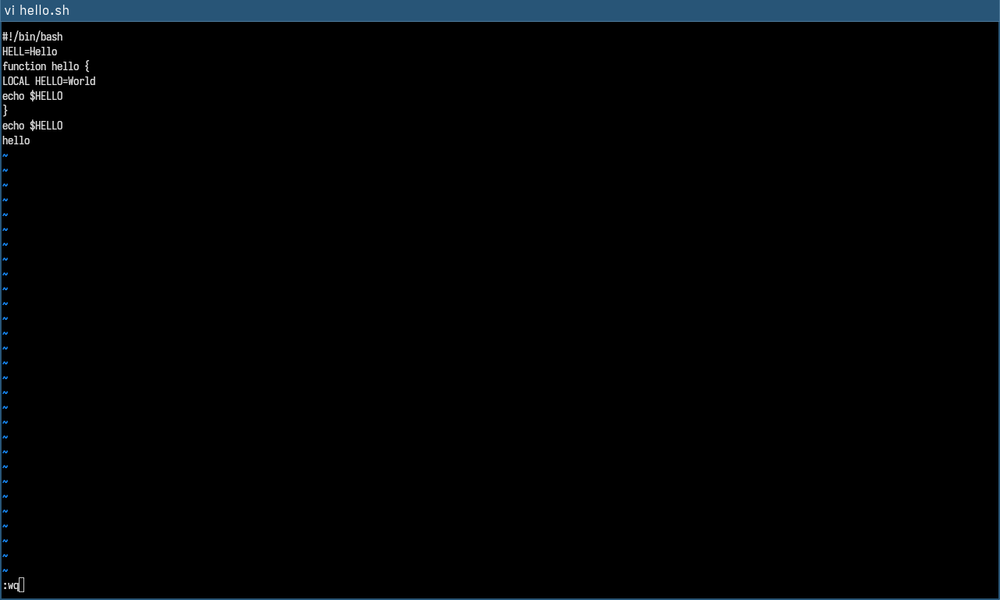
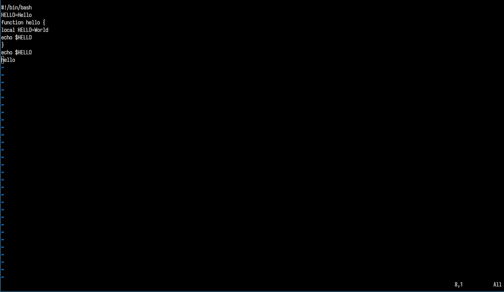
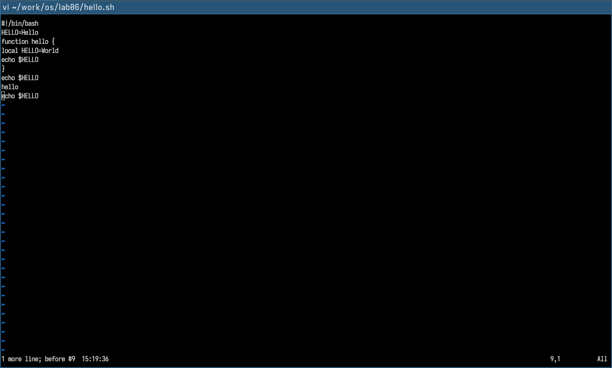

---
## Author
author:
  name: Кабанов Иван Олегович
  email: 1032253495@rudn.ru
  affiliation:
    - name: Российский университет дружбы народов
      country: Российская Федерация
      postal-code: 117198
      city: Москва
      address: ул. Миклухо-Маклая, д. 6

## Title
title: "Отчет по лабораторной работе №10"
subtitle: "Архитектура компьютеров и операционные системы. Раздел Операционные системы"
license: "CC BY"
---

# Цель работы

Познакомиться с операционной системой Linux. Получить практические навыки работы с редактором vi, установленным по умолчанию практически во всех дистрибутивах.

# Задание 1. Создание нового файла с использованием vi

1. Создайте каталог с именем ~/work/os/lab06.
2. Перейдите во вновь созданный каталог.
3. Вызовите vi и создайте файл hello.sh
``` bash
   vi hello.sh
```
4. Нажмите клавишу i и вводите следующий текст.
``` bash
   #!/bin/bash
   HELL=Hello
   function hello {
    LOCAL HELLO=World
    echo $HELLO
    }
    echo $HELLO
    hello
```
5. Нажмите клавишу Esc для перехода в командный режим после завершения ввода текста.
6. Нажмите : для перехода в режим последней строки и внизу вашего экрана появится приглашение в виде двоеточия.
7. Нажмите w (записать) и q (выйти), а затем нажмите клавишу Enter для сохранения вашего текста и завершения работы.
8. Сделайте файл исполняемым
``` bash
chmod +x hello.sh
``` 

# Задание 2. Редактирование существующего файла

1. Вызовите vi на редактирование файла
``` bash
 vi ~/work/os/lab06/hello.sh
```
2. Установите курсор в конец слова HELL второй строки.
3. Перейдите в режим вставки и замените на HELLO. Нажмите Esc для возврата в командный режим.
4. Установите курсор на четвертую строку и сотрите слово LOCAL.
5. Перейдите в режим вставки и наберите следующий текст: local, нажмите Esc для возврата в командный режим.
6. Установите курсор на последней строке файла. Вставьте после неё строку, содержащую следующий текст: echo $HELLO.
7. Нажмите Esc для перехода в командный режим.
8. Удалите последнюю строку.
9. Введите команду отмены изменений u для отмены последней команды.
10. Введите символ : для перехода в режим последней строки. Запишите произведённые изменения и выйдите из vi.

# Теоретическое введение

## Указания к работе

В большинстве дистрибутивов Linux в качестве текстового редактора по умолчанию устанавливается интерактивный экранный редактор vi (Visual display editor).
Редактор vi имеет три режима работы:
– командный режим — предназначен для ввода команд редактирования и навигации по редактируемому файлу;
– режим вставки — предназначен для ввода содержания редактируемого файла;
– режим последней (или командной) строки — используется для записи изменений в файл
и выхода из редактора.
Для вызова редактора vi необходимо указать команду vi и имя редактируемого файла:
vi <имя_файла>
При этом в случае отсутствия файла с указанным именем будет создан такой файл.
Переход в командный режим осуществляется нажатием клавиши Esc . Для выхода из
редактора vi необходимо перейти в режим последней строки: находясь в командном режиме, нажать Shift-; (по сути символ : — двоеточие), затем:
– набрать символы wq, если перед выходом из редактора требуется записать изменения
в файл;
– набрать символ q (или q!), если требуется выйти из редактора без сохранения.

# Выполнение лабораторной работы

## Задание 1

### Пункты 1, 2, 3

Создадим каталог с именем ~/work/os/lab06. Перейдем во вновь созданный каталог. Вызовем vi и создадим файл hello.sh. ([рис. @fig-001])

{#fig-001 width=70%}

### Пункт 4

Нажмем клавишу i и введем текст из задания. ([рис. @fig-002])

{#fig-002 width=70%}

### Пункты 5, 6, 7

Нажмем клавишу Esc для перехода в командный режим после завершения ввода текста. Нажмем : для перехода в режим последней строки, а  затем  w (записать), q (выйти)  и Enter для сохранения
текста и завершения работы. ([рис. @fig-003])

{#fig-003 width=70%}

### Пункт 8

Сделаем файл исполняемым с помощью chmod ([рис. @fig-004])

{#fig-004 width=70%}

## Задание 2

### Пункт 1

Вызовем vi на редактирование файла. ([рис. @fig-005])

{#fig-005 width=70%}

### Пункты 2, 3

Установим курсор в конец слова HELL второй строки. Перейдем в режим вставки и заменим на HELLO. Нажмем Esc для возврата в команд-
ный режим. ([рис. @fig-006])

{#fig-006 width=70%}

### Пункты 4, 5

Установим курсор на четвертую строку и сотрем слово LOCAL.
Перейдем в режим вставки и наберем следующий текст: local, нажмем Esc для возврата в командный режим. ([рис. @fig-007])

{#fig-007 width=70%}

### Пункт 6

Установим курсор на последней строке файла. Вставим после неё строку, содержащую следующий текст: echo $HELLO. ([рис. @fig-008])

{#fig-008 width=70%}

### Пункты 7, 8

Нажмем Esc для перехода в командный режим и удалим последнюю строку. ([рис. @fig-009])

{#fig-009 width=70%}

### Пункт 9

Введем команду отмены изменений u для отмены последней команды.([рис. @fig-010])

{#fig-010 width=70%}

### Пункт 10

Введем символ : для перехода в режим последней строки. Запишем произведённые изменения и выйдите из vi. ([рис. @fig-011])

{#fig-011 width=70%}

# Ответы на контрольные вопросы

## 1. Режимы работы

vi имеет три режима:

- Командный — режим по умолчанию, клавиши выполняют команды, не вводят текст
- Режим вставки — ввод и редактирование текста (вход через `i`, `a`, `o` и др.)
- Режим последней строки — ввод команд поиска, замены, сохранения (вход через `:`, `/`, `?`)

## 2. Выход без сохранения

Из командного режима набрать:
```
:q!
```
Символ `!` форсирует выход, игнорируя несохранённые изменения.

## 3. Команды позиционирования

- `h` / `l` — влево / вправо на символ
- `j` / `k` — вниз / вверх на строку
- `w` — вперёд на слово, `b` — назад на слово, `e` — конец слова
- `0` — начало строки, `$` — конец строки
- `gg` — начало файла, `G` — конец файла
- `nG` или `:n` — перейти на строку n
- `Ctrl+F` / `Ctrl+B` — вперёд / назад на страницу

## 4. Слово в vi

Слово — это последовательность символов, ограниченная пробелами, табуляцией, переводом строки или знаками пунктуации. Команды `w`, `b`, `e` оперируют словами. Варианты с заглавными буквами (`W`, `B`, `E`) считают словом всё между пробелами, игнорируя пунктуацию.

## 5. Переход в начало и конец файла

- Начало файла: `gg` или `1G` или `:1`
- Конец файла: `G` или `:$`

Работают из любого места файла в командном режиме.

## 6. Основные группы команд редактирования

- Вставка: `i` — перед курсором, `a` — после, `o` — новая строка ниже, `O` — выше
- Удаление: `x` — символ, `dw` — слово, `dd` — строка, `d$` — до конца строки
- Замена: `r` — один символ, `R` — режим замены, `cw` — заменить слово
- Копирование: `yy` — скопировать строку, `yw` — слово
- Вставка скопированного: `p` — после курсора, `P` — перед
- Повтор: `.` — повторить последнее изменение

## 7. Заполнение строки символами $

1. Перейти на нужную строку
2. В командном режиме: `0` — встать в начало строки
3. Войти в режим вставки: `i`
4. Набрать нужное количество символов `$`
5. Либо использовать мультипликатор: `Esc`, затем `100i$`, затем `Esc` — вставит 100 символов `$`

## 8. Отмена некорректного действия

- `u` — отменить последнее действие (undo)
- `U` — восстановить всю строку в исходное состояние
- `Ctrl+R` — повторить отменённое действие (redo)

Нажатия `u` можно повторять для последовательной отмены.

## 9. Основные группы команд режима последней строки

- Файловые операции: `:w` — сохранить, `:w file` — сохранить в файл, `:q` — выйти, `:wq` — сохранить и выйти, `:q!` — выйти без сохранения
- Поиск: `/pattern` — вперёд, `?pattern` — назад, `n` / `N` — следующее вхождение
- Замена: `:%s/old/new/g` — глобальная замена, `:n,ms/old/new/g` — в диапазоне строк
- Настройки: `:set option` — установить опцию, `:set nooption` — снять
- Переход: `:n` — на строку n

## 10. Определение конца строки без перемещения курсора

В командном режиме:
```
g$
```
или использовать команду `:set ruler` — включает отображение номера строки и столбца в строке состояния, что позволяет видеть общую длину строки. Также можно нажать `$` — курсор перейдёт в конец строки и в строке состояния отобразится позиция.

## 11. Анализ опций редактора vi

Посмотреть все текущие опции:
```
:set all
```
Количество опций — несколько десятков (в зависимости от реализации: vi, vim, nvi). В vim их более 400.

Узнать назначение конкретной опции:
```
:help имя_опции
```
Часто используемые опции:

- `number` / `nu` — показывать номера строк
- `autoindent` — автоотступ
- `tabstop=n` — ширина табуляции
- `ignorecase` — игнорировать регистр при поиске
- `hlsearch` — подсвечивать найденное
- `wrap` — перенос длинных строк

## 12. Определение текущего режима

- Командный режим — нет никаких индикаторов внизу экрана
- Режим вставки — внизу отображается `-- INSERT --`
- Режим замены — внизу `-- REPLACE --`
- Режим последней строки — внизу отображается `:`, `/` или `?` с вводимой командой

Для надёжности можно включить: `:set showmode`

## 13. Граф взаимосвязи режимов

```
                    i, a, o, I, A, O, s, c...
                   ┌─────────────────────────────┐
                   ▼                             │
        ┌──────────────────┐          ┌──────────────────┐
        │   Режим вставки  │          │  Командный режим │
        └──────────────────┘          └──────────────────┘
                   │                       ▲      │
                  Esc                      │      │  :  /  ?
                   └───────────────────────┘      │
                                                  ▼
                                     ┌──────────────────────┐
                                     │ Режим последней стро-│
                                     │       ки             │
                                     └──────────────────────┘
                                                  │
                                          Enter / Esc
                                                  │
                                                  ▼
                                          Командный режим
```

Переходы:
- Командный → Вставка: `i`, `a`, `o`, `I`, `A`, `O`, `c`, `s`
- Вставка → Командный: `Esc`
- Командный → Последняя строка: `:`, `/`, `?`
- Последняя строка → Командный: `Enter` (выполнить) или `Esc` (отмена)
- Прямого перехода между режимом вставки и последней строки нет

# Выводы

В результате выполнения лабораторной работы были получены практические навыки работы с редактором vi, установленным по умолчанию практически во всех дистрибутивах Linux. Также были освоены дополнительные знания о Linux. 


# Список литературы{.unnumbered}

::: {#refs}
:::
