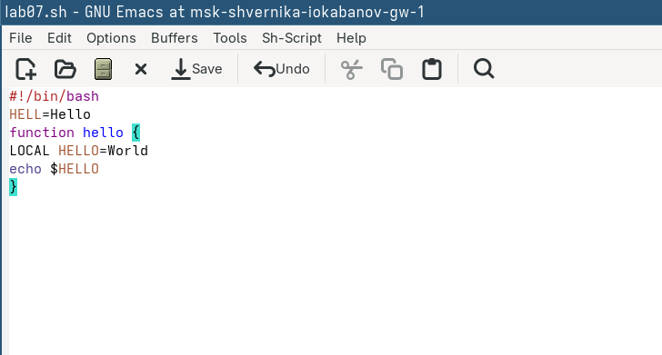
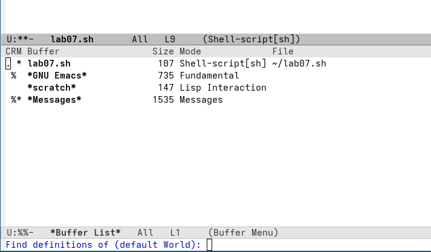
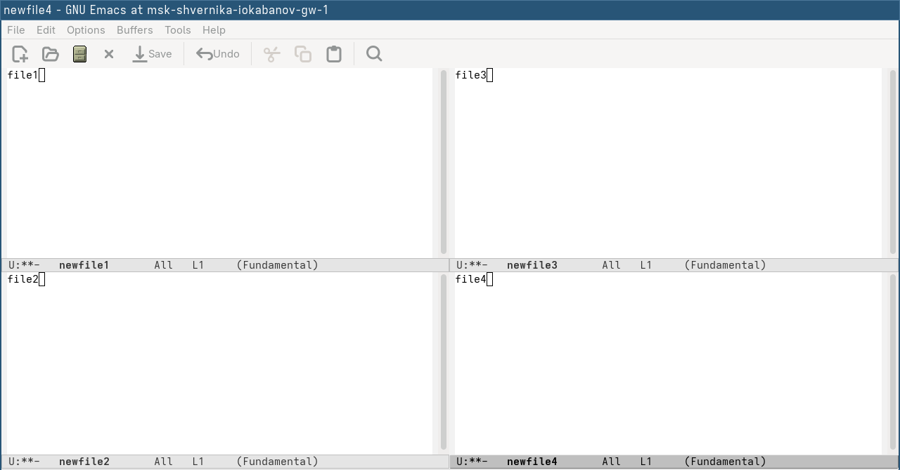

---
author:
  name: Кабанов Иван Олегович
  email: 1032253495@rudn.ru
  affiliation:
    - name: Российский университет дружбы народов
      country: Российская Федерация
      postal-code: 117198
      city: Москва
      address: ул. Миклухо-Маклая, д. 6

## Title
lang: ru-RU
fontenc: T2A
mainfont: "DejaVu Serif"
sansfont: "DejaVu Sans"
monofont: "DejaVu Sans Mono"
title: "Презентация по лабораторной работе №11"
subtitle: "Архитектура компьютеров и операционные системы. Раздел Операционные системы"
license: "CC BY"
date: today
date-format: "YYYY-MM-DD" # Example: 2025-09-06
---

# Информация

## Докладчик

:::::::::::::: {.columns align=center}
::: {.column width="70%"}

  * Кабанов Иван Олегович
  * студент группы НКАбд-03-25
  * Российский университет дружбы народов им. П. Лумумбы
  * [1032253495@rudn.ru](mailto:1032253495@rudn.ru)
  * <https://github.com/iokabanov/>

:::
::: {.column width="30%"}

:::
::::::::::::::

# Цель работы

Познакомиться с операционной системой Linux. Получить практические навыки работы с редактором Emacs.

# Последовательность выполнения лабораторной работы

1. Ознакомиться с теоретическим материалом.
2. Ознакомиться с редактором emacs.
3. Выполнить упражнения.
4. Ответить на контрольные вопросы.

# Теоретическое введение

## Указания к работе

Emacs представляет собой мощный экранный редактор текста, написанный на языке
высокого уровня Elisp.

## Основные термины Emacs

Буфер — объект, представляющий какой-либо текст.
Фрейм соответствует окну в обычном понимании этого слова. Каждый
фрейм содержит область вывода и одно или несколько окон Emacs.
Окно — прямоугольная область фрейма, отображающая один из буферов.
Область вывода — одна или несколько строк внизу фрейма, в которой
Emacs выводит различные сообщения, а также запрашивает подтверждения и дополнительную информацию от пользователя.
Минибуфер используется для ввода дополнительной информации и все-
гда отображается в области вывода.
Точка вставки — место вставки (удаления) данных в буфере.
Режим — пакет расширений, изменяющий поведение буфера Emacs при
редактировании и просмотре текста (например, для редактирования исходного текста
программ на языках С или Perl).

# Выполнение лабораторной работы

## Задания 1 - 4

Откроем emacs, создадим файл lab07.sh с помощью комбинации Ctrl-x Ctrl-f и наберем текст из задания([рис. @fig-001])

{#fig-001 width=70%}

## Задание 5

Проделаем с текстом стандартные процедуры редактирования: 

Вырежем одной командой целую строку (С-k). ([рис. @fig-003])

{#fig-003 width=70%}

## Задание 6

Научимся использовать команды по перемещению курсора.
Переместим курсор в начало строки (C-a). ([рис. @fig-009])

{#fig-009 width=70%}

## Задание 7

Выведем список активных буферов на экран (C-x C-b). ([рис. @fig-013]) Переместимся во вновь открытое окно (C-x) o со списком открытых буферов и переключимся на другой буфер. Закроем это окно (C-x 0). Теперь вновь переключаемся между буферами, но уже без вывода их списка на экран (C-x b).

{#fig-013 width=70%}

## Задание 8

Поделим фрейм на 4 части: разделим фрейм на два окна по вертикали (C-x 3), а затем каждое из этих окон на две части по горизонтали (C-x 2). В каждом из четырёх созданных окон откроем новый буфер (файл) и введем текст. ([рис. @fig-014])

{#fig-014 width=70%}

## Задание 9

Переключимся в режим поиска (C-s) и найдем слово file, присутствующее в тексте. Нажимая C-s переключаемся между результатами поиска ([рис. @fig-015]).

{#fig-015 width=70%}

# Выводы

В результате выполнения лабораторной работы были получены практические навыки работы с редактором emacs, расширены знания о Linux.
