---
## Author
author:
  name: Кабанов Иван Олегович
  email: 1032253495@rudn.ru
  affiliation:
    - name: Российский университет дружбы народов
      country: Российская Федерация
      postal-code: 117198
      city: Москва
      address: ул. Миклухо-Маклая, д. 6

## Title
title: "Отчет по лабораторной работе №11"
subtitle: "Архитектура компьютеров и операционные системы. Раздел Операционные системы"
license: "CC BY"
---

# Цель работы

Познакомиться с операционной системой Linux. Получить практические навыки работы с редактором Emacs.

# Последовательность выполнения лабораторной работы

1. Ознакомиться с теоретическим материалом.
2. Ознакомиться с редактором emacs.
3. Выполнить упражнения.
4. Ответить на контрольные вопросы.

# Теоретическое введение

## Указания к работе

Emacs представляет собой мощный экранный редактор текста, написанный на языке
высокого уровня Elisp.

## Основные термины Emacs

Буфер — объект, представляющий какой-либо текст.

Фрейм соответствует окну в обычном понимании этого слова. Каждый
фрейм содержит область вывода и одно или несколько окон Emacs.

Окно — прямоугольная область фрейма, отображающая один из буферов.

Область вывода — одна или несколько строк внизу фрейма, в которой
Emacs выводит различные сообщения, а также запрашивает подтверждения и дополни-
тельную информацию от пользователя.

Минибуфер используется для ввода дополнительной информации и все-
гда отображается в области вывода.

Точка вставки — место вставки (удаления) данных в буфере.

Режим — пакет расширений, изменяющий поведение буфера Emacs при
редактировании и просмотре текста (например, для редактирования исходного текста
программ на языках С или Perl).

# Выполнение лабораторной работы

## Задания 1 - 4

Откроем emacs, создадим файл lab07.sh с помощью комбинации Ctrl-x Ctrl-f и наберем текст из задания([рис. @fig-001])

{#fig-001 width=70%}

Сохраним файл с помощью комбинации Ctrl-x Ctrl-s. ([рис. @fig-002])

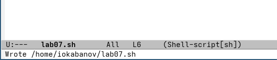{#fig-002 width=70%}

## Задание 5

Проделаем с текстом стандартные процедуры редактирования: 

Вырежем одной командой целую строку (С-k). ([рис. @fig-003])

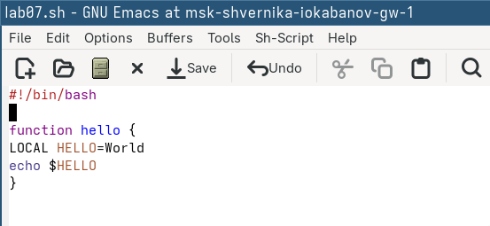{#fig-003 width=70%}

Вставим эту строку в конец файла (C-y).([рис. @fig-004])

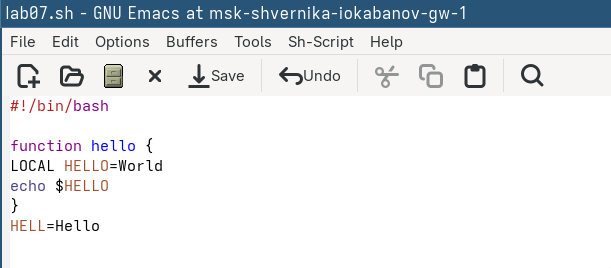{#fig-004 width=70%}

Выделим область текста (C-space). ([рис. @fig-005])

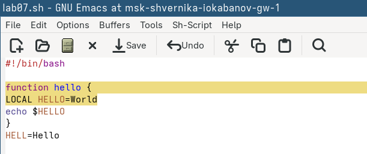{#fig-005 width=70%}

Скопируем область в буфер обмена и вставим ее в конец файла. ([рис. @fig-006])

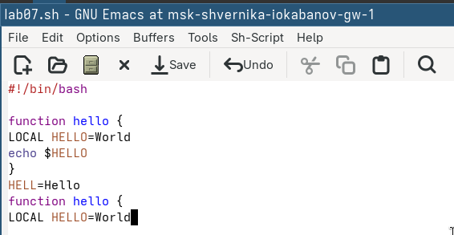{#fig-006 width=70%}

Вновь выделяем эту область и на этот раз вырезать её (C-w). ([рис. @fig-007])

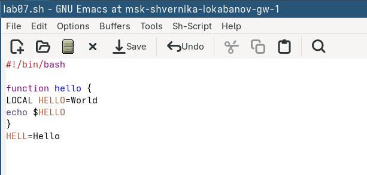{#fig-007 width=70%}

Отменяем последнее действие. ([рис. @fig-008])

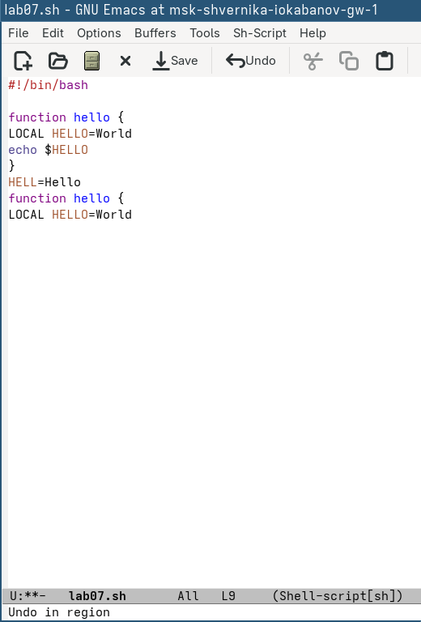{#fig-008 width=70%}

## Задание 6

Научимся использовать команды по перемещению курсора.
Переместим курсор в начало строки (C-a). ([рис. @fig-009])

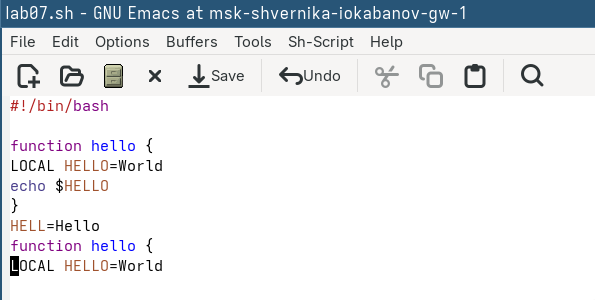{#fig-009 width=70%}

Переместим курсор в конец строки (C-e). ([рис. @fig-010])

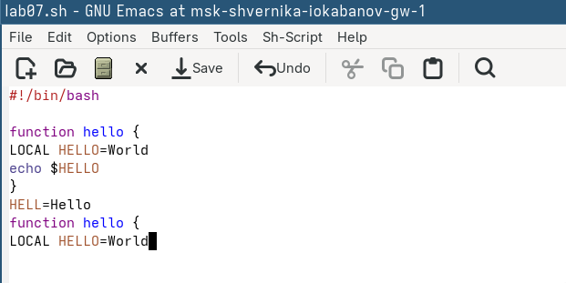{#fig-010 width=70%}

Переместим курсор в начало буфера (M-<). ([рис. @fig-011])

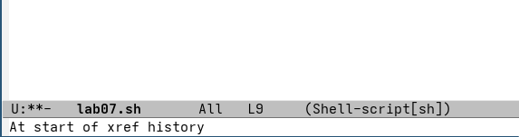{#fig-011 width=70%}

Переместим курсор в конец буфера (M->). ([рис. @fig-012])

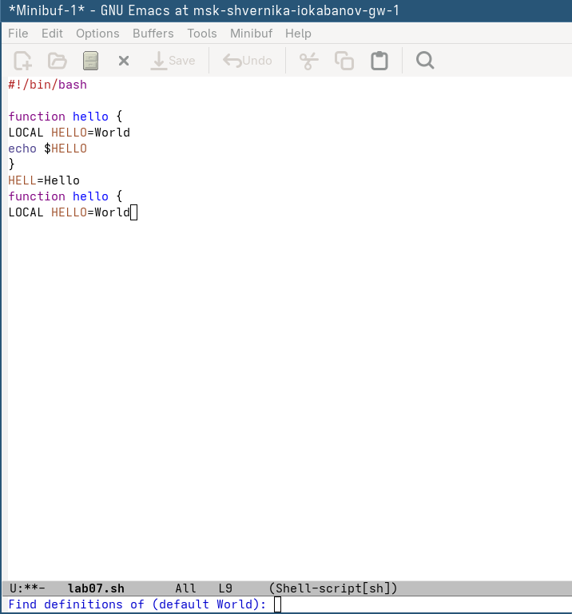{#fig-012 width=70%}

## Задание 7

Выведем список активных буферов на экран (C-x C-b). ([рис. @fig-013]) Переместимся во вновь открытое окно (C-x) o со списком открытых буферов и переключимся на другой буфер. Закроем это окно (C-x 0). Теперь вновь переключаемся между буферами, но уже без вывода их списка на экран (C-x b).

{#fig-013 width=70%}

## Задание 8

Поделим фрейм на 4 части: разделим фрейм на два окна по вертикали (C-x 3), а затем каждое из этих окон на две части по горизонтали (C-x 2). В каждом из четырёх созданных окон откроем новый буфер (файл) и введем текст. ([рис. @fig-014])

{#fig-014 width=70%}

## Задание 9

Переключимся в режим поиска (C-s) и найдем слово file, присутствующее в тексте. Нажимая C-s переключаемся между результатами поиска ([рис. @fig-015]).

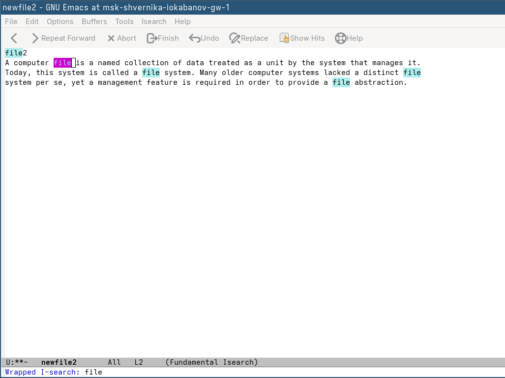{#fig-015 width=70%}

Выйдем из режима поиска, нажав C-g. и перейдем в режим поиска и замены (M-%). Введем текст, который следует найти
и заменить (Many в данном случае) ([рис. @fig-016]), нажмем Enter, затем введем текст для замены (A lot of в данном случае) ([рис. @fig-017]). После того как будут подсвечены результаты поиска, нажмем ! для подтверждения замены.

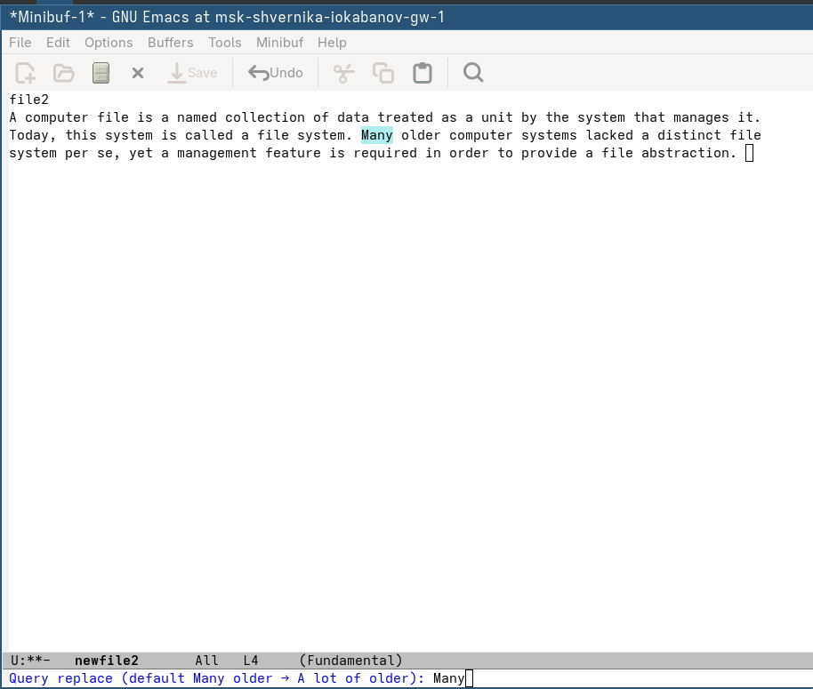{#fig-016 width=70%}

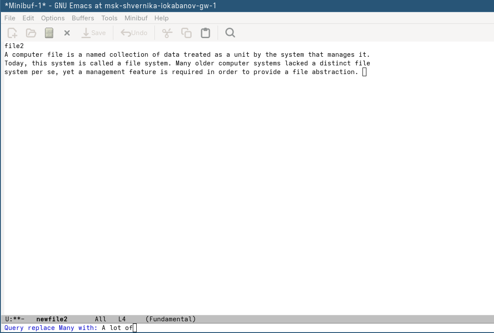{#fig-017 width=70%}

Попробуем другой режим поиска, нажав M-s o. ([рис. @fig-018])

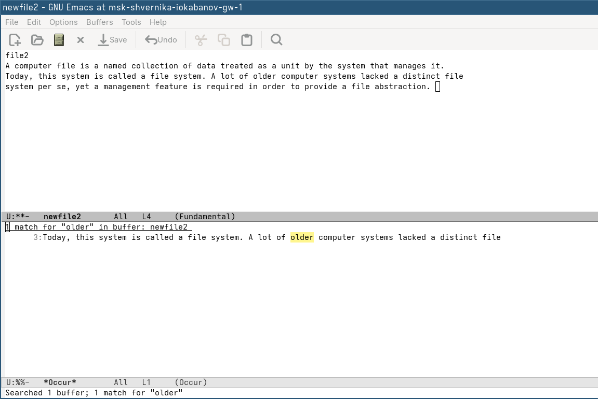{#fig-018 width=70%}

C-s - инкрементальный поиск: по мере ввода символов курсор перемещается к первому совпадению прямо в тексте. Пользователь остаётся в буфере и видит результат сразу.
M-s o (occur) - показывает все строки с совпадением сразу в отдельном буфере Occur, с номерами строк. Удобно для обзора всех вхождений целиком, а не поиска по одному.​​​​​​​​​

# Ответы на контрольные вопросы

## 1. Краткая характеристика Emacs

Emacs — мощный расширяемый текстовый редактор, созданный Ричардом Столлманом. Он построен на основе языка Emacs Lisp, что позволяет практически безгранично настраивать и расширять его функциональность. Фактически, Emacs — это целая среда для работы: в нём можно редактировать код, читать почту, просматривать файлы и многое другое.

## 2. Сложности для новичка

- Огромное количество сочетаний клавиш, которые нужно запомнить
- Нестандартная терминология (буфер, фрейм, окно)
- Специфические модификаторы: C- (Ctrl), M- (Meta/Alt)
- Необходимость знания Emacs Lisp для глубокой настройки
- Отсутствие привычного интерфейса из коробки

## 3. Буфер и окно в терминологии Emacs

Буфер — это область памяти, в которой хранится содержимое файла или какие-либо данные (например, результат команды). Файл при открытии загружается в буфер, и редактирование происходит именно в нём.

Окно в Emacs — это не отдельное системное окно, а область отображения внутри фрейма (того, что обычно называют окном). Через окно пользователь видит содержимое одного из буферов.

## 4. Можно ли открыть больше 10 буферов в одном окне?

Да. Количество буферов не ограничено. В одном окне отображается один буфер, но переключаться между ними можно сколько угодно раз командой C-x b.

## 5. Буферы по умолчанию при запуске Emacs

- `*scratch*` — буфер для произвольных заметок и вычислений на Emacs Lisp
- `*Messages*` — буфер с системными сообщениями и логами редактора

## 6. Ввод комбинаций C-c | и C-c C-|

- C-c | — нажать Ctrl+C, отпустить, затем нажать Shift+\\ (чтобы получить |)
- C-c C-| — нажать Ctrl+C, отпустить, затем нажать Ctrl+Shift+\\ (Ctrl и | одновременно)

## 7. Разделение окна на две части

- По горизонтали: C-x 2 (одно над другим)
- По вертикали: C-x 3 (рядом)

## 8. Файл настроек Emacs

Настройки хранятся в файле ~/.emacs или ~/.emacs.d/init.el в домашней директории пользователя.

## 9. Клавиша Backspace (←)

Клавиша Backspace удаляет символ слева от курсора. Да, её можно переназначить с помощью функции global-set-key в конфигурационном файле, например:

```lisp
(global-set-key (kbd "<backspace>") 'some-function)
```

## 10. Какой редактор удобнее: vi или Emacs?

На мой взгляд, vi (vim) удобнее для начала работы в терминальной среде, поскольку он есть практически в любой Unix-системе и быстро запускается. Однако Emacs выигрывает при долгосрочной работе за счёт гибкости настройки и встроенных инструментов. Выбор зависит от задач: для быстрого редактирования конфигов удобнее vi, для полноценной разработки — Emacs.

# Выводы

В результате выполнения лабораторной работы были получены практические навыки работы с редактором emacs, расширены знания о Linux.

# Список литературы{.unnumbered}

::: {#refs}
:::
