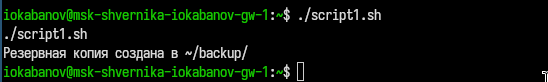
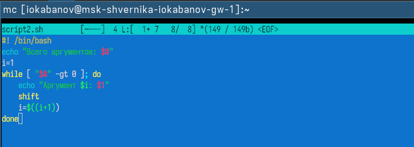
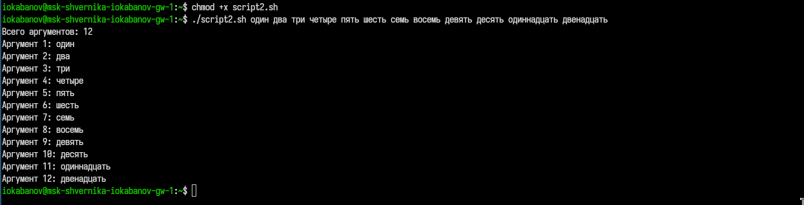
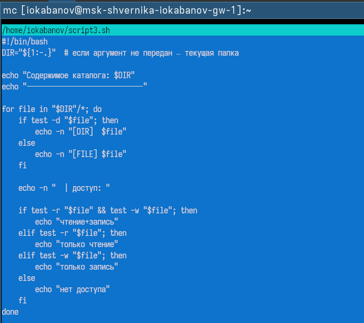
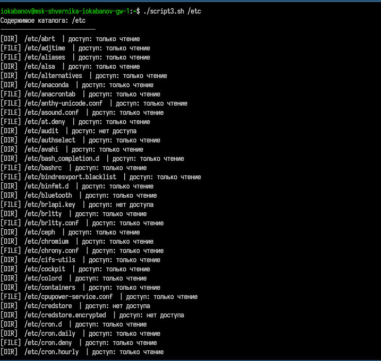
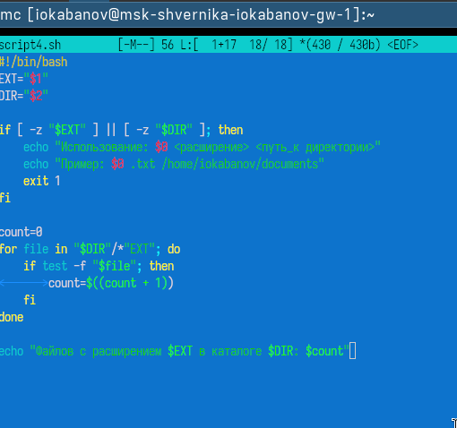
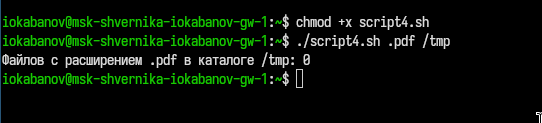

---
## Author
author:
  name: Кабанов Иван Олегович
  email: 1032253495@rudn.ru
  affiliation:
    - name: Российский университет дружбы народов
      country: Российская Федерация
      postal-code: 117198
      city: Москва
      address: ул. Миклухо-Маклая, д. 6

## Title
title: "Отчет по лабораторной работе №12"
subtitle: "Архитектура компьютеров и операционные системы. Раздел Операционные системы"
license: "CC BY"
---

# Цель работы

Изучить основы программирования в оболочке ОС UNIX/Linux. Научиться писать небольшие командные файлы.

# Задание

1. Написать скрипт, который при запуске будет делать резервную копию самого себя (то есть файла, в котором содержится его исходный код) в другую директорию backup в вашем домашнем каталоге. При этом файл должен архивироваться одним из архиваторов на выбор zip, bzip2 или tar. Способ использования команд архивации
необходимо узнать, изучив справку.
2. Написать пример командного файла, обрабатывающего любое произвольное число аргументов командной строки, в том числе превышающее десять. Например, скрипт может последовательно распечатывать значения всех переданных аргументов.
3. Написать командный файл — аналог команды ls (без использования самой этой команды и команды dir). Требуется, чтобы он выдавал информацию о нужном каталоге и выводил информацию о возможностях доступа к файлам этого каталога.
4. Написать командный файл, который получает в качестве аргумента командной строки формат файла (.txt, .doc, .jpg, .pdf и т.д.) и вычисляет количество таких файлов в указанной директории. Путь к директории также передаётся в виде аргумента командной строки.

# Теоретическое введение

Командный процессор (командная оболочка, интерпретатор команд shell) — это про-
грамма, позволяющая пользователю взаимодействовать с операционной системой
компьютера. В операционных системах типа UNIX/Linux наиболее часто используются
следующие реализации командных оболочек:
– оболочка Борна (Bourne shell или sh) — стандартная командная оболочка UNIX/Linux,
содержащая базовый, но при этом полный набор функций;
– С-оболочка (или csh) — надстройка на оболочкой Борна, использующая С-подобный
синтаксис команд с возможностью сохранения истории выполнения команд;
– оболочка Корна (или ksh) — напоминает оболочку С, но операторы управления програм-
мой совместимы с операторами оболочки Борна;
– BASH — сокращение от Bourne Again Shell (опять оболочка Борна), в основе своей сов-
мещает свойства оболочек С и Корна (разработка компании Free Software Foundation).
POSIX (Portable Operating System Interface for Computer Environments) — набор стандартов
описания интерфейсов взаимодействия операционной системы и прикладных программ.
Стандарты POSIX разработаны комитетом IEEE (Institute of Electrical and Electronics
Engineers) для обеспечения совместимости различных UNIX/Linux-подобных операционных систем и переносимости прикладных программ на уровне исходного кода.
POSIX-совместимые оболочки разработаны на базе оболочки Корна.
Рассмотрим основные элементы программирования в оболочке bash. В других оболочках большинство команд будет совпадать с описанными ниже.

# Выполнение лабораторной работы

## Задание 1

В файле script1.sh напишем скрипт, который при запуске будет делать резервную копию самого себя (то есть файла, в котором содержится его исходный код) в другую директорию backup в домашнем каталоге. ([рис. @fig-001])

Листинг script1.sh:

``` bash
#!/bin/bash
mkdir -p ~/backup
tar -czvf ~/backup/backup_$(date +%Y%m%d_%H%M%S).tar.gz "$0"
echo "Резервная копия создана в ~/backup/"
```

{#fig-001 width=70%}

Запустим скрипт и убедимся в корректной работе. ([рис. @fig-002])

{#fig-002 width=70%}

## Задание 2

В файле script2.sh напишем пример командного файла, обрабатывающего любое произвольное число аргументов командной строки, в том числе превышающее десять. ([рис. @fig-003])

Листинг script1.sh:

``` bash
#! /bin/bash
echo "Всего аргументов: $#"
i=1
while [ "$#" -gt 0 ]; do
    echo "Аргумент $i: $1"
    shift
    i=$((i+1))
done
```

{#fig-003 width=70%}

Запустим скрипт и убедимся в корректной работе. ([рис. @fig-004])

{#fig-004 width=70%}

## Задание 3

В файле script3.sh напишем командный файл — аналог команды ls (без использования самой этой команды и команды dir). ([рис. @fig-005])

Листинг script3.sh:

``` bash
#!/bin/bash
DIR="${1:-.}"  # если аргумент не передан — текущая папка

echo "Содержимое каталога: $DIR"
echo "----------------------------"

for file in "$DIR"/*; do
    if test -d "$file"; then
        echo -n "[DIR]  $file"
    else
        echo -n "[FILE] $file"
    fi

    echo -n "  | доступ: "

    if test -r "$file" && test -w "$file"; then
        echo "чтение+запись"
    elif test -r "$file"; then
        echo "только чтение"
    elif test -w "$file"; then
        echo "только запись"
    else
        echo "нет доступа"
    fi
done
```

{#fig-005 width=70%}

Запустим скрипт и убедимся в корректной работе. ([рис. @fig-006])

{#fig-006 width=70%}

## Задание 4

В файле script4.sh напишем командный файл, который получает в качестве аргумента командной строки формат файла (.txt, .doc, .jpg, .pdf и т.д.) и вычисляет количество таких файлов в указанной директории.  ([рис. @fig-005])

Листинг script4.sh:

``` bash
#!/bin/bash
EXT="$1"
DIR="$2"

if [ -z "$EXT" ] || [ -z "$DIR" ]; then
    echo "Использование: $0 <расширение> <путь_к директории>"
    echo "Пример: $0 .txt /home/iokabanov/documents"
    exit 1
fi

count=0
for file in "$DIR"/*"EXT"; do
    if test -f "$file"; then
	count=$((count + 1))
    fi
done

echo "Файлов с расширением $EXT в каталоге $DIR: $count"
```

{#fig-007 width=70%}

Запустим скрипт и убедимся в корректной работе. ([рис. @fig-008])

{#fig-008 width=70%}

# Ответы на контрольные вопросы

## 1. Командная оболочка

Командная оболочка (shell) — это программа-интерпретатор, позволяющая пользователю взаимодействовать с ОС, вводя команды. Примеры:

- **sh** (Bourne shell) — стандартная, базовая оболочка UNIX
- **csh** — С-подобный синтаксис, история команд
- **ksh** (Kornshell) — совместима с sh, похожа на csh
- **bash** (Bourne Again Shell) — объединяет возможности csh и ksh, наиболее распространена в Linux

Отличаются синтаксисом, набором возможностей и совместимостью.

## 2. POSIX

POSIX (Portable Operating System Interface) — набор стандартов IEEE, описывающих интерфейс взаимодействия ОС и прикладных программ. Обеспечивает совместимость UNIX/Linux-систем и переносимость программ на уровне исходного кода.

## 3. Переменные и массивы в bash

Переменная задаётся присваиванием без пробелов:
```bash
name=value
```
Обращение к значению — через `$name` или `${name}`.

Массив создаётся командой `set -A`:
```bash
set -A states Delaware Michigan "New Jersey"
```
Либо напрямую: `states[0]=Delaware`. Индексация начинается с нуля.

## 4. Операторы let и read

**let** — вычисляет арифметическое выражение:
```bash
let sum=x+7
```

**read** — считывает значение переменной со стандартного ввода (с клавиатуры):
```bash
read mon day
```

## 5. Арифметические операции в bash

Поддерживаются: сложение `+`, вычитание `-`, умножение `*`, деление `/`, остаток от деления `%`, побитовые операции (`&`, `|`, `^`, `~`, `<<`, `>>`), логические (`&&`, `||`, `!`), операции сравнения (`<`, `>`, `<=`, `>=`, `==`, `!=`), а также составное присваивание (`+=`, `-=`, `*=` и т.д.).

## 6. Операция (( ))

Двойные круглые скобки задают арифметический контекст — позволяют записывать арифметические и условные выражения без явного использования `let`:
```bash
(( x += 1 ))
while (( x > 0 )); do ... done
```
Ноль воспринимается как «ложь», любое другое значение — как «истина».

## 7. Стандартные имена переменных

- `PATH` — список каталогов поиска программ
- `HOME` — домашний каталог пользователя
- `IFS` — символы-разделители в командной строке
- `MAIL` — путь к файлу почтового ящика
- `TERM` — тип терминала
- `LOGNAME` — имя текущего пользователя
- `PS1` — основной промптер (по умолчанию `$`)
- `PS2` — вторичный промптер (по умолчанию `>`)

## 8. Метасимволы

Метасимволы — символы, имеющие специальный смысл для командного процессора. К ним относятся: `* ? | \ " ' & < > [ ]` и другие. Например, `*` соответствует любой строке, `?` — любому одному символу.

## 9. Экранирование метасимволов

Снять специальный смысл с метасимвола можно тремя способами:

- Обратный слеш перед символом: `\*` выведет буквальный `*`
- Одинарные кавычки экранируют всё внутри: `'* | ?'`
- Двойные кавычки экранируют всё, кроме `$`, `` ` ``, `\`, `"`

## 10. Создание и запуск командных файлов

Создать текстовый файл с командами, первой строкой указать интерпретатор:
```bash
#!/bin/bash
```
Сделать файл исполняемым:
```bash
chmod +x имя_файла
```
Запустить:
```bash
./имя_файла
# или
bash имя_файла
```

## 11. Определение функций в bash

Функция определяется с помощью ключевого слова `function`:
```bash
function имя_функции {
    команды
}
```
Удалить функцию можно командой `unset -f имя_функции`. Просмотреть определённые функции — `typeset -f`.

## 12. Проверка: каталог или файл

С помощью команды `test`:
```bash
test -d имя   # истина, если это каталог
test -f имя   # истина, если это обычный файл
```
Или в условии if:
```bash
if test -d "$A"; then
    echo "это каталог"
else
    echo "это файл"
fi
```

## 13. Команды set, typeset и unset

**set** — выводит все переменные и их значения; также используется для создания массивов (`set -A`).

**typeset** — объявляет переменные с атрибутами, например `typeset -i x` делает `x` целочисленной; управляет функциями (`-f`, `-fx`, `-fu`).

**unset** — удаляет переменную (`unset имя`) или функцию (`unset -f имя`).

## 14. Передача параметров в командные файлы

Параметры передаются при вызове скрипта через пробел:
```bash
./script.sh arg1 arg2 arg3
```
Внутри скрипта доступны как `$1`, `$2`, ..., `$9`. Для обработки более 9 аргументов используется команда `shift`, которая сдвигает все аргументы влево, удаляя первый. `$0` — имя самого скрипта, `$#` — количество аргументов.

## 15. Специальные переменные bash

- `$*` — все переданные аргументы одной строкой
- `$#` — количество аргументов
- `$0` — имя текущего скрипта
- `$?` — код завершения последней команды (0 = успех)
- `$$` — PID текущего процесса оболочки
- `$!` — PID последнего фонового процесса
- `$-` — текущие флаги командного процессора
- `${#name}` — длина строки в переменной `name`
- `${name:-value}` — значение `value`, если `name` не определена
- `${name=value}` — присвоить `value` переменной `name`, если она не определена
- `${name?value}` — вывести ошибку `value` и остановиться, если `name` не определена

# Выводы

В результате выполнения лабораторной работы были изучены основы программирования в оболочке ОС UNIX/Linux. Теория была подкреплена практикой: были написаны небольшие командные файлы.

# Список литературы{.unnumbered}

::: {#refs}
:::
