---
## Author
author:
  name: Кабанов Иван Олегович
  email: 1032253495@rudn.ru
  affiliation:
    - name: Российский университет дружбы народов
      country: Российская Федерация
      postal-code: 117198
      city: Москва
      address: ул. Миклухо-Маклая, д. 6

## Title
title: "Отчет по лабораторной работе №13"
subtitle: "Архитектура компьютеров и операционные системы. Раздел Операционные системы"
license: "CC BY"
---

# Цель работы

Изучить основы программирования в оболочке ОС UNIX. Научится писать более
сложные командные файлы с использованием логических управляющих конструкций
и циклов.

# Задание

1. Используя команды getopts grep, написать командный файл, который анализирует
командную строку с ключами:
– -iinputfile — прочитать данные из указанного файла;
– -ooutputfile — вывести данные в указанный файл;
– -pшаблон — указать шаблон для поиска;
– -C — различать большие и малые буквы;
– -n — выдавать номера строк.
а затем ищет в указанном файле нужные строки, определяемые ключом -p.
2. Написать на языке Си программу, которая вводит число и определяет, является ли оно
больше нуля, меньше нуля или равно нулю. Затем программа завершается с помощью
функции exit(n), передавая информацию в о коде завершения в оболочку. Команд-
ный файл должен вызывать эту программу и, проанализировав с помощью команды
$?, выдать сообщение о том, какое число было введено.
3. Написать командный файл, создающий указанное число файлов, пронумерованных
последовательно от 1 до 𝑁 (например 1.tmp, 2.tmp, 3.tmp,4.tmp и т.д.). Число файлов,
которые необходимо создать, передаётся в аргументы командной строки. Этот же ко-
мандный файл должен уметь удалять все созданные им файлы (если они существуют).
4. Написать командный файл, который с помощью команды tar запаковывает в архив
все файлы в указанной директории. Модифицировать его так, чтобы запаковывались
только те файлы, которые были изменены менее недели тому назад (использовать
команду find).

# Выполнение лабораторной работы

## Задание 1

Используя команды getopts grep, напишем командный файл, который анализирует
командную строку с ключами:
– -iinputfile — прочитать данные из указанного файла;
– -ooutputfile — вывести данные в указанный файл;
– -pшаблон — указать шаблон для поиска;
– -C — различать большие и малые буквы;
– -n — выдавать номера строк.
а затем ищет в указанном файле нужные строки, определяемые ключом -p.
([рис. @fig-001])

Листинг script1_lab13.sh:

``` bash
#!/bin/bash

inputfile=""
outputfile=""
pattern=""
case_flag=""
line_numbers=""

while getopts "i:o:p:Cn" opt; do
    case $opt in
        i) inputfile="$OPTARG" ;;
        o) outputfile="$OPTARG" ;;
        p) pattern="$OPTARG" ;;
        C) case_flag="-i" ;;   # -i у grep = игнорировать регистр
        n) line_numbers="-n" ;;
        *) echo "Неизвестный ключ"; exit 1 ;;
    esac
done

if [ -z "$inputfile" ] || [ -z "$pattern" ]; then
    echo "Укажите входной файл (-i) и шаблон (-p)"
    exit 1
fi

if [ -n "$outputfile" ]; then
    grep $case_flag $line_numbers "$pattern" "$inputfile" > "$outputfile"
else
    grep $case_flag $line_numbers "$pattern" "$inputfile"
fi

```

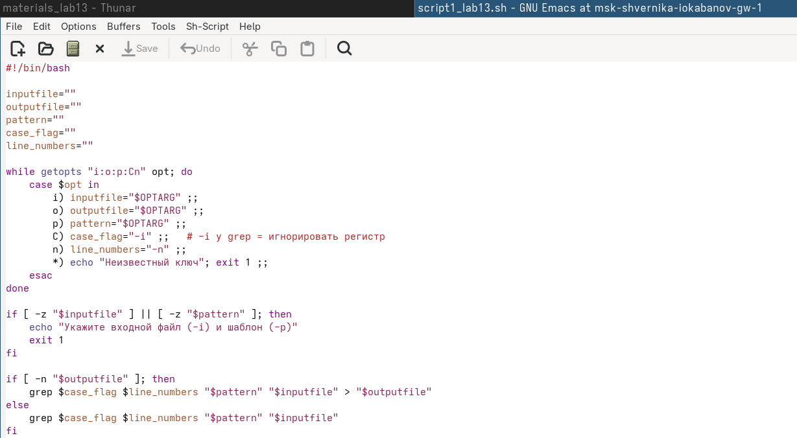{#fig-001 width=70%}

Запустим скрипт и убедимся в корректной работе. ([рис. @fig-002])

{#fig-002 width=70%}

## Задание 2

Напишем на языке Си программу ([рис. @fig-003]), которая вводит число и определяет, является ли оно
больше нуля, меньше нуля или равно нулю. Затем программа завершается с помощью
функции exit(n), передавая информацию в о коде завершения в оболочку. Команд-
ный файл должен вызывать эту программу и, проанализировав с помощью команды
$?, выдать сообщение о том, какое число было введено. ([рис. @fig-004])

Листинг check.c: 
``` c
#include <stdio.h>
#include <stdlib.h>

int main() {
    int n;
    printf("Введите число: ");
    scanf("%d", &n);

    if (n > 0)
        exit(1);
    else if (n < 0)
        exit(2);
    else
        exit(0);
}
``` 

Листинг script2_lab13.sh:

``` bash
#!/bin/bash

./check
code=$?

if [ $code -eq 1 ]; then
    echo "Число больше нуля"
elif [ $code -eq 2 ]; then
    echo "Число меньше нуля"
else
    echo "Число равно нулю"
fi
```

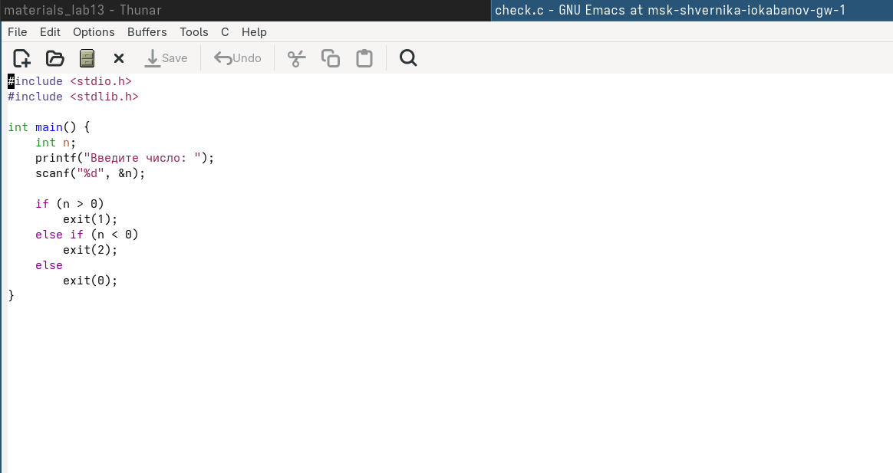{#fig-003 width=70%}

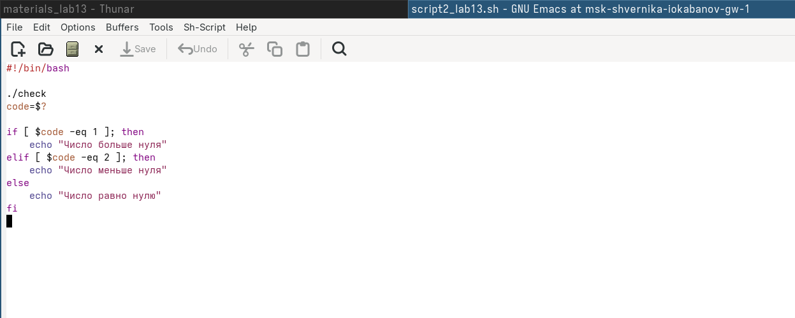{#fig-004 width=70%}

Запустим скрипт и убедимся в корректной работе. ([рис. @fig-005])

{#fig-005 width=70%}

## Задание 3

Напишем командный файл, создающий указанное число файлов, пронумерованных
последовательно от 1 до 𝑁 (например 1.tmp, 2.tmp, 3.tmp,4.tmp и т.д.). Число файлов,
которые необходимо создать, передаётся в аргументы командной строки. Этот же командный файл должен уметь удалять все созданные им файлы (если они существуют). ([рис. @fig-006])

Листинг script3_lab13.sh:

``` bash
#!/bin/bash

if [ $# -lt 1 ]; then
    echo "Использование: $0 <N> [--delete]"
    exit 1
fi

N=$1
action=$2

if [ "$action" == "--delete" ]; then
    for i in $(seq 1 $N); do
        if [ -f "$i.tmp" ]; then
            rm "$i.tmp"
            echo "Удалён: $i.tmp"
        fi
    done
else
    for i in $(seq 1 $N); do
        touch "$i.tmp"
        echo "Создан: $i.tmp"
    done
fi
```

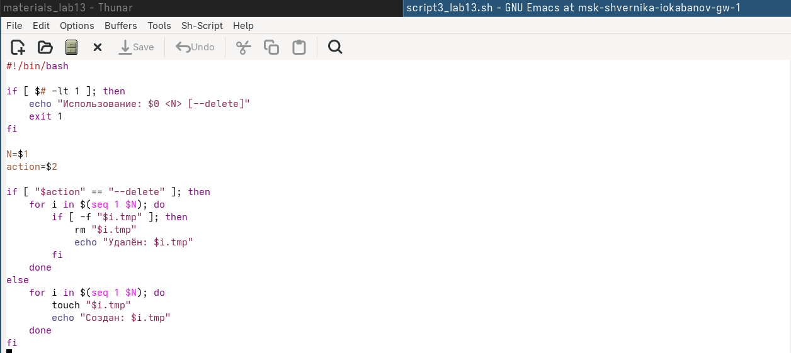{#fig-006 width=70%}

Запустим скрипт и убедимся в корректной работе. ([рис. @fig-007]) ([рис. @fig-008])

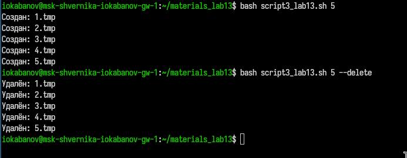{#fig-007 width=70%}

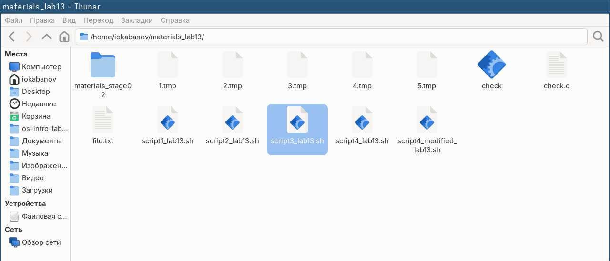{#fig-008 width=70%}

## Задание 4

Напишем командный файл, который с помощью команды tar запаковывает в архив
все файлы в указанной директории. ([рис. @fig-009]) Модифицируем его так, чтобы запаковывались
только те файлы, которые были изменены менее недели тому назад (используем
команду find). ([рис. @fig-012])

Листинг script4_lab13.sh:

``` bash
#!/bin/bash

if [ $# -lt 1 ]; then
    echo "Использование: $0 <директория>"
    exit 1
fi

dir=$1
tar -cvf archive.tar "$dir"
echo "Архив archive.tar создан"
```

Листинг script4_modified_lab13.sh:

``` bash
#!/bin/bash

if [ $# -lt 1 ]; then
    echo "Использование: $0 <директория>"
    exit 1
fi

dir=$1

# Находим файлы, изменённые менее 7 дней назад
files=$(find "$dir" -maxdepth 1 -type f -mtime -7)

if [ -z "$files" ]; then
    echo "Нет файлов, изменённых за последнюю неделю"
    exit 0
fi

echo "$files" | tar -cvf archive.tar -T -
echo "Архив archive.tar создан"
```

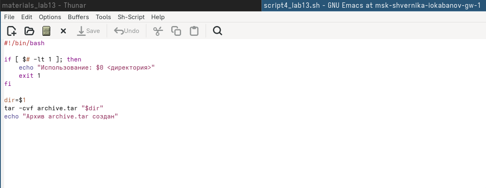{#fig-009 width=70%}

Запустим скрипт и убедимся в корректной работе. ([рис. @fig-010]) ([рис. @fig-011])

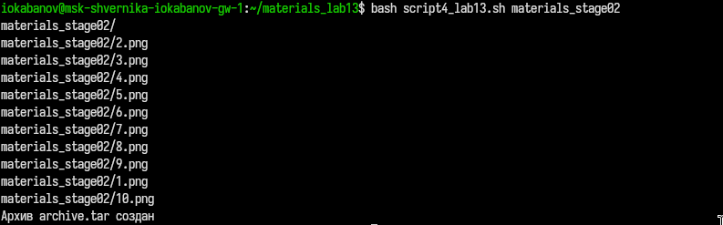{#fig-010 width=70%}

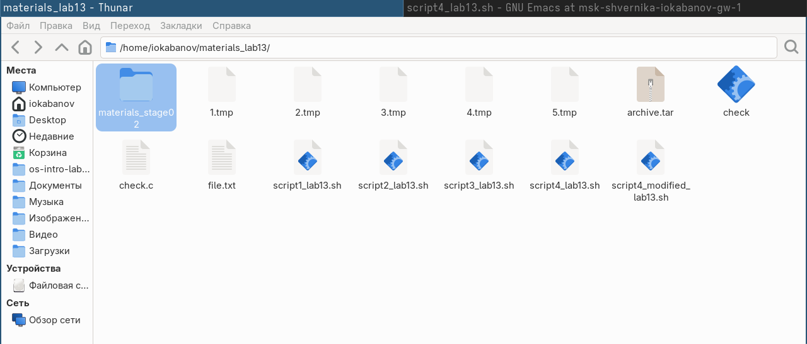{#fig-011 width=70%}

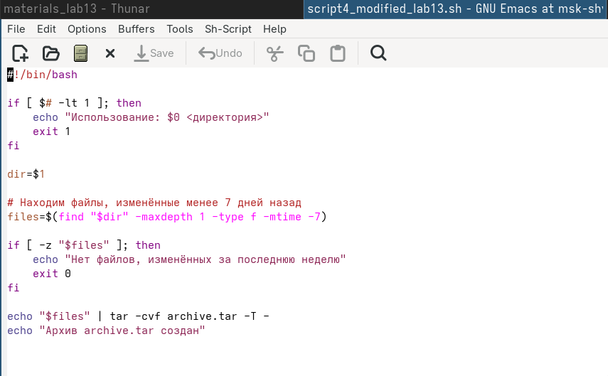{#fig-012 width=70%}

Запустим модифицированный скрипт и убедимся в корректной работе. ([рис. @fig-013])

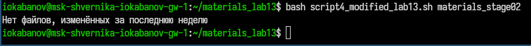{#fig-013 width=70%}

# Ответы на контрольные вопросы

## 1. Предназначение команды `getopts`
Разбирает аргументы командной строки в виде флагов (`-a`, `-b value`). Используется в скриптах для обработки опций, переданных при запуске.

## 2. Метасимволы и генерация имён файлов
Метасимволы (`*`, `?`, `[...]`) используются для **глоббинга** — подстановки имён файлов, соответствующих шаблону. Shell раскрывает их в список совпадающих файлов до выполнения команды.

## 3. Операторы управления действиями
`&&` — выполнить следующую команду, если предыдущая завершилась успешно
`||` — выполнить следующую команду, если предыдущая завершилась с ошибкой
`;` — выполнить команды последовательно независимо от результата
`&` — выполнить команду в фоновом режиме

## 4. Операторы прерывания цикла
`break` — прервать цикл полностью
`continue` — перейти к следующей итерации цикла
`exit` — завершить выполнение скрипта

## 5. Команды `false` и `true`
Возвращают фиксированный код завершения: `true` всегда возвращает `0` (успех), `false` — `1` (ошибка). Используются для организации бесконечных циклов (`while true`) и тестирования условий.

## 6. Строка `if test -f man$s/$i.$s`
Проверяет, существует ли **обычный файл** по пути `man<s>/<i>.<s>`, где `$s` и `$i` — значения переменных. Флаг `-f` означает «является обычным файлом (не директорией и не устройством)».

## 7. Различия между `while` и `until`
`while` — выполняет тело цикла, **пока условие истинно** (код возврата `0`)
`until` — выполняет тело цикла, **пока условие ложно** (код возврата `≠ 0`)

По сути, `until` — это `while` с инвертированным условием.

# Выводы

В ходе выполнения лабораторной работы были освоены навыки написания более сложных командных файлов с использованием логических управляющих конструкций и циклов.

# Список литературы{.unnumbered}

::: {#refs}
:::
