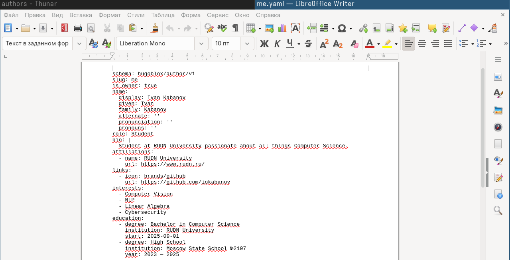
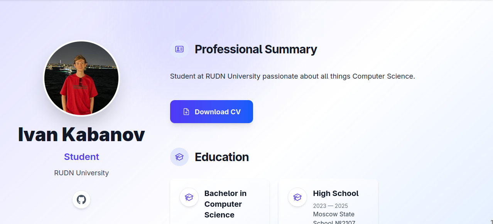
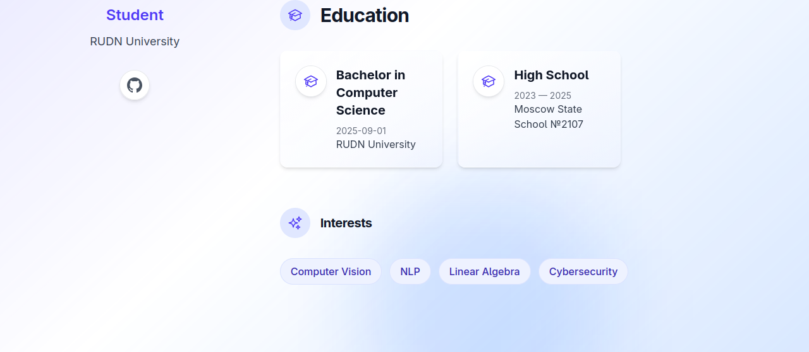
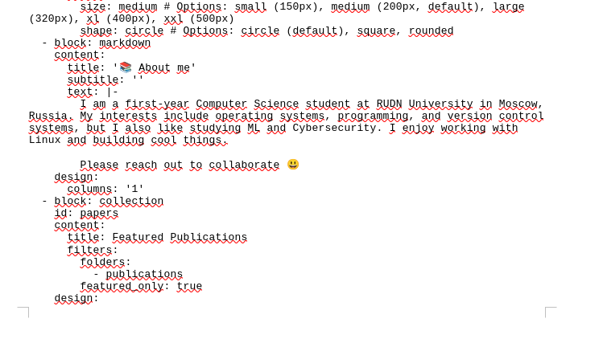
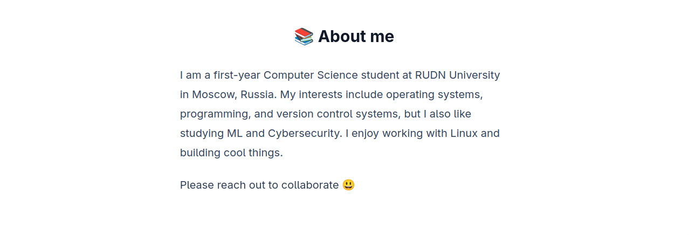
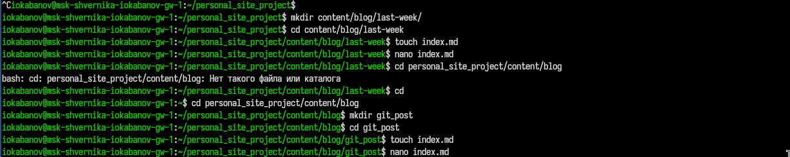
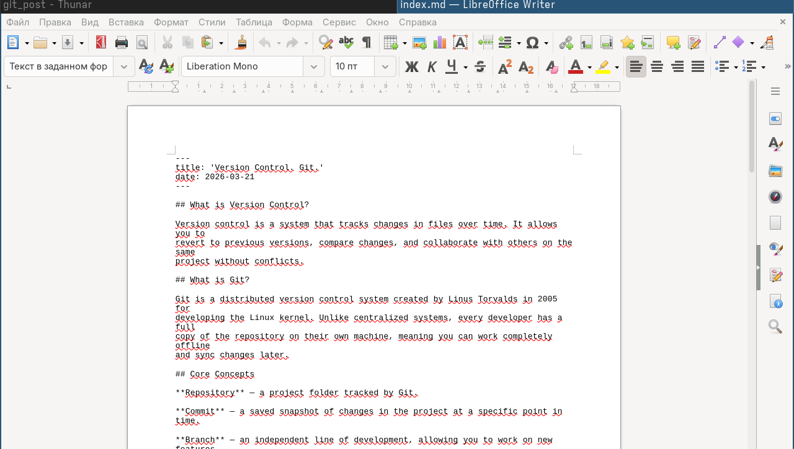
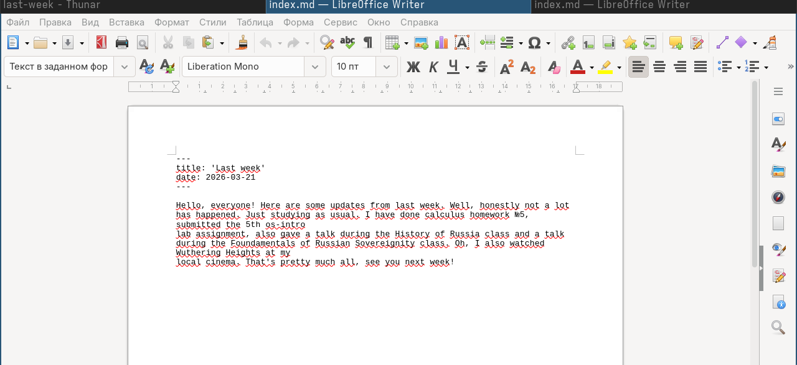
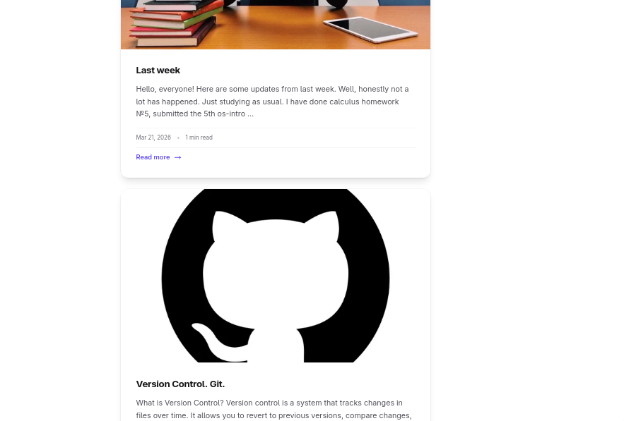
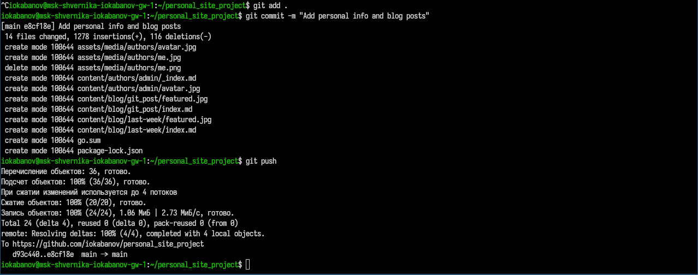

---
author:
  name: Кабанов Иван Олегович
  email: 1032253495@rudn.ru
  affiliation:
    - name: Российский университет дружбы народов
      country: Российская Федерация
      postal-code: 117198
      city: Москва
      address: ул. Миклухо-Маклая, д. 6

## Title
lang: ru-RU
fontenc: T2A
mainfont: "DejaVu Serif"
sansfont: "DejaVu Sans"
monofont: "DejaVu Sans Mono"
title: "Презентация по второму этапу индивидуального проекта"
subtitle: "Архитектура компьютеров и операционные системы. Раздел 'Операционные системы'"
license: "CC BY"
date: today
date-format: "YYYY-MM-DD" # Example: 2025-09-06
---

# Информация

## Докладчик

:::::::::::::: {.columns align=center}
::: {.column width="70%"}

  * Кабанов Иван Олегович
  * студент группы НКАбд-03-25
  * Российский университет дружбы народов им. П. Лумумбы
  * [1032253495@rudn.ru](mailto:1032253495@rudn.ru)
  * <https://github.com/iokabanov/>

:::
::: {.column width="30%"}

:::
::::::::::::::

# Цель работы

Освоить навыки изменения шаблона сайта, создания постов.

# Задание

Добавить к сайту данные о себе.
    Список добавляемых данных.
        Разместить фотографию владельца сайта.
        Разместить краткое описание владельца сайта (Biography).
        Добавить информацию об интересах (Interests).
        Добавить информацию от образовании (Education).
    Сделать пост по прошедшей неделе.
    Добавить пост на тему по выбору:
        Управление версиями. Git.
        Непрерывная интеграция и непрерывное развертывание (CI/CD).

# Теоретическое введение

Для реализации сайта используется генератор статических сайтов Hugo.
Общие файлы для тем Wowchemy:
  Репозиторий: https://github.com/wowchemy/wowchemy-hugo-themes
В качестве шаблона индивидуального сайта используется шаблон Hugo Academic Theme.
Демо-сайт: https://academic-demo.netlify.app/
Репозиторий: https://github.com/wowchemy/starter-hugo-academic

# Выполнение лабораторной работы

## Основная информация

Сначала добавлю основную информацию обо мне, изменив шаблон находящий по пути /home/iokabanov/personal_site_project/data/authors/me.yaml ([рис. @fig-001]).

{#fig-001 width=70%}

Посмотрим внесенные изменения ([рис. @fig-002]) ([рис. @fig-003]).

{#fig-002 width=70%}

{#fig-003 width=70%}

## Описание

Добавлю описание, внеся изменения в файл /home/iokabanov/personal_site_project/content/_index.md ([рис. @fig-004]).

{#fig-004 width=70%}

Посмотрим внесенные изменения ([рис. @fig-005]).

{#fig-005 width=70%}

## Посты в блоге

Теперь добавлю посты для блога. Создам соответствующие директории и файлы ([рис. @fig-006]).

{#fig-006 width=70%}

Напишу текст поста про управление версиями и Git ([рис. @fig-007]).

{#fig-007 width=70%}

Напишу текст поста про мою прошедшую неделю ([рис. @fig-008]).

{#fig-008 width=70%}

Убедимся, что посты добавлены ([рис. @fig-009]).

{#fig-009 width=70%}

## Завершение работы

Сделаем коммит на github ([рис. @fig-010]).

{#fig-010 width=70%}

# Выводы

В результате выполнения второго этапа лабораторной работы на сайт была добавлена информация о его владельце и два поста. Таким образом, на практике были освоены навыки изменения шаблона сайта, создания постов.