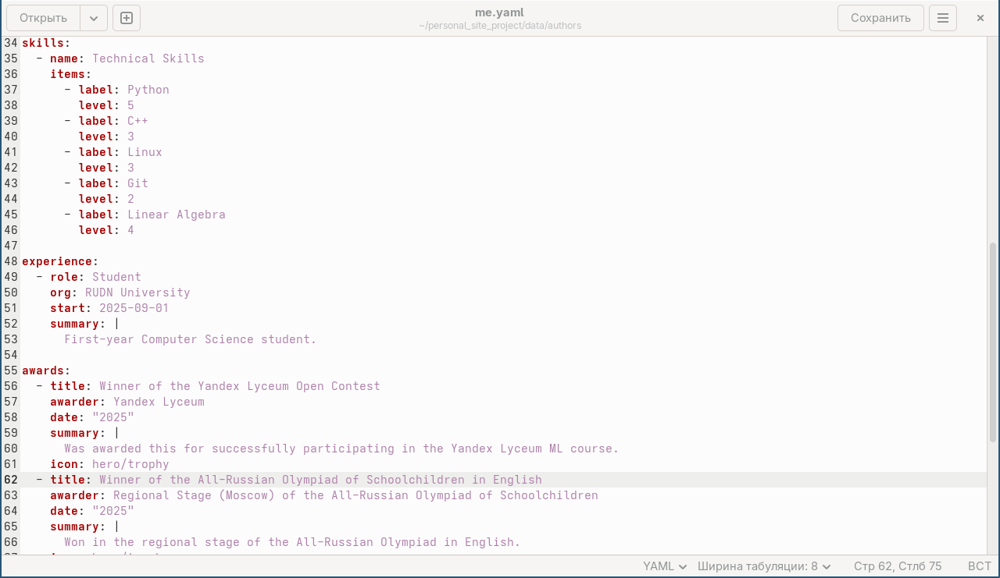
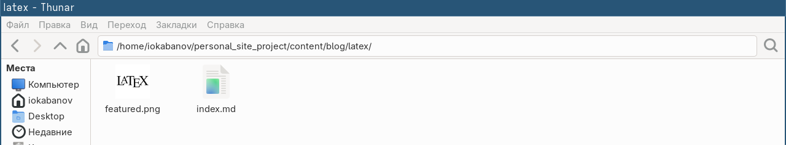
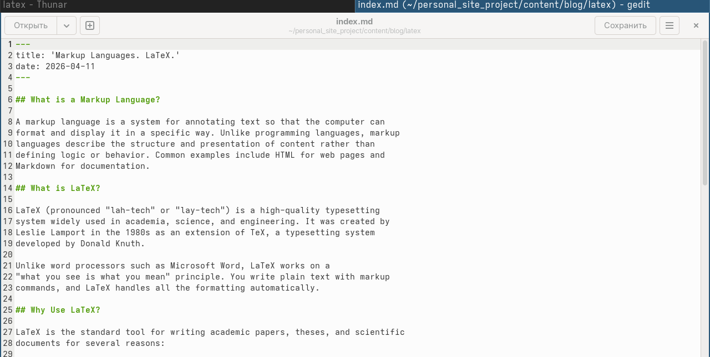
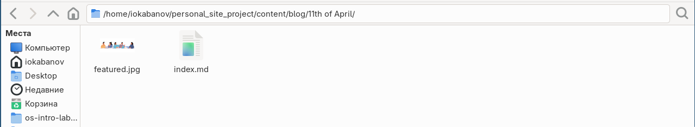
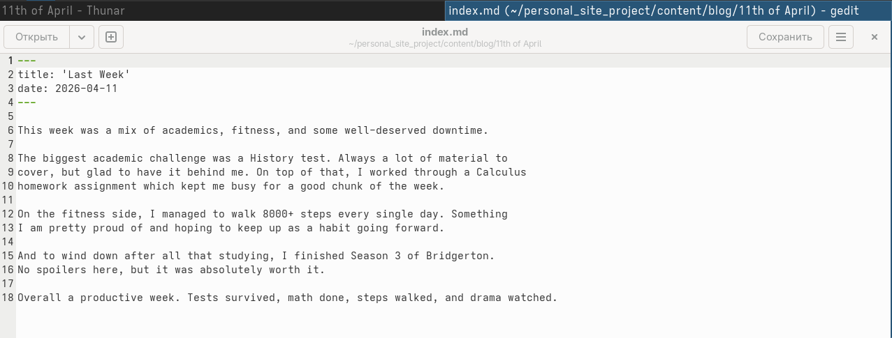
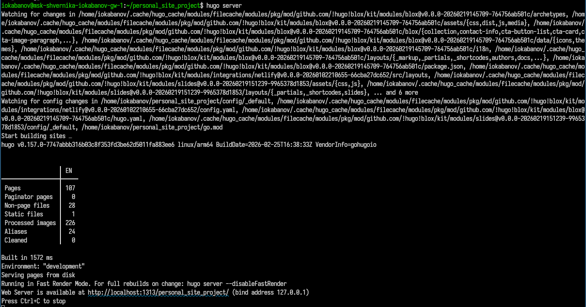
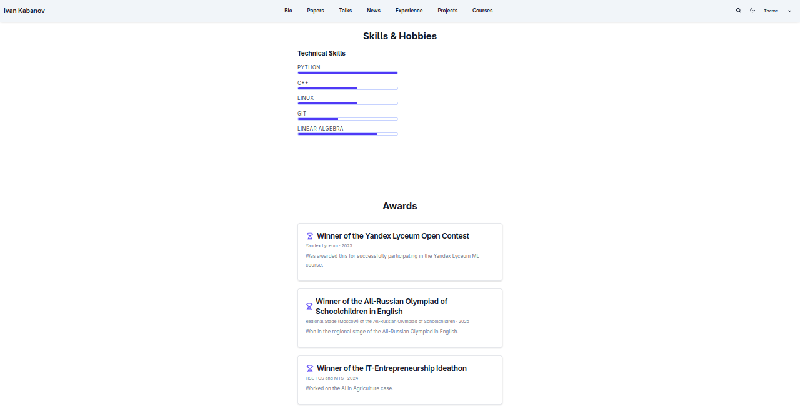
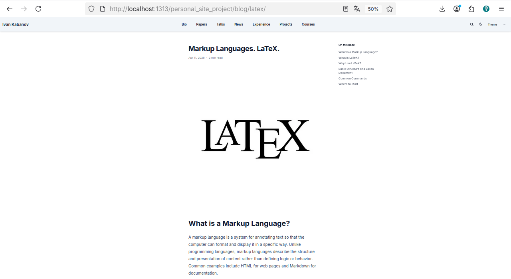
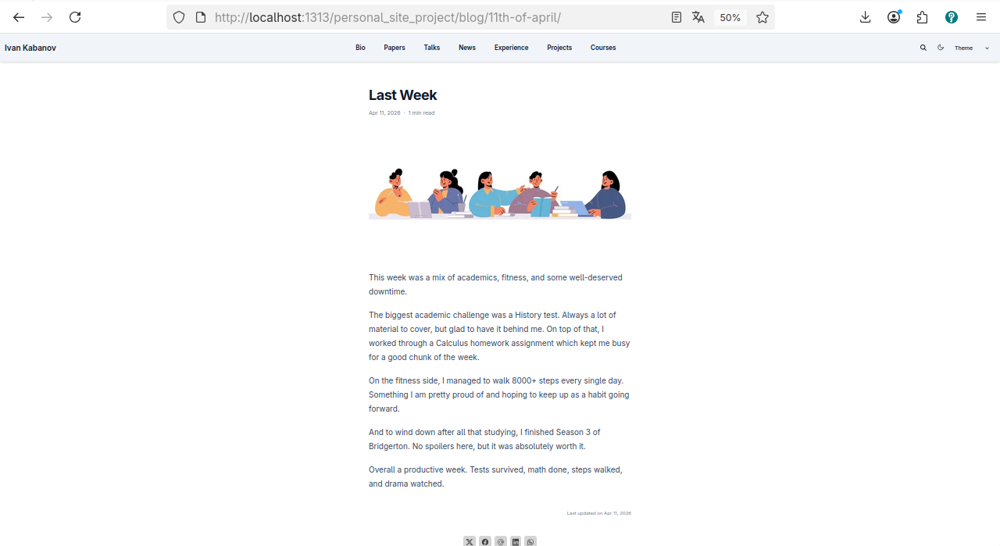
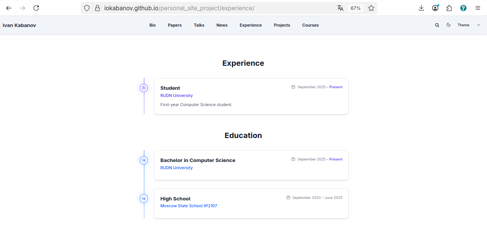

---
## Author
author:
  name: Кабанов Иван Олегович
  email: 1032253495@rudn.ru
  affiliation:
    - name: Российский университет дружбы народов
      country: Российская Федерация
      postal-code: 117198
      city: Москва
      address: ул. Миклухо-Маклая, д. 6

## Title
title: "Отчет по третьему этапу индивидуального проекта"
subtitle: "Архитектура компьютеров и операционные системы. Раздел 'Операционные системы' "
license: "CC BY"
---

# Цель работы

Расширить информацию о себе, добавив сведения об опыте, достижениях и наградах, отработать навык написания постов

# Задание
Добавить к сайту достижения.
  Добавить информацию о навыках (Skills).
  Добавить информацию об опыте (Experience).
  Добавить информацию о достижениях (Accomplishments).
Сделать пост по прошедшей неделе.
Добавить пост на тему по выбору:
  Легковесные языки разметки.
  Языки разметки. LaTeX.
  Язык разметки Markdown.

# Теоретическое введение

Для реализации сайта используется генератор статических сайтов Hugo.
Общие файлы для тем Wowchemy:
  Репозиторий: https://github.com/wowchemy/wowchemy-hugo-themes
В качестве шаблона индивидуального сайта используется шаблон Hugo Academic Theme.
Демо-сайт: https://academic-demo.netlify.app/
Репозиторий: https://github.com/wowchemy/starter-hugo-academic

# Выполнение индивидуального проекта

## Навыки, опыт, достижения

Добавим информацию о навыках, опыте, достижениях, изменив шаблон находящий по пути /home/iokabanov/personal_site_project/data/authors/me.yaml ([рис. @fig-001]).

{#fig-001 width=70%}

## Пост о языке разметки LaTeX

Добавим пост о языке разметки LaTeX, добавив директорию /home/iokabanov/personal_site_project/content/blog/latex, файл index.md с текстом поста и изображение featured.jpg ([рис. @fig-002]) ([рис. @fig-003]).

{#fig-002 width=70%}

{#fig-003 width=70%}

## Пост о прошедшей неделе

Добавим пост о прошедшей неделе, добавив директорию /home/iokabanov/personal_site_project/content/blog/11th of April, файл index.md с текстом поста и изображение featured.jpg ([рис. @fig-004]) ([рис. @fig-005]).

{#fig-004 width=70%}

{#fig-005 width=70%}

## Просмотр изменений

С помощью команды hugo server убедимся, что изменения успешно добавлены. ([рис. @fig-006]).

{#fig-006 width=70%}

Посмотрим секцию с опытом и достижениями ([рис. @fig-007]).

{#fig-007 width=70%}

Посмотрим пост про LaTeX ([рис. @fig-008]).

{#fig-008 width=70%}

Посмотрим пост про прошедшую неделю ([рис. @fig-009]).

{#fig-009 width=70%}

## Github Pages

Сделаем коммит на github и убедимся что изменения отобразились на Github Pages ([рис. @fig-010]).

{#fig-010 width=70%}

# Выводы

В результате выполнения второго этапа лабораторной работы на сайт была добавлена информация о навыках, опыте, достижениях и два поста: про LaTeX и про прошедшую неделю. Таким образом, сайт стал содержать больше полезной информации об авторе, а также пополнился новыми записями в блоге.

# Список литературы{.unnumbered}

::: {#refs}
:::
