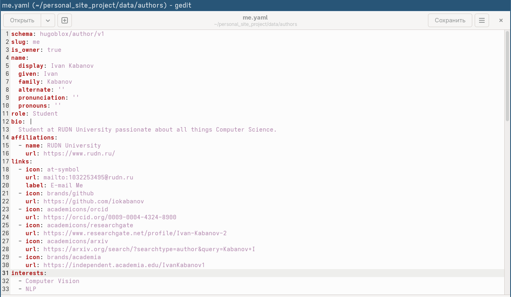
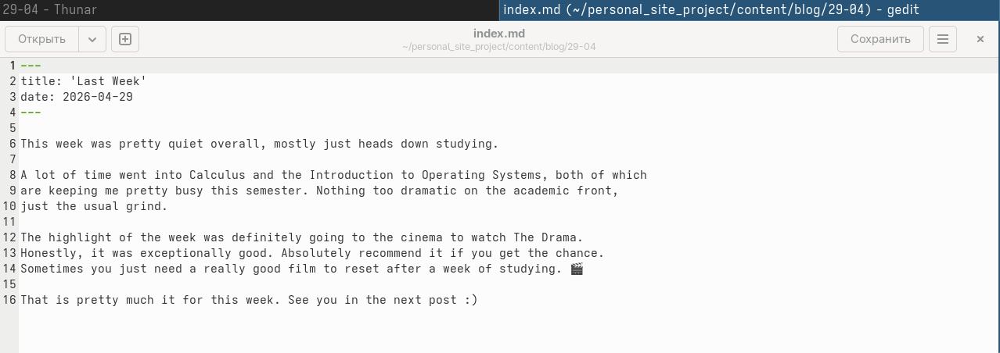
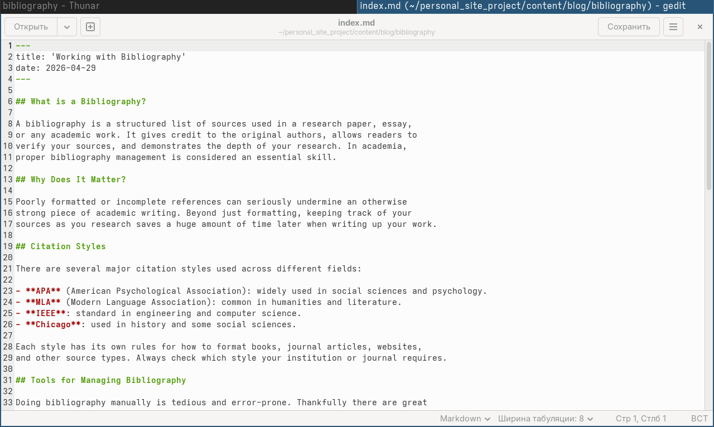
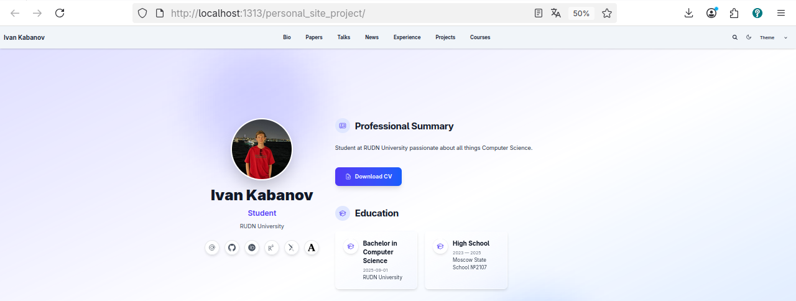
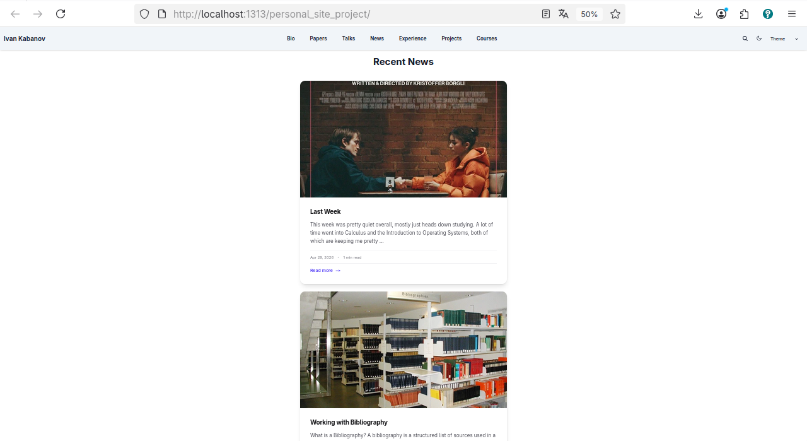
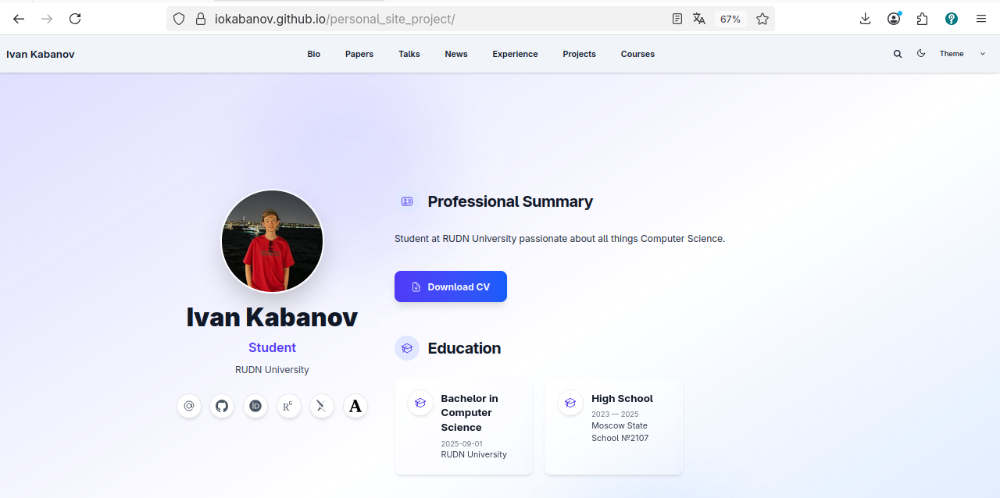

---
author:
  name: Кабанов Иван Олегович
  email: 1032253495@rudn.ru
  affiliation:
    - name: Российский университет дружбы народов
      country: Российская Федерация
      postal-code: 117198
      city: Москва
      address: ул. Миклухо-Маклая, д. 6

## Title
lang: ru-RU
fontenc: T2A
mainfont: "DejaVu Serif"
sansfont: "DejaVu Sans"
monofont: "DejaVu Sans Mono"
title: "Презентация по четвертому этапу индивидуального проекта"
subtitle: "Архитектура компьютеров и операционные системы. Раздел 'Операционные системы'"
license: "CC BY"
date: today
date-format: "YYYY-MM-DD" # Example: 2025-09-06
---

# Информация

## Докладчик

:::::::::::::: {.columns align=center}
::: {.column width="70%"}

  * Кабанов Иван Олегович
  * студент группы НКАбд-03-25
  * Российский университет дружбы народов им. П. Лумумбы
  * [1032253495@rudn.ru](mailto:1032253495@rudn.ru)
  * <https://github.com/iokabanov/>

:::
::: {.column width="30%"}

:::
::::::::::::::

# Цель работы

Познакомиться с научными и библиометрическими ресурсами, дополнить сайт ссылками на свои профили на основные из них, пополнить блог новыми постами

# Задание
Зарегистрироваться на соответствующих ресурсах и разместить на них ссылки на сайте:
  eLibrary : https://elibrary.ru/;
  Google Scholar : https://scholar.google.com/;
  ORCID : https://orcid.org/;
  Mendeley : https://www.mendeley.com/;
  ResearchGate : https://www.researchgate.net/;
  Academia.edu : https://www.academia.edu/;
  arXiv : https://arxiv.org/;
  github : https://github.com/.
Сделать пост по прошедшей неделе.
Добавить пост на тему по выбору:
  Оформление отчёта.
  Создание презентаций.
  Работа с библиографией.

# Теоретическое введение

Для реализации сайта используется генератор статических сайтов Hugo.
Общие файлы для тем Wowchemy:
  Репозиторий: https://github.com/wowchemy/wowchemy-hugo-themes
В качестве шаблона индивидуального сайта используется шаблон Hugo Academic Theme.
Демо-сайт: https://academic-demo.netlify.app/
Репозиторий: https://github.com/wowchemy/starter-hugo-academic

# Выполнение индивидуального проекта

## Добавление ссылок на научные и библиметрические ресурсы

Добавим информацию о профилях на научных и библиометрических ресурсах указанных в задании (кроме Mendeley, так как там ссылки на профили больше недоступны,  Google Scholar и eLibrary, так как там нельзя указать ссылку на профиль, не имеющий публикаций), изменив шаблон находящий по пути /home/iokabanov/personal_site_project/data/authors/me.yaml ([рис. @fig-001]).

{#fig-001 width=70%}

## Пост о прошедшей неделе

Добавим пост о прошедшей неделе, создав директорию /home/iokabanov/personal_site_project/content/blog/29-04, и добавив туда файл index.md с текстом поста и изображение featured.jpg ([рис. @fig-002]) 

{#fig-002 width=70%}

## Пост о работе с библиографией

Добавим пост о работе с библиографией, создав директорию /home/iokabanov/personal_site_project/content/blog/bibliography, и добавив туда файл index.md с текстом поста и изображение featured.jpg ([рис. @fig-003]).

{#fig-003 width=70%}

## Просмотр изменений

С помощью команды hugo server убедимся, что изменения успешно добавлены.
Под фотографией появились необходимые ссылки ([рис. @fig-004]).

{#fig-004 width=70%}

Посмотрим добавленные посты ([рис. @fig-005]).

{#fig-005 width=70%}

## Github Pages

Сделаем коммит на github и убедимся что изменения отобразились на Github Pages ([рис. @fig-006]).

{#fig-006 width=70%}

# Выводы

В результате выполнения четвертого этапа индивидуального проекта на сайт были добавлены ссылки на научные и библиометрические ресурсы и два поста: про работу с библиографией и про прошедшую неделю. Таким образом, сайт стал содержать больше полезной информации об авторе, а также пополнился новыми записями в блоге.