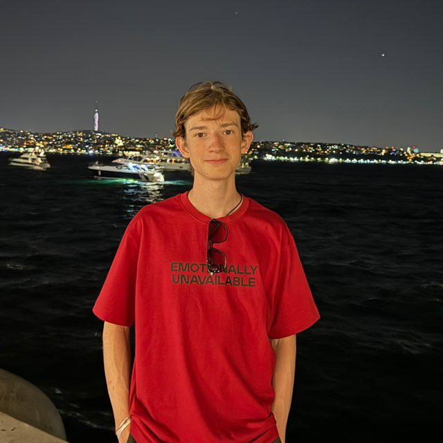
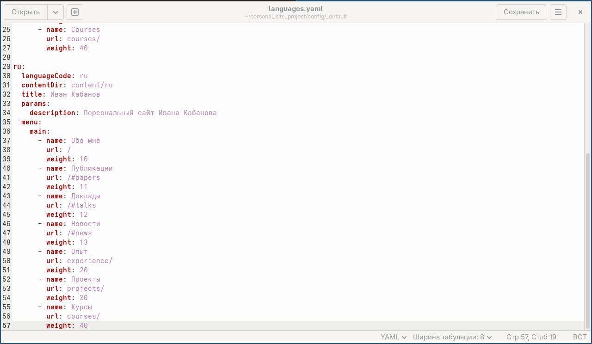
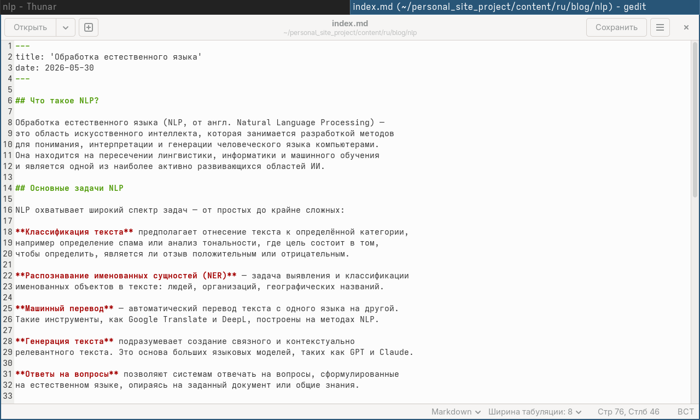
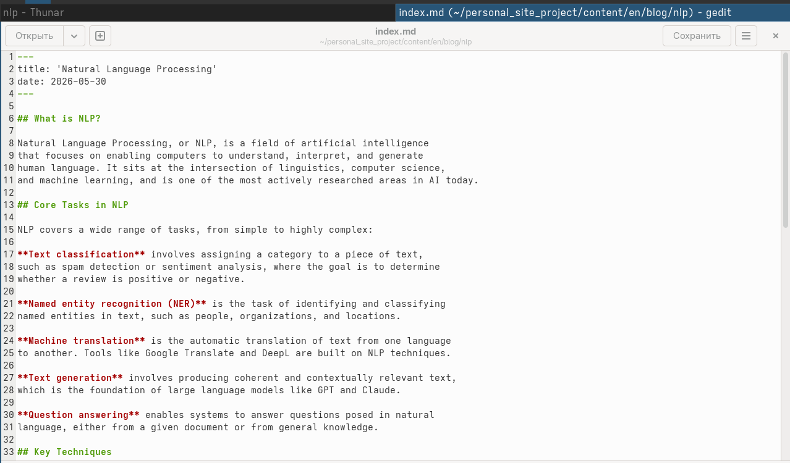
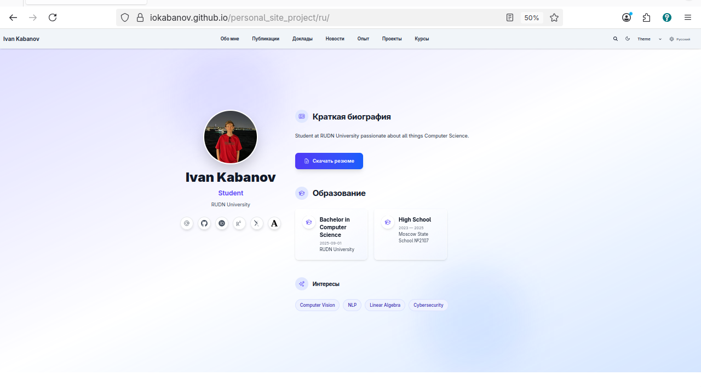

---
author:
  name: Кабанов Иван Олегович
  email: 1032253495@rudn.ru
  affiliation:
    - name: Российский университет дружбы народов
      country: Российская Федерация
      postal-code: 117198
      city: Москва
      address: ул. Миклухо-Маклая, д. 6

## Title
lang: ru-RU
fontenc: T2A
mainfont: "DejaVu Serif"
sansfont: "DejaVu Sans"
monofont: "DejaVu Sans Mono"
title: "Презентация по шестому этапу индивидуального проекта"
subtitle: "Архитектура компьютеров и операционные системы. Раздел 'Операционные системы'"
license: "CC BY"
date: today
date-format: "YYYY-MM-DD" # Example: 2025-09-06
---

# Информация

## Докладчик

:::::::::::::: {.columns align=center}
::: {.column width="70%"}

Кабанов Иван Олегович  
студент группы НКАбд-03-25 
Российский университет дружбы народов им. П. Лумумбы 
[1032253495@rudn.ru](mailto:1032253495@rudn.ru) 
<https://github.com/iokabanov/>

:::
::: {.column width="30%"}

:::
::::::::::::::

# Цель работы

Познакомиться с созданием двуязычных сайтов, дополнить сайт материалами на русском языке

# Задание
Сделать поддержку английского и русского языков. 
Разместить элементы сайта на обоих языках. 
Разместить контент на обоих языках. 
Сделать пост по прошедшей неделе. 
Добавить пост на тему по выбору (на двух языках). 

# Теоретическое введение

Для реализации сайта используется генератор статических сайтов Hugo. 
Общие файлы для тем Wowchemy: 
  Репозиторий: https://github.com/wowchemy/wowchemy-hugo-themes 
В качестве шаблона индивидуального сайта используется шаблон Hugo Academic Theme. 
Демо-сайт: https://academic-demo.netlify.app/ 
Репозиторий: https://github.com/wowchemy/starter-hugo-academic 

# Выполнение индивидуального проекта

## Изменение проекта для поддержки двух языков

Изменим папку content, добавив туда папки "ru" и "en", в которых будем сохранять контен на сответствующем языке. Создадим в папке ru файл _index.md
Создадим папки с постами, проектами как в англоязычной версии, переведем соответсвующие материалы.
В файле languages.yaml в папке config добавим информацию на русском языке ([рис. @fig-006]).

{#fig-006 width=70%}

## Посты на русском языке

Добавим пост о прошедшей неделе и пост о NLP ([рис. @fig-008])  на русском языке в соответствующие директории.

{#fig-008 width=70%}

## Посты на английском языке

Добавим пост о прошедшей неделе и пост о NLP ([рис. @fig-010])  на русском языке в соответсвующие директории.

{#fig-010 width=70%}

## Просмотр изменений

С помощью команды hugo server убедимся, что изменения успешно добавлены.
([рис. @fig-013]).

{#fig-013 width=70%}

## Github Pages

Сделаем коммит на github и убедимся что изменения отобразились на Github Pages ([рис. @fig-014])

{#fig-014 width=70%}

# Выводы

В результате выполнения шестого этапа индивидуального проекта, сайт был сделан двуязычным: материалы добавленные ранее теперь доступны на русском и английском языках. Также были добавлены два новых поста.

