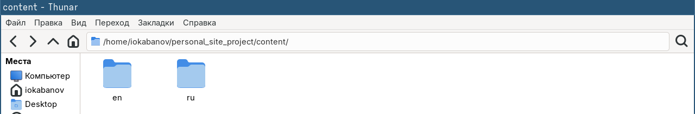
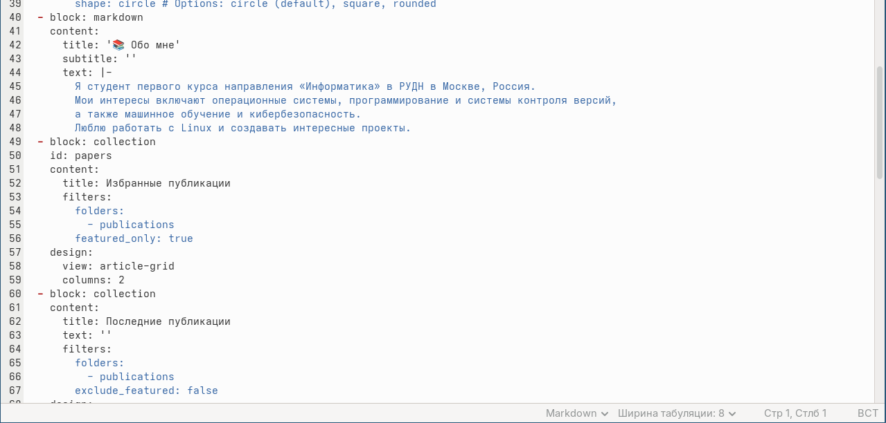
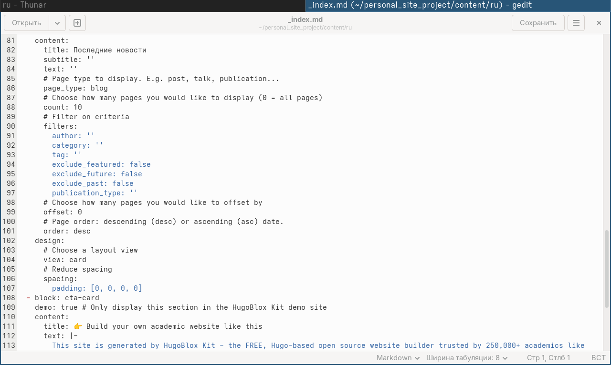
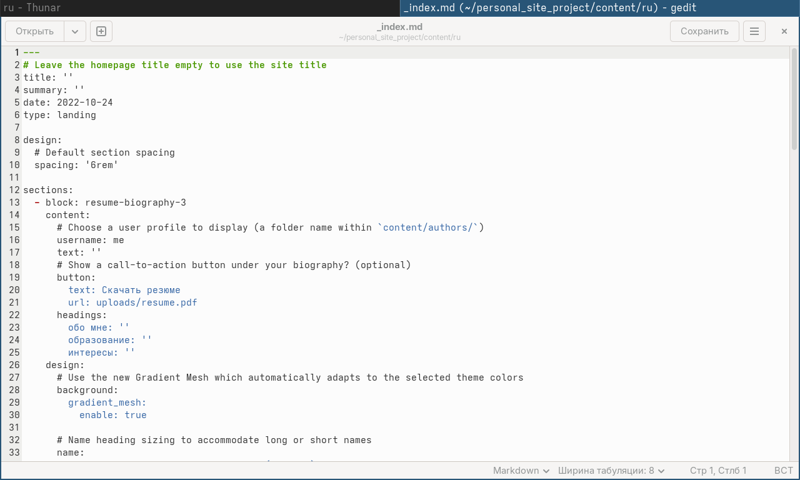
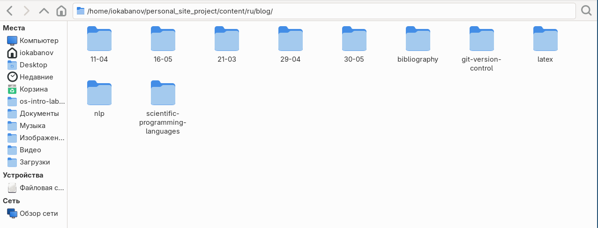
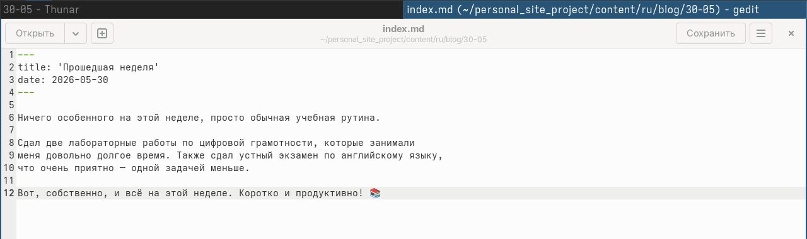
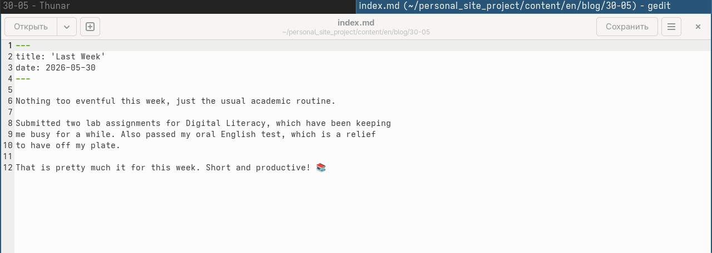
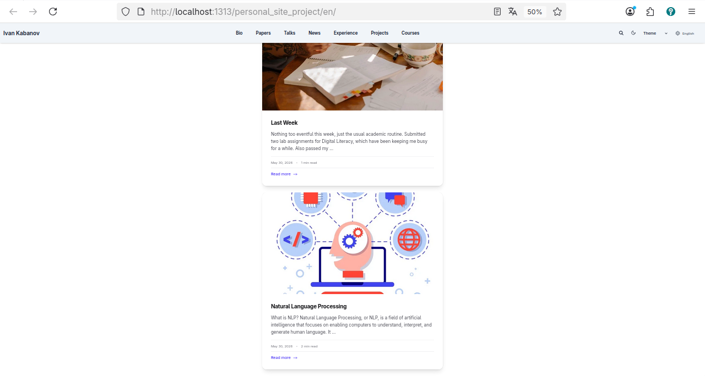
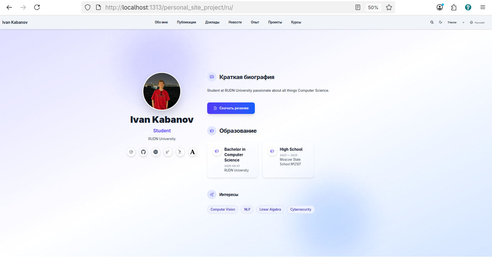
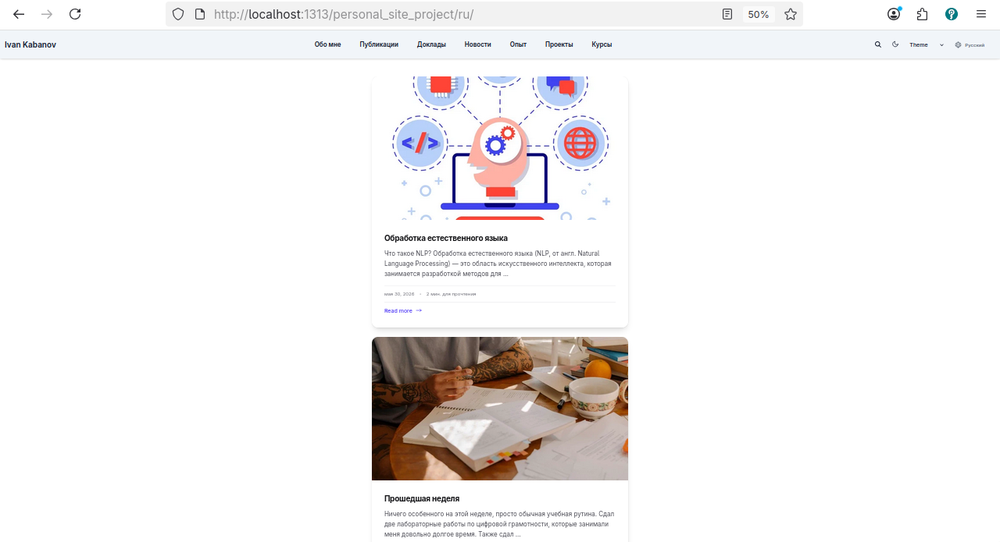

---
## Author
author:
  name: Кабанов Иван Олегович
  email: 1032253495@rudn.ru
  affiliation:
    - name: Российский университет дружбы народов
      country: Российская Федерация
      postal-code: 117198
      city: Москва
      address: ул. Миклухо-Маклая, д. 6

## Title
title: "Отчет по шестому этапу индивидуального проекта"
subtitle: "Архитектура компьютеров и операционные системы. Раздел 'Операционные системы' "
license: "CC BY"
---

# Цель работы

Познакомиться с созданием двуязычных сайтов, дополнить сайт материалами на русском языке

# Задание
Сделать поддержку английского и русского языков.
Разместить элементы сайта на обоих языках.
Разместить контент на обоих языках.
Сделать пост по прошедшей неделе.
Добавить пост на тему по выбору (на двух языках).

# Теоретическое введение

Для реализации сайта используется генератор статических сайтов Hugo.
Общие файлы для тем Wowchemy:
  Репозиторий: https://github.com/wowchemy/wowchemy-hugo-themes
В качестве шаблона индивидуального сайта используется шаблон Hugo Academic Theme.
Демо-сайт: https://academic-demo.netlify.app/
Репозиторий: https://github.com/wowchemy/starter-hugo-academic

# Выполнение индивидуального проекта

## Изменение проекта для поддержки двух языков

Изменим папку content, добавив туда папки "ru" и "en", в которых будем сохранять контен на сответствующем языке ([рис. @fig-001]).

{#fig-001 width=70%}

Создадим в папке ru файл _index.md ([рис. @fig-002]). ([рис. @fig-002]). ([рис. @fig-003]).

{#fig-002 width=70%}

{#fig-003 width=70%}

{#fig-004 width=70%}

Создадим папки с постами, проектами как в англоязычной версии, переведем соответсвующие материалы. ([рис. @fig-005]) 

{#fig-005 width=70%}

В файле languages.yaml в папке config добавим информацию на русском языке ([рис. @fig-006]).

{#fig-006 width=70%}

## Посты на русском языке

Добавим пост о прошедшей неделе ([рис. @fig-007]) и пост о NLP ([рис. @fig-008])  на русском языке в соответсвующие директории.

{#fig-007 width=70%}

{#fig-008 width=70%}

## Посты на английском языке

Добавим пост о прошедшей неделе ([рис. @fig-009]) и пост о NLP ([рис. @fig-010])  на русском языке в соответсвующие директории.

{#fig-009 width=70%}

{#fig-010 width=70%}

## Просмотр изменений

С помощью команды hugo server убедимся, что изменения успешно добавлены.
([рис. @fig-011]) ([рис. @fig-012]) ([рис. @fig-013]).

{#fig-011 width=70%}

{#fig-012 width=70%}

{#fig-013 width=70%}

## Github Pages

Сделаем коммит на github и убедимся что изменения отобразились на Github Pages ([рис. @fig-014])

{#fig-014 width=70%}

# Выводы

В результате выполнения шестого этапа индивидуального проекта, сайт был сделан двуязычным: материалы добавленные ранее теперь доступны на русском и английском языках. Также были добавлены два новых поста.

# Список литературы{.unnumbered}

::: {#refs}
:::
